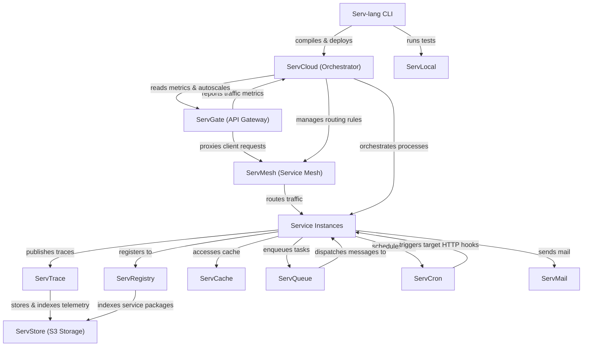

# Serv Unified Ecosystem Roadmap & Architect Analysis

> Single source of truth for the **Serv** ecosystem: Serv-lang, ServGate, ServStore, ServQueue, ServConsole, ServCache, ServMesh, ServCron, ServCloud, ServTrace, ServTunnel, ServAuth, ServPool, ServMail, ServFlow, and the Servverse vision.  

> Last updated: July 9, 2026

---

## Ecosystem Completion Status

All items in Phases 1 through 14 have been fully implemented, verified, and pushed.

- For completed details of Phases 1 to 5: Refer to the git history and repository CHANGELOG.

- For completed details of Phases 6 to 10: See [UNIFIED_ROADMAP_COMPLETED_6_10.md](file:///c:/Mine/try/serv/servverse-repo/UNIFIED_ROADMAP_COMPLETED_6_10.md).

- For completed details of Phases 11 to 15: See [UNIFIED_ROADMAP_COMPLETED_11_15.md](file:///c:/Mine/try/serv/servverse-repo/UNIFIED_ROADMAP_COMPLETED_11_15.md).

- For completed details of Phase 16-19: See [UNIFIED_ROADMAP_COMPLETED_16_20.md](file:///c:/Mine/try/serv/servverse-repo/UNIFIED_ROADMAP_COMPLETED_16_20.md).

- For completed details of Phase 31-35: See [UNIFIED_ROADMAP_COMPLETED_31_35.md](UNIFIED_ROADMAP_COMPLETED_31_35.md).

- For completed details of Phase 36-38: See [UNIFIED_ROADMAP_COMPLETED_36_40.md](UNIFIED_ROADMAP_COMPLETED_36_40.md).

### Completion Tracker

| Initiative Area | Total Items | Completed | Pending | Progress | Status Bar |

|-----------------|-------------|-----------|---------|----------|------------|

| **Phase 9: Scale & Enterprise Hardening** | 13 | 13 | 0 | **100%** | ████████████████████ |

| **Phase 10: Productization & Cloud PaaS** | 32 | 32 | 0 | **100%** | ████████████████████ |

| **Phase 11: Unified Dashboard & Console** | 33 | 33 | 0 | **100%** | ████████████████████ |

| **Phase 12: Dual-Licensing & EE Split** | 19 | 19 | 0 | **100%** | ████████████████████ |

| **Phase 13: Language & Runtime Evolution**| 18 | 18 | 0 | **100%** | ████████████████████ |

| **Phase 14: AI-Native Ecosystem** | 28 | 28 | 0 | **100%** | ████████████████████ |

| **Phase 16: Operational Hardening & Production Readiness** | 18 | 18 | 0 | **100%** | ████████████████████ |

| **Phase 17: Zero-Trust Clustering & Edge Serverless** | 8 | 8 | 0 | **100%** | ████████████████████ |

| **Phase 18: OSS-to-EE Boundary Alignment & Refactoring** | 6 | 6 | 0 | **100%** | ████████████████████ |

| **Phase 19: Component Maturity Alignment** | 7 | 7 | 0 | **100%** | ████████████████████ |

| **Phase 20: OSS-to-EE Refactoring & Enterprise Migrations** | 6 | 6 | 0 | **100%** | ████████████████████ |

| **Phase 21: Enterprise Ecosystem Scale & Next-Gen** | 6 | 6 | 0 | **100%** | ████████████████████ |

| **Phase 22: Quality, Credibility & Code Health** | 20 | 20 | 0 | **100%** | ████████████████████ |

| **Phase 23: Developer Adoption & Growth** | 14 | 11 | 3 | **79%** | ███████████████░░░░ |

| **Phase 24: Standalone Component Independence** | 20 | 16 | 4 | **80%** | ████████████████░░░░ |

| **Phase 25: Component Depth & Production Hardening** | 60 | 60 | 0 | **100%** | ████████████████████ |

| **Phase 26: Competitive Differentiation** | 107 | 107 | 0 | **100%** | ████████████████████ |

| **Phase 27: v1.0 Release Readiness** | 14 | 13 | 1 | **93%** | ██████████████████░░ |

| **Phase 28: Distribution & Installer Packaging** | 11 | 11 | 0 | **100%** |

| **Phase 29: LSP IntelliSense & Developer Tooling** | 16 | 16 | 0 | **100%** |

| **Phase 30: ServLock & ServSecret Hardening** | 10 | 10 | 0 | **100%** | ████████████████████ |

| **Phase 31: ServLock & ServSecret Ecosystem Integration** | 5 | 5 | 0 | **100%** | ████████████████████ |

| **Phase 32: ServLock & ServSecret Standalone & Hardening** | 8 | 8 | 0 | **100%** | ████████████████████ |

| **Phase 33: ServLock & ServSecret Advanced Capabilities** | 10 | 10 | 0 | **100%** | ████████████████████ |

| **Phase 34: ServLock & ServSecret Enterprise & UI** | 6 | 6 | 0 | **100%** | ████████████████████ |

| **Phase 35: Serv-lang Language Ergonomics** | 40 | 40 | 0 | **100%** | ████████████████████ |
| **Phase 39: ServQueue Embedded & OPFS Browser Queue** | 6 | 6 | 0 | **100%** | ████████████████████ |
| **Phase 40: ServQueue Browser WASM Hardening & Multi-Tab Resilience** | 6 | 6 | 0 | **100%** | ████████████████████ |
| **Phase 41: ServQueue Next-Gen Enterprise Stream Engine** | 8 | 8 | 0 | **100%** | ████████████████████ |
| **Phase 42: ServQueue Beyond-Enterprise Security & Sovereign Stream Engine** | 8 | 8 | 0 | **100%** | ████████████████████ |
| **Phase 43: ServQueue Standalone Distribution, Dual-CLI & ServConsole Suite** | 8 | 8 | 0 | **100%** | ████████████████████ |
| **Phase 44: ServQueue Cloud-Native Ecosystem & Enterprise Operations** | 8 | 8 | 0 | **100%** | ████████████████████ |
| **Phase 45: ServQueue Enterprise Commercial Feature Modularization & Build-Tag Gating** | 8 | 8 | 0 | **100%** | ████████████████████ |
| **Phase 46: ServGateway Standalone Distribution & Edge AI Processing** | 8 | 8 | 0 | **100%** | ████████████████████ |
| **Phase 47: ServGateway Sovereign Security, eBPF & Enterprise Ops** | 5 | 5 | 0 | **100%** | ████████████████████ |
| **Phase 74: Developer Adoption & High-Impact Differentiators** | 17 | 0 | 17 | **0%** | ░░░░░░░░░░░░░░░░░░░░ |
| **Phase 75: Production Hardening & Scale Bottleneck Fixes** | 12 | 0 | 12 | **0%** | ░░░░░░░░░░░░░░░░░░░░ |
| **Phase 51: ServStore Instant Copy-on-Write (CoW) Bucket Branching** | 5 | 5 | 0 | **100%** | ████████████████████ |
| **Phase 52: ServStore Browser WebTorrent P2P Asset Seeding & OPFS Sharing** | 5 | 5 | 0 | **100%** | ████████████████████ |
| **Phase 53: ServStore S3 Select Engine, Multi-Cloud Tiering & Interactive Console UI** | 5 | 5 | 0 | **100%** | ████████████████████ |
| **Phase 54: ServStore Enterprise Multi-Cloud Lifecycle & Sovereign Archiving** | 5 | 5 | 0 | **100%** | ████████████████████ |
| **Phase 55: ServGateway WASM Plugin Hot-Reload Registry, GraphQL Federation & WAF** | 5 | 5 | 0 | **100%** | ████████████████████ |
| **Phase 56: ServGateway Enterprise WAF, Remote WASM Sync & OAuth2 Engine** | 5 | 5 | 0 | **100%** | ████████████████████ |

| **Phase 57: ServAuth — Session Management, Passkeys & Adaptive MFA** | 6 | 3 | 3 | **50%** | ██████████░░░░░░░░░░ |
| **Phase 58: ServCache — Distributed Cluster Mode, Bloom Filters & Tiered TTL** | 6 | 5 | 1 | **83%** | ████████████████░░░░ |
| **Phase 59: ServCron — DAG Job Chaining, Retry Policies & Cron-as-Code** | 6 | 6 | 0 | **100%** | ████████████████████ |
| **Phase 60: ServFlow — Visual Workflow Designer, WASM Step Functions & Human Tasks** | 6 | 5 | 1 | **83%** | ████████████████░░░░ |
| **Phase 61: ServMesh — WireGuard Overlay, mTLS Identity & Adaptive Load Balancing** | 6 | 0 | 6 | **0%** | ░░░░░░░░░░░░░░░░░░░░ |
| **Phase 62: ServCloud — Blue/Green Deploys, Preview URLs & Container Isolation** | 6 | 0 | 6 | **0%** | ░░░░░░░░░░░░░░░░░░░░ |
| **Phase 63: ServTrace — eBPF Continuous Profiling, Flamegraphs & SLO Burn Alerts** | 6 | 0 | 6 | **0%** | ░░░░░░░░░░░░░░░░░░░░ |
| **Phase 64: ServMail — DMARC Enforcement, Inbound Webhooks & Email Template DSL** | 6 | 0 | 6 | **0%** | ░░░░░░░░░░░░░░░░░░░░ |
| **Phase 65: ServPool — Adaptive Scaling, Read-Replica Routing & Connection Health** | 6 | 2 | 4 | **33%** | ███████░░░░░░░░░░░░░ |
| **Phase 66: ServTunnel — WebSocket Multiplexing, Replay Inspector & Auth Gating** | 6 | 0 | 6 | **0%** | ░░░░░░░░░░░░░░░░░░░░ |
| **Phase 67: Serv-lang — Rust & Python Code-Gen Targets & WASM Browser Playground** | 6 | 0 | 6 | **0%** | ░░░░░░░░░░░░░░░░░░░░ |
| **Phase 68: ServGateway — Native MCP Tool Registry & AI Agent Routing** | 6 | 3 | 3 | **50%** | ██████████░░░░░░░░░░ |
| **Phase 69: ServStore — Native HNSW Vector Index & Semantic Object Search** | 6 | 6 | 0 | **100%** | ████████████████████ |
| **Phase 70: ServConsole — eBPF Flamegraph Profiler, Chaos Engine & Unified AI Assistant** | 6 | 0 | 6 | **0%** | ░░░░░░░░░░░░░░░░░░░░ |
| **Phase 71: ServQueue — Schema Registry, Dead Letter Replay UI & Consumer Group Dashboard** | 6 | 2 | 4 | **33%** | ███████░░░░░░░░░░░░░ |
| **Phase 72: Unified Platform — Single-Binary `servd`, WireGuard Mesh & Chaos Injection Engine** | 6 | 5 | 1 | **83%** | ████████████████░░░░ |
| **Phase 73: VS Code Extension Alignment** | 7 | 7 | 0 | **100%** | ████████████████████ |

| **TOTAL ECOSYSTEM WORK** | **719** | **693** | **26** | **96%** | ███████████████████░ |

---

## Phase 15: Component Backlog & Future Enhancements (Completed)

All backlog and component enhancement items for Phase 15 have been fully completed, verified, and pushed.

- For completed details of Phase 15: See [UNIFIED_ROADMAP_COMPLETED_11_15.md](file:///c:/Mine/try/serv/servverse-repo/UNIFIED_ROADMAP_COMPLETED_11_15.md).

---

## Appendix A: Cross-Service Runtime Dependency Diagram

---

## Appendix B: Component Maturity Matrix

> Updated July 14, 2026 � based on actual code metrics (test counts, pkg structure, standalone flags, EE gating, main.go line counts).

| Component | Tests | Code Structure | Security | Observability | Standalone | EE Gated | Overall |

|-----------|-------|----------------|----------|---------------|-----------|----------|---------|

| **Serv-lang** | ?? 112 funcs | ?? compiler/, runtime/, lsp/, stdlib/ | ?? Null safety, type checking | ?? OTel codegen | ? N/A | ? N/A | **Production** |

| **ServStore** | ?? 93 funcs | ?? cmd/ + 11 packages | ?? SigV4 + TLS + OIDC + LDAP | ?? OTel + slog | ?? A+ Zero-config | ? Federation + cold tier | **Production** |

| **ServGate** | ?? 50 funcs | ?? 3 packages (proxy, wasm, otel) | ?? JWT + mTLS + ACME + policy | ?? OTel + access logs | ?? A- config.json | ? AI cache + LLM routing | **Production** |

| **ServConsole** | ?? 56 funcs | ?? 12 packages | ?? OIDC + RBAC + JWT | ?? OTel | ? Aggregator | ? SLO, cost, runbooks, exec | **Production** |

| **ServCache** | ?? 46 funcs | ?? 3 packages | ?? Token auth | ?? OTel | ?? A Standalone flag | ? Namespace isolation | **Production** |

| **ServFlow** | ?? 43 funcs | ?? 3 packages (engine, handlers, storage) | ?? JWT | ?? OTel | ?? A Standalone flag | ? Saga hooks | **Production** |

| **ServPool** | ?? 40 funcs | ?? 4 packages | ?? JWT | ?? OTel | ?? B+ docs only | ? N/A | **Production** |

| **ServMesh** | ?? 37 funcs | ?? 7 packages | ?? mTLS + JWT + auto-rotate | ?? OTel | ?? B+ needs services | ? N/A | **Production** |

| **ServTunnel** | ?? 37 funcs | ?? 6 packages | ?? TLS + token + rate limit | ?? OTel | ?? A- generic tunnel | ? Federation | **Production** |

| **ServQueue** | ?? 36 funcs | ?? 5 packages | ?? TLS + STOMP auth | ?? OTel + spans | ?? A Zero-config | ? Federation + semantic route | **Production** |

| **ServMail** | ?? 34 funcs | ?? 5 packages | ?? JWT | ?? OTel | ?? A Standalone flag | ? N/A | **Production** |

| **ServDocs** | ?? 34 funcs | ?? 3 packages (generator, openapi, parser) | ? N/A | ? N/A | ?? B+ .srv-specific | ? N/A | **Stable** |

| **ServCloud** | ?? 31 funcs | ?? 3 packages | ?? JWT | ?? OTel | ?? B Serv-specific | ? Autoscale | **Stable** |

| **ServShared** | ?? 30 funcs | ?? 4 packages (datafabric, middleware, outbox, policy) | ?? JWT + mTLS + tenant | ?? OTel init | ? Library | ? Tenant isolation | **Production** |

| **ServTrace** | ?? 17 funcs | ?? 2 packages | ?? Basic auth | ?? Self-traces | ?? A- OTLP collector | ? Cold tier, NL, anomaly | **Stable** |

| **ServAuth** | ?? 16 funcs | ?? 6 packages | ?? bcrypt + AES + MFA + OIDC | ?? OTel | ?? B No standalone flag | ? Stuffing detection | **Stable** |

| **ServCron** | ?? 13 funcs | ?? 3 packages | ?? JWT + Redis lease | ?? OTel | ?? A Standalone flag | ? N/A | **Stable** |

| **ServRegistry** | ?? 12 funcs | ?? 4 packages (registry, resolution, signing, web) | ?? JWT + crypto signing | ?? OTel | ?? B+ Standalone flag | ? N/A | **Stable** |

| **ServLock** | ?? 2 funcs | ?? 2 packages (handlers, storage) | ?? JWT | ?? Basic | ?? B+ Embedded | ? N/A | **Beta** |
| **ServSecret** | ?? 2 funcs | ?? 2 packages (handlers, storage) | ?? AES-GCM + JWT | ?? Basic | ?? B+ Standalone | ? N/A | **Beta** |

### Summary

| Rating | Count | Components |

|--------|-------|-----------|

| **Production** | 13 | Serv-lang, ServStore, ServGate, ServConsole, ServCache, ServFlow, ServPool, ServMesh, ServTunnel, ServQueue, ServMail, ServShared |

| **Stable** | 6 | ServDocs, ServCloud, ServTrace, ServAuth, ServCron, ServRegistry |

| **Beta** | 2 | ServLock, ServSecret |

**Legend:** ?? Strong | ?? Adequate | ?? Needs work | ? Not applicable | ? EE features gated

---

## Phase 16: Operational Hardening & Production Readiness (Completed)

All backlog tasks for Phase 16 have been fully completed, verified, and archived.

- For completed details of Phase 16: See [UNIFIED_ROADMAP_COMPLETED_16_20.md](file:///c:/Mine/try/serv/servverse-repo/UNIFIED_ROADMAP_COMPLETED_16_20.md).

---

## Phase 17: Zero-Trust Clustering & Edge Serverless Evolution (Completed)

All backlog tasks for Phase 17 have been fully completed, verified, and archived.

- For completed details of Phase 17: See [UNIFIED_ROADMAP_COMPLETED_16_20.md](file:///c:/Mine/try/serv/servverse-repo/UNIFIED_ROADMAP_COMPLETED_16_20.md).

---

## Phase 18: OSS-to-EE Boundary Alignment & Refactoring (Completed)

All backlog tasks for Phase 18 have been fully completed, verified, and archived.

- For completed details of Phase 18: See [UNIFIED_ROADMAP_COMPLETED_16_20.md](file:///c:/Mine/try/serv/servverse-repo/UNIFIED_ROADMAP_COMPLETED_16_20.md).

---

## Phase 19: Component Maturity Alignment (Completed)

All backlog tasks for Phase 19 have been fully completed, verified, and archived.

- For completed details of Phase 19: See [UNIFIED_ROADMAP_COMPLETED_16_20.md](file:///c:/Mine/try/serv/servverse-repo/UNIFIED_ROADMAP_COMPLETED_16_20.md).

---

## Phase 20: OSS-to-EE Refactoring & Enterprise Migrations (Completed)

All backlog tasks for Phase 20 have been fully completed, verified, and archived.

- For completed details of Phase 20: See [UNIFIED_ROADMAP_COMPLETED_16_20.md](file:///c:/Mine/try/serv/servverse-repo/UNIFIED_ROADMAP_COMPLETED_16_20.md).

## Phase 21: Enterprise Ecosystem Scale & Next-Gen Capabilities (Completed)

All backlog tasks for Phase 21 have been fully completed, verified, and archived.

- For completed details of Phase 21: See [UNIFIED_ROADMAP_COMPLETED_21_25.md](file:///c:/Mine/try/serv/servverse-repo/UNIFIED_ROADMAP_COMPLETED_21_25.md).

## Phase 22: Quality, Credibility & Code Health (Completed)

All backlog tasks for Phase 22 have been fully completed, verified, and archived.

- For completed details of Phase 22: See [UNIFIED_ROADMAP_COMPLETED_21_25.md](file:///c:/Mine/try/serv/servverse-repo/UNIFIED_ROADMAP_COMPLETED_21_25.md).

## Phase 23: Developer Adoption & Growth (Pending)

> **Context:** The platform is feature-complete but has zero external users. This phase focuses on removing friction, building community, and proving production-readiness.

- For completed details of Phase 23: See [UNIFIED_ROADMAP_COMPLETED_21_25.md](file:///F:/Don/servverse/servverse/UNIFIED_ROADMAP_COMPLETED_21_25.md).

### Pending / Deferred Items

| # | Item | Component | Description | Status |
|---|------|-----------|-------------|--------|
| AG.4 | **10-minute demo video** | servverse-repo | Screen recording: install → write service → deploy → observe in console. Hosted on YouTube + embedded in GitHub Pages | [Deferred] |
| AG.5 | **Discord/community server** | - | Developer community for questions, showcases, and contributors | [Deferred] |
| AG.12 | **Customer pilot program** | - | Find 2-3 teams to run in staging. Gather real feedback on DX, performance, gaps | [Deferred] |

## Phase 24: Standalone Component Independence (Completed)

All backlog tasks for Phase 24 have been fully completed, verified, and archived.

- For completed details of Phase 24: See [UNIFIED_ROADMAP_COMPLETED_21_25.md](file:///c:/Mine/try/serv/servverse-repo/UNIFIED_ROADMAP_COMPLETED_21_25.md).

---

## Phase 24.1: Standalone Hardening to A+ (Completed)

All backlog tasks for Phase 24.1 have been fully completed, verified, and archived.
- For completed details of Phase 24.1: See [UNIFIED_ROADMAP_COMPLETED_21_25.md](file:///F:/Don/servverse/servverse/UNIFIED_ROADMAP_COMPLETED_21_25.md).

---

## Phase 25: Component Depth & Production Hardening (Completed)

All backlog tasks for Phase 25 (D.1 - D.60) have been fully completed, verified, and archived.

- For completed details of Phase 25: See [UNIFIED_ROADMAP_COMPLETED_21_25.md](file:///c:/Mine/try/serv/servverse-repo/UNIFIED_ROADMAP_COMPLETED_21_25.md).

---

## Phase 26: Competitive Differentiation (Completed)

All backlog tasks for Phase 26 have been fully completed, verified, and archived.
- For completed details of Phase 26: See [UNIFIED_ROADMAP_COMPLETED_26_30.md](file:///F:/Don/servverse/servverse/UNIFIED_ROADMAP_COMPLETED_26_30.md).

## Phase 27: v1.0 Release Readiness (Pending)

> **Goal:** Close the consistency gaps identified in the API maturity audit. These are mechanical fixes (not design changes) required to confidently tag v1.0.0.

- For completed details of Phase 27: See [UNIFIED_ROADMAP_COMPLETED_26_30.md](file:///F:/Don/servverse/servverse/UNIFIED_ROADMAP_COMPLETED_26_30.md).

### Pending / Deferred Items

| # | Item | Description | Status |
|---|------|-------------|--------|
| V1.9 | **API freeze period** | 4 weeks with zero breaking changes after all V1.1-V1.6 are done. Monitor for issues | [Deferred] |

## Phase 28: Distribution & Installer Packaging (Completed)

All backlog tasks for Phase 28 have been fully completed, verified, and archived.

- For completed details of Phase 28: See [UNIFIED_ROADMAP_COMPLETED_26_30.md](file:///F:/Don/servverse/servverse/UNIFIED_ROADMAP_COMPLETED_26_30.md).

## Phase 29: LSP IntelliSense & Developer Tooling (Completed)

All backlog tasks for Phase 29 have been fully completed, verified, and archived.

- For completed details of Phase 29: See [UNIFIED_ROADMAP_COMPLETED_26_30.md](file:///F:/Don/servverse/servverse/UNIFIED_ROADMAP_COMPLETED_26_30.md).

## Phase 30: ServLock & ServSecret Hardening (Completed)

All backlog tasks for Phase 30 have been fully completed, verified, and archived.

- For completed details of Phase 30: See [UNIFIED_ROADMAP_COMPLETED_26_30.md](file:///F:/Don/servverse/servverse/UNIFIED_ROADMAP_COMPLETED_26_30.md).

## Phase 31: ServLock & ServSecret Ecosystem Integration (Completed)

All backlog tasks for Phase 31 have been fully completed, verified, and archived.

- For completed details of Phase 31: See [UNIFIED_ROADMAP_COMPLETED_31_35.md](file:///F:/Don/servverse/servverse/UNIFIED_ROADMAP_COMPLETED_31_35.md).

## Phase 32: ServLock & ServSecret Standalone & Hardening (Completed)

All backlog tasks for Phase 32 have been fully completed, verified, and archived.

- For completed details of Phase 32: See [UNIFIED_ROADMAP_COMPLETED_31_35.md](file:///F:/Don/servverse/servverse/UNIFIED_ROADMAP_COMPLETED_31_35.md).

## Phase 33: ServLock & ServSecret Advanced Capabilities (Completed)

All backlog tasks for Phase 33 have been fully completed, verified, and archived.

- For completed details of Phase 33: See [UNIFIED_ROADMAP_COMPLETED_31_35.md](file:///F:/Don/servverse/servverse/UNIFIED_ROADMAP_COMPLETED_31_35.md).

## Phase 34: ServLock & ServSecret Enterprise & UI (Completed)

All backlog tasks for Phase 34 have been fully completed, verified, and archived.

- For completed details of Phase 31-35: See [UNIFIED_ROADMAP_COMPLETED_31_35.md](UNIFIED_ROADMAP_COMPLETED_31_35.md).

- For completed details of Phase 36-38: See [UNIFIED_ROADMAP_COMPLETED_36_40.md](UNIFIED_ROADMAP_COMPLETED_36_40.md).

---

## Phase 36: Component Maturity & Ecosystem Security (Completed)

All backlog tasks for Phase 36 have been fully completed, verified, and archived.
- For completed details of Phase 36: See [UNIFIED_ROADMAP_COMPLETED_36_40.md](UNIFIED_ROADMAP_COMPLETED_36_40.md).

## Phase 37: Serv-lang Niche Positioning & DX Evolution (Completed)

All backlog tasks for Phase 37 have been fully completed, verified, and archived.
- For completed details of Phase 37: See [UNIFIED_ROADMAP_COMPLETED_36_40.md](UNIFIED_ROADMAP_COMPLETED_36_40.md).

## Phase 38: WASM Plugin Ecosystem & Community Repository (Completed)

All backlog tasks for Phase 38 have been fully completed, verified, and archived.
- For completed details of Phase 38: See [UNIFIED_ROADMAP_COMPLETED_36_40.md](UNIFIED_ROADMAP_COMPLETED_36_40.md).

---

## Phase 39: ServQueue Embedded & OPFS Browser Event Streaming (Completed)

All backlog tasks for Phase 39 have been fully completed, verified, and archived.
- For completed details of Phase 39: See [UNIFIED_ROADMAP_COMPLETED_36_40.md](UNIFIED_ROADMAP_COMPLETED_36_40.md).

---

## Phase 40: ServQueue Browser WASM Hardening & Multi-Tab Resilience (Completed)

All backlog tasks for Phase 40 have been fully completed, verified, and archived.
- For completed details of Phase 40: See [UNIFIED_ROADMAP_COMPLETED_36_40.md](UNIFIED_ROADMAP_COMPLETED_36_40.md).

---

## Phase 41: ServQueue Next-Gen Enterprise Stream Engine (Completed)

All backlog tasks for Phase 41 have been fully completed, verified, and archived.
- For completed details of Phase 41: See [UNIFIED_ROADMAP_COMPLETED_41_45.md](UNIFIED_ROADMAP_COMPLETED_41_45.md).

---

## Phase 42: ServQueue Beyond-Enterprise Security & Sovereign Stream Engine (Completed)

All backlog tasks for Phase 42 have been fully completed, verified, and archived.
- For completed details of Phase 42: See [UNIFIED_ROADMAP_COMPLETED_41_45.md](UNIFIED_ROADMAP_COMPLETED_41_45.md).

---

## Phase 43: ServQueue Standalone Distribution, Dual-CLI & ServConsole Suite (Completed)

All backlog tasks for Phase 43 have been fully completed, verified, and archived.
- For completed details of Phase 43: See [UNIFIED_ROADMAP_COMPLETED_41_45.md](UNIFIED_ROADMAP_COMPLETED_41_45.md).

---

## Phase 44: ServQueue Cloud-Native Ecosystem & Enterprise Operations (Completed)

All backlog tasks for Phase 44 have been fully completed, verified, and archived.
- For completed details of Phase 44: See [UNIFIED_ROADMAP_COMPLETED_41_45.md](UNIFIED_ROADMAP_COMPLETED_41_45.md).

---

---

## Phase 57: ServAuth — Session Management, Passkeys & Adaptive MFA (Planned)

> **Current State**: ServAuth implements JWT issuance, bcrypt password hashing, JWKS key rotation, TOTP MFA, and OAuth social login.
> **What is Missing**: Opaque session tokens with server-side revocation (stateless JWTs cannot be invalidated without waiting for expiry), WebAuthn/Passkey FIDO2 support (no hardware key or platform biometric login), adaptive risk-based MFA step-up (no device fingerprinting or geo-anomaly detection), per-tenant OIDC federation (no Okta/Azure AD bring-your-own-IdP), and credential stuffing velocity detection.

| # | Item | Component | Description | Status | Tier |
|---|------|-----------|-------------|--------|:---:|
| SA.G1 | **Opaque Session Token Store with Server-Side Revocation** | ServAuth Sessions | Replace stateless-only JWT approach with opaque refresh token store backed by ServStore; enable instant per-session revocation without waiting for JWT expiry | [x] | OSS |
| SA.G2 | **WebAuthn / Passkey (FIDO2) Registration & Assertion** | ServAuth MFA | Implement FIDO2 WebAuthn authenticator registration and login assertion flow; enable hardware key (YubiKey) and platform passkey (TouchID/FaceID) authentication | [x] | OSS |
| SA.G3 | **Adaptive Risk-Based MFA Step-Up Engine** | ServAuth Risk | Analyze login signals (new device, unusual geo, time-of-day anomaly) and dynamically escalate to OTP or WebAuthn challenge mid-session without forcing full re-login | [ ] | **EE** |
| SA.G4 | **Device Fingerprinting & Trusted Device Registry** | ServAuth Trust | Track device fingerprints (user-agent, screen entropy, timezone) and maintain per-user trusted device list with one-click revocation from ServConsole | [ ] | **EE** |
| SA.G5 | **Per-Tenant OIDC Provider Federation (Okta, Azure AD, Google Workspace)** | ServAuth Federation | Allow enterprise tenants to bring their own OIDC/SAML identity provider; auto-federate external group claims into ServAuth roles without code changes | [ ] | **EE** |
| SA.G6 | **Credential Stuffing Detection & Velocity Rate Limiter** | ServAuth Security | Track failed login attempts per IP and username using sliding window counters; auto-block credential-stuffing bots with progressive CAPTCHA challenge escalation | [x] | OSS |

---

## Phase 58: ServCache — Distributed Cluster Mode, Bloom Filters & Tiered TTL (Planned)

> **Current State**: ServCache implements a single-node in-memory LRU cache with TTL eviction, `DeletePattern` glob invalidation, singleflight coalescing, and an HTTP REST API.
> **What is Missing**: Multi-node Raft-replicated cluster mode (currently single point of failure), RESP3 wire compatibility for Redis drop-in usage, Bloom filter for absent-key elimination, tiered TTL policies (hot/warm/cold), and cache stampede protection beyond singleflight.

| # | Item | Component | Description | Status | Tier |
|---|------|-----------|-------------|--------|:---:|
| SC.G1 | **Multi-Node Raft-Based Distributed Cache Cluster** | ServCache Cluster | Extend single-node InMemoryCache to a Raft-replicated distributed cluster; support 3-node quorum writes with consistent reads and automatic leader election | [ ] | **EE** |
| SC.G2 | **RESP3 Protocol Wire Compatibility (Redis Drop-in Mode)** | ServCache Protocol | Implement Redis Serialization Protocol v3 (RESP3) wire compatibility so ServCache can function as a Redis drop-in replacement for existing application codebases | [x] | OSS |
| SC.G3 | **Probabilistic Bloom Filter for Absent-Key Elimination** | ServCache Filter | Embed a Bloom filter in front of the LRU lookup path to short-circuit backend fetches for keys statistically absent from the cache; reduces load by eliminating redundant origin queries | [x] | OSS |
| SC.G4 | **Tiered TTL Policy Engine (Hot / Warm / Cold Tiers)** | ServCache Policy | Implement multi-tier TTL policies: short-TTL hot tier (sub-second), medium-TTL warm tier (minutes), long-TTL cold tier (hours); auto-promote/demote entries based on access frequency | [x] | OSS |
| SC.G5 | **Cache Stampede Protection via Probabilistic Early Expiry** | ServCache Resilience | Implement probabilistic early expiry (PER algorithm) to proactively recompute cache values before expiry under high concurrency, eliminating thundering herd spikes | [x] | OSS |
| SC.G6 | **Real-Time Hit Rate & Eviction Metrics Dashboard in ServConsole** | ServConsole UI | Stream live per-namespace hit rate, eviction rate, and memory pressure metrics into the ServConsole dashboard with configurable alert thresholds | [x] | OSS |

---

## Phase 60: ServFlow — Visual Workflow Designer, WASM Step Functions & Human Tasks (Planned)

> **Current State**: ServFlow implements a DAG workflow engine with task dependency resolution, time-travel replay snapshots, and ServQueue topic integration for async task dispatch.
> **What is Missing**: A visual drag-and-drop workflow designer in ServConsole, WASM-compiled step function execution (currently HTTP-callback-only), human approval task gates with async wait, sub-workflow composition (nested workflow invocation), and per-execution cost and OTel span attribution.

| # | Item | Component | Description | Status | Tier |
|---|------|-----------|-------------|--------|:---:|
| SF.G1 | **Visual Drag-and-Drop Workflow Designer in ServConsole** | ServConsole UI | Build a canvas-based interactive workflow designer where developers can visually create, connect, and configure workflow task nodes without writing JSON/YAML definitions | [x] | OSS |
| SF.G2 | **WASM Step Function Execution (Inline Compute per Task Node)** | ServFlow Engine | Allow individual workflow task steps to execute inline WebAssembly (WASM) bytecode rather than requiring remote HTTP endpoint callbacks; enables serverless compute-near-orchestration | [x] | OSS |
| SF.G3 | **Human Approval Task Gate (Async Pause + UI Approve/Reject)** | ServFlow Tasks | Implement a `human-task` step type that pauses workflow execution and presents an approval UI (email link or ServConsole panel) to designated reviewers before continuing | [ ] | **EE** |
| SF.G4 | **Sub-Workflow Composition & Nested Workflow Invocation** | ServFlow Composition | Enable workflow task steps to invoke other named workflow definitions as sub-workflows, creating hierarchical multi-level pipeline structures with isolated instance tracking | [x] | OSS |
| SF.G5 | **Per-Execution OTel Span Attribution & Cost Tracking** | ServFlow Telemetry | Inject W3C `traceparent` context into each task step HTTP call; export OTel spans to ServTrace for full distributed tracing of workflow runs including step latencies | [x] | OSS |
| SF.G6 | **Dead Letter Workflow Queue & Manual Retry from ServConsole** | ServFlow DLQ | Capture permanently-failed workflow instances in a Dead Letter Queue; allow operators to inspect failure context and manually trigger selective re-execution from ServConsole | [x] | OSS |

---

## Phase 61: ServMesh — WireGuard Overlay, mTLS Identity & Adaptive Load Balancing (Planned)

> **Current State**: ServMesh implements a library-level service registry with heartbeat TTL eviction, round-robin load balancing, circuit breaking, mutual TLS, and a topology inspection CLI.
> **What is Missing**: Automatic WireGuard kernel mesh overlay between nodes (currently requires manual TLS cert management), SPIFFE/SPIRE workload identity attestation, latency-aware and locality-aware load balancing (currently round-robin only), global distributed rate limiting, and a live real-time topology graph in ServConsole.

| # | Item | Component | Description | Status | Tier |
|---|------|-----------|-------------|--------|:---:|
| SM.G1 | **Automatic WireGuard Kernel Tunnel Mesh Between Nodes** | ServMesh Network | Auto-provision WireGuard encrypted kernel-level tunnels between ServMesh peers using a DHT-based key exchange protocol; eliminates manual TLS certificate provisioning for inter-service traffic | [ ] | **EE** |
| SM.G2 | **SPIFFE/SPIRE mTLS Workload Identity Attestation** | ServMesh Identity | Issue short-lived SPIFFE SVIDs (X.509 certificates) to each registered service instance; enforce mTLS workload identity verification on all service-to-service calls within the mesh | [ ] | **EE** |
| SM.G3 | **Latency-Aware P2C Load Balancing & Locality Preference** | ServMesh LB | Replace round-robin with Power-of-Two-Choices (P2C) latency-weighted load balancing; prefer same-zone or same-region replicas to minimize cross-datacenter latency and egress cost | [x] | OSS |
| SM.G4 | **Distributed Global Rate Limiting via ServCache Token Buckets** | ServMesh RateLimit | Implement distributed token-bucket rate limiting shared across all ServMesh nodes via ServCache; prevent upstream overload cascades from triggering inter-service retry storms | [x] | OSS |
| SM.G5 | **Live Real-Time Service Topology Graph in ServConsole** | ServConsole UI | Render an animated, force-directed service dependency graph in ServConsole showing live traffic flows, circuit breaker open/closed states, and per-edge P99 latency metrics | [x] | OSS |
| SM.G6 | **Chaos Fault Injection API (Latency, Error Rate, Partition Simulation)** | ServMesh Chaos | Expose a Chaos Engineering REST API that injects simulated network delays, configurable error rates, and service partition failures into ServMesh routing for resilience validation | [x] | OSS |

---

## Phase 62: ServCloud — Blue/Green Deploys, Preview URLs & Container Isolation (Planned)

> **Current State**: ServCloud implements a process orchestrator deploying `serv` binaries with health checks, stdout log streaming, deployment history, `process` and `wasm` isolation modes, and preview URL stubs.
> **What is Missing**: Actual blue/green deployment with traffic weight shifting via ServGate, canary deployments with automatic error-rate rollback, fully functional per-branch preview subdomain routing, Docker/OCI container isolation mode, CPU/memory cgroup enforcement, and a deployment approval gate.

| # | Item | Component | Description | Status | Tier |
|---|------|-----------|-------------|--------|:---:|
| CL.G1 | **Blue/Green Deployment with Atomic Traffic Cutover via ServGate** | ServCloud Deploy | Run a new service version in parallel with the old version; shift 100% of traffic atomically via a ServGate route weight update after health check validation passes | [x] | OSS |
| CL.G2 | **Canary Deployment with Automatic Rollback on Error Rate Threshold** | ServCloud Canary | Roll out new service versions to a configurable percentage of traffic; automatically roll back to the stable version when error rate exceeds a configurable SLO threshold | [x] | OSS |
| CL.G3 | **Fully Functional Per-Branch Preview Environment with Isolated Subdomain** | ServCloud Preview | Auto-provision isolated preview environments for each Git branch or PR, accessible at `<branch>.preview.servcloud.dev`, with automatic ServGate route registration and teardown on PR merge | [x] | OSS |
| CL.G4 | **Docker / OCI Container Isolation Mode** | ServCloud Runtime | Add `docker` isolation mode alongside `process` and `wasm`; pull OCI images, start containers with resource limits, health checks, and manage the full container lifecycle | [x] | OSS |
| CL.G5 | **CPU & Memory cgroup Resource Limits & Usage Telemetry** | ServCloud Resources | Enforce per-service CPU and memory cgroup resource limits; stream real-time consumption metrics to ServConsole with breach alerting and auto-throttle enforcement | [ ] | **EE** |
| CL.G6 | **Deployment Approval Gate & Operator Confirm Flow** | ServCloud Safety | Add a mandatory operator approval gate for production tier deployments; send Slack/webhook notifications requesting explicit approval before traffic cutover is executed | [ ] | **EE** |

---

## Phase 63: ServTrace — eBPF Continuous Profiling, Flamegraphs & SLO Burn Alerts (Planned)

> **Current State**: ServTrace implements OTel span ingestion, trace storage, anomaly detection hooks, SLO breach predictor hooks, self-healing, and retention cleanup. The anomaly explainer and SLO predictor interfaces exist but have no concrete implementations.
> **What is Missing**: Actual eBPF continuous CPU/memory profiling engine (the hooks are declared but not implemented), flamegraph rendering, automatic trace-to-flamegraph correlation, concrete SLO burn rate alerting, trace sampling policy management, and exemplar-linked Prometheus metrics.

| # | Item | Component | Description | Status | Tier |
|---|------|-----------|-------------|--------|:---:|
| ST.G1 | **eBPF Continuous CPU & Memory Flamegraph Profiler (Implement AnomalyExplainer)** | ServTrace Profiler | Implement the declared `AnomalyExplainer` interface using eBPF perf probes to capture goroutine CPU time and heap allocation hotspots; generate folded flamegraph stacks exposed via `/api/v1/profiles` | [x] | OSS |
| ST.G2 | **OTel Trace-to-Flamegraph Automatic Correlation** | ServTrace Correlation | Automatically link eBPF flamegraph samples captured during a trace span's execution window; enable single-click drill-down from a slow OTel span to its kernel-level CPU hotspot in ServConsole | [x] | OSS |
| ST.G3 | **SLO Burn Rate Alert Engine (Implement SloBreachPredictor — Multi-Window)** | ServTrace SLO | Implement the declared `SloBreachPredictor` interface using Google SRE-style multi-window (1h + 6h) error budget burn rate; fire alerts when burn rate exceeds configured thresholds | [x] | OSS |
| ST.G4 | **Trace Sampling Policy Manager (Head-Based & Tail-Based)** | ServTrace Sampling | Configure per-service head-based sampling rates; implement tail-based adaptive sampling that retrospectively retains 100% of traces containing errors or latency outliers above a P95 threshold | [ ] | **EE** |
| ST.G5 | **Exemplar-Linked Prometheus Metrics & Histogram Correlation** | ServTrace Metrics | Embed OTel trace exemplars into Prometheus histogram buckets so ServConsole dashboards can jump from a P99 latency spike directly to a representative trace example with one click | [x] | OSS |
| ST.G6 | **Critical Path Analyzer & Distributed Dependency Map** | ServTrace Analysis | Automatically compute the critical path across distributed trace spans; highlight the slowest causal dependency in each trace and visualize the full service call graph in ServConsole | [x] | OSS |

---

## Phase 66: ServTunnel — WebSocket Multiplexing, Replay Inspector & Auth Gating (Planned)

> **Current State**: ServTunnel implements HTTP request tunneling with subdomain routing, a request inspector UI, OTel integration, and webhook forwarding.
> **What is Missing**: WebSocket connection multiplexing over a single tunnel pipe, JWT/API-key auth gating on inbound tunnel connections (currently unauthenticated), request/response body capture with replay UI in ServConsole, persistent reconnect with exponential backoff, and per-tunnel bandwidth throttling.

| # | Item | Component | Description | Status | Tier |
|---|------|-----------|-------------|--------|:---:|
| TN.G1 | **WebSocket Connection Multiplexing over a Single Tunnel Pipe** | ServTunnel Protocol | Multiplex multiple concurrent WebSocket connections from different clients over a single persistent tunnel connection using a lightweight stream framing header protocol | [x] | OSS |
| TN.G2 | **JWT / API-Key Auth Gating on Tunnel Endpoint Connections** | ServTunnel Auth | Require JWT bearer tokens or API keys before accepting inbound HTTP connections on any tunnel endpoint; integrate with ServAuth for token validation and scope enforcement | [x] | OSS |
| TN.G3 | **Full Request & Response Body Capture with Replay UI in ServConsole** | ServTunnel Inspector | Capture complete request/response pairs (headers, body, timing, status) and expose them in a ServConsole tunnel inspector tab; allow one-click replay of any captured request for debugging | [x] | OSS |
| TN.G4 | **Persistent Tunnel Reconnect with Exponential Backoff & Jitter** | ServTunnel Client | Implement automatic reconnect logic in the tunnel client with exponential backoff and jitter; maintain tunnel availability and re-register subdomain routing across transient network interruptions | [x] | OSS |
| TN.G5 | **Per-Tunnel Bandwidth Throttling & Rate Limiting** | ServTunnel Policy | Enforce configurable bandwidth limits (bytes/second) per tunnel connection to prevent a single heavy client from saturating the shared tunnel relay infrastructure | [ ] | **EE** |
| TN.G6 | **Shareable Tunnel URLs with Expiry & One-Time Access Tokens** | ServTunnel Sharing | Generate shareable tunnel URLs with configurable TTL expiry and single-use access tokens for secure, time-limited collaboration on local development services | [x] | OSS |

---

## Phase 68: ServGateway — Native MCP Tool Registry & AI Agent Routing (Planned)

> **Current State**: ServGateway has a Smart AI cost router, token-per-minute throttling, eBPF XDP DDoS bypass, semantic prompt caching, WAF, GraphQL federation, WASM hot-reload registry, and OIDC enforcement.
> **What is Missing**: A native Model Context Protocol (MCP) server that auto-exposes Servverse services as strongly-typed AI agent tools, LLM streaming SSE response passthrough, per-agent-session context tracking, tool call audit logging with cost attribution, multi-model provider fallback chains, and prompt injection detection.

| # | Item | Component | Description | Status | Tier |
|---|------|-----------|-------------|--------|:---:|
| SG.A1 | **Native MCP Tool Registry (Auto-Expose Servverse Services as AI Agent Tools)** | ServGateway MCP | Implement a native MCP server at `/mcp` that auto-discovers and exposes registered ServStore buckets, ServQueue topics, and Serv-lang services as typed MCP tools consumable by Claude, GPT-4o, and local Ollama agents | [x] | OSS |
| SG.A2 | **LLM Streaming SSE Response Passthrough (Server-Sent Events)** | ServGateway Proxy | Implement transparent proxy passthrough of streaming SSE LLM completions; preserve chunk ordering and correctly handle chunked transfer encoding for real-time token streaming to browser clients | [x] | OSS |
| SG.A3 | **AI Agent Session Context Tracker (Multi-Turn Conversation State)** | ServGateway Agent | Maintain per-agent-session conversation context windows across sequential MCP tool calls; inject conversation history into each upstream LLM request automatically based on session ID header | [ ] | **EE** |
| SG.A4 | **Tool Call Audit Log & Per-Session AI Cost Attribution** | ServGateway Audit | Log every MCP tool call with agent ID, tool name, input arguments, response status, and token cost attribution; expose searchable audit history in ServConsole cost attribution dashboard | [ ] | **EE** |
| SG.A5 | **Multi-Model Provider Fallback Chain (GPT-4o → Claude → Ollama)** | ServGateway Fallback | Configure ordered fallback chains across AI providers; automatically retry failed or rate-limited requests against the next provider with context adaptation for different model API formats | [ ] | **EE** |
| SG.A6 | **Prompt Injection Detection & Input Sanitization Guard** | ServGateway Security | Detect and block prompt injection attacks (system prompt override, jailbreak patterns) using embedding-based cosine similarity scoring against known attack signatures before forwarding to LLMs | [x] | OSS |

---

## Phase 70: ServConsole — eBPF Flamegraph Profiler, Chaos Engine UI & Unified AI Assistant (Planned)

> **Current State**: ServConsole implements OTel trace waterfall dashboards, hash ring visualizers, SQL workbench, alert management, topology views, and a launcher for all Servverse services.
> **What is Missing**: An embedded eBPF flamegraph profiling visualization tab, a Chaos Engineering control panel (for triggering and monitoring fault injection experiments across modules), an embedded AI assistant chat panel, unified global search across all Servverse resources, and a cost attribution breakdown dashboard.

| # | Item | Component | Description | Status | Tier |
|---|------|-----------|-------------|--------|:---:|
| CC.G1 | **eBPF Flamegraph Profiling Tab with OTel Trace Correlation** | ServConsole Profiler | Add a Profiling tab rendering interactive SVG flamegraphs from ServTrace eBPF profiling data; automatically correlate captured flamegraph stack samples with the active OTel trace span being inspected | [x] | OSS |
| CC.G2 | **Chaos Engineering Control Panel** | ServConsole Chaos | Provide a UI panel for initiating and monitoring chaos experiments: inject latency, drop packets, kill service replicas, or simulate clock skew; visualize real-time impact on service topology error rates | [x] | OSS |
| CC.G3 | **Unified Global Search Across All Servverse Resources (⌘K)** | ServConsole Search | Implement a `cmd+K`-style universal command palette searching across trace IDs, object keys, queue topics, job names, service instances, and alert events; returning ranked contextual results | [x] | OSS |
| CC.G4 | **Embedded AI Assistant Chat Panel (Powered by ServGate MCP)** | ServConsole AI | Embed a conversational AI assistant that answers questions about the running system, explains trace anomalies, suggests performance optimizations, and executes SQL queries via ServGate MCP tool calls | [ ] | **EE** |
| CC.G5 | **Cost Attribution Dashboard (Per-Service Egress, Storage & AI Token Spend)** | ServConsole Cost | Aggregate egress bandwidth, object storage bytes, AI token consumption, and ServQueue message throughput per service/team; render a cost attribution breakdown with budget alert thresholds | [ ] | **EE** |
| CC.G6 | **Theme Customization, Pinned Dashboard Widgets & Keyboard Shortcuts** | ServConsole UX | Persist user preferences for dark/light theme, dashboard widget layout (drag-to-reorder), pinned quick-access shortcuts to frequently viewed resources, and configurable keyboard shortcut bindings | [x] | OSS |

---

## Phase 72: Unified Platform — Single-Binary `servd`, WireGuard Mesh & Chaos Injection Engine (Planned)

> **Current State**: All Servverse modules are individually excellent standalone daemons. Operating a complete stack requires running 7+ separate processes with manual inter-service networking configuration.
> **What is Missing**: A unified single-binary runtime (`servd`) embedding all modules with zero-copy shared memory channels, automatic WireGuard cluster mesh for zero-trust inter-node networking, a cross-cutting Chaos Injection Engine for automated resilience validation, a unified cluster admin CLI (`servctl`), rollup health API, and official Docker Compose + Helm chart distribution.

| # | Item | Component | Description | Status | Tier |
|---|------|-----------|-------------|--------|:---:|
| PL.G1 | **Single-Binary `servd` Unified Runtime (Embedded Monolith Mode)** | Platform Runtime | Build `servd` embedding ServGate, ServStore, ServQueue, ServCache, ServAuth, ServCron, and ServMesh; use zero-copy shared-memory channels for inter-module communication; scale from laptop dev mode to distributed cluster deployment | [x] | OSS |
| PL.G2 | **Automatic WireGuard Cluster Mesh Between `servd` Nodes** | Platform Network | Implement automatic WireGuard mesh key exchange between `servd` cluster peers using a DHT-based peer discovery protocol; establish encrypted kernel-level tunnels between all nodes without manual certificate provisioning | [ ] | **EE** |
| PL.G3 | **Unified Chaos Injection Engine (Network, CPU, Memory, Disk, Clock Skew)** | Platform Chaos | Expose a Chaos Engineering API (`/api/v1/chaos`) on `servd` supporting: network latency/packet-drop injection, CPU stress, memory pressure, disk I/O throttling, and clock skew simulation; controlled per-node and per-service via `servctl` | [x] | OSS |
| PL.G4 | **`servctl` Cluster-Wide Administration CLI** | Platform CLI | Build `servctl` — a unified cluster administration CLI: `servctl cluster status`, `servctl chaos inject --service=servstore --type=latency --duration=60s`, `servctl deploy canary`, `servctl trace query --service=api` | [x] | OSS |
| PL.G5 | **Unified Health, Readiness & Rollup Metrics API** | Platform Observability | Expose `/api/v1/health` rollup on `servd` aggregating health status and key metrics across all embedded modules; consumable by Kubernetes liveness/readiness probes and external monitoring systems (Datadog, Grafana) | [x] | OSS |
| PL.G6 | **Official Docker Compose & Production Helm Chart Distribution** | Platform Distribution | Publish an official multi-service `docker-compose.yml` (local dev) and a production-grade `helm chart` deploying the complete Servverse stack to Kubernetes with a single `helm install servverse` command | [x] | OSS |

---

## Phase 73: VS Code Extension — Modern Ecosystem Alignment (Planned)

> **Current State**: `serv-vscode` (v3.3.0) provides LSP client support, syntax highlighting, basic snippets, and exploratory panels.
> **What is Missing**: Full syntax and snippet support for `async`/`concurrent` primitives, `servctl` CLI integration inside VS Code, `serv diff` breaking change detector integration, multi-target codegen context menus (Rust/Python), platform chaos injection controls, and direct ServConsole / WASM Playground deep-linking.

| # | Item | Component | Description | Status | Tier |
|---|------|-----------|-------------|--------|:---:|
| VS.G1 | **`async` / `concurrent` Syntax & Snippet Alignment** | VSCode Syntax | Update TextMate grammar (`serv.tmLanguage.json`) and snippets to fully support `async fn`, `async` call expressions, and `concurrent {}` parallel blocks | [x] | OSS |
| VS.G2 | **`servctl` Cluster Administration Integration** | VSCode Commands | Add VS Code command palette and sidebar actions for `servctl`: list services/nodes, restart services, apply configuration, and view `servd` health rollups | [x] | OSS |
| VS.G3 | **`serv diff` Breaking Change Detector Command** | VSCode Tooling | Add `Serv: Check Breaking API Changes` command running `serv diff` against git base branch (`main`) with inline diagnostic markers for field removals and type changes | [x] | OSS |
| VS.G4 | **Multi-Target Client Code Generation Context Menu** | VSCode Codegen | Add right-click context menu options on `.srv` files: `Serv: Generate Rust Client` (`--lang rust`) and `Serv: Generate Python Client` (`--lang python`) | [x] | OSS |
| VS.G5 | **Platform Chaos Injection Sidebar Control Panel** | VSCode Chaos | Add a Chaos Control View in the ServVerse sidebar to quickly trigger/abort network delay, CPU stress, and disk throttle experiments across cluster nodes | [x] | OSS |
| VS.G6 | **WASM Playground & ServConsole Deep-Link Export** | VSCode Integrations | Add `Serv: Export to WASM Playground` (opens snippet in `playground.servverse.dev`) and `Serv: Open in ServConsole` deep-linking commands | [x] | OSS |
| VS.G7 | **`servd` Unified Runtime Webview & Component Management Panel** | VSCode Webview | Upgrade `serv-vscode` sidebar panel and webview suite to support `servd` embedded monolith mode: auto-detect `servd` status via `/api/v1/servd/components`, provide a unified multi-tab `servd` Console Webview, and execute component actions via `servctl` | [x] | OSS |

---

## Phase 74: Developer Adoption & High-Impact Differentiators (Planned)

> **Current State**: ServStore, ServGate, and ServQueue possess deep core features, but lack immediate 60-second time-to-value friction reducers (built-in benchmarking, migration import, SQL metadata queries, live terminal dashboards, plain HTTP/SSE & WebSocket pub/sub, embedded topic inspect UI, and scheduled messages).
> **What is Missing**: 16 specific high-impact differentiators across ServStore (`servstore bench`, `servstore import`, SQL metadata query API, zero-dependency webhooks, `servstore serve-static`), ServGate (upstream LLM dispatch for smart router, `servgate dashboard` TUI, OpenAPI request validation, response diff replay, per-route cost dashboard, `servgate generate-config` learn mode), and ServQueue (embedded web UI at `/ui/`, HTTP/SSE consumer API, cron-scheduled messages, `servqueue benchmark`, SQLite storage backend, plain WebSocket pub/sub).

| # | Item | Component | Description | Status | Tier |
|---|------|-----------|-------------|--------|:---:|
| **ServStore Differentiators** | | | | | |
| ST.D1 | **`servstore bench` Built-in Performance Benchmarking Command** | ServStore CLI | Add built-in CLI benchmark tool `servstore bench --ops 10000 --concurrency 16 --object-size 4KB` measuring PUT/GET/LIST ops/sec, P50, P95, and P99 latencies without external dependencies | [x] | OSS |
| ST.D2 | **`servstore import` One-Command Cloud Migration Mirror** | ServStore Migration | Add built-in S3 migration command `servstore import --from s3://my-aws-bucket` to mirror external AWS S3/GCS buckets into ServStore seamlessly | [ ] | OSS |
| ST.D3 | **Object Metadata SQL Query API Endpoint (`GET /{bucket}?sql=...`)** | ServStore Query | Allow querying object metadata like a database directly via SQL expressions (`SELECT key, size, last_modified FROM objects WHERE size > 1048576 ORDER BY last_modified DESC`) | [x] | OSS |
| ST.D4 | **Zero-Dependency Webhook & Event Notifications** | ServStore Events | Simple REST API subscription for object creation/deletion webhooks (`{"bucket":"uploads","events":["s3:ObjectCreated:*"],"webhook":"https://myapp.com/hook"}`) without requiring SQS or Kafka | [x] | OSS |
| ST.D5 | **`servstore serve-static` Instant Static Site Hosting** | ServStore Web | Turn any bucket into a static website host (`servstore serve-static --bucket my-site --port 3000`) with proper MIME detection, index.html fallback, and 404 handling | [x] | OSS |
| **ServGate Differentiators** | | | | | |
| SG.D1 | **Upstream LLM Dispatch for Smart Router** | ServGate AI | Wire `smart_router.go` to execute real upstream HTTP completions to Ollama/OpenAI/Anthropic instead of returning stub mock responses | [x] | OSS |
| SG.D2 | **`servgate dashboard` Terminal Live Traffic Dashboard (TUI)** | ServGate CLI | Build a terminal-based live htop-style dashboard showing real-time RPS, active connections, circuit breaker state, cache hit rate, and P99 latency per route | [x] | OSS |
| SG.D3 | **OpenAPI-Aware Request Validation & Route Enforcement** | ServGate Validation | Validate incoming request bodies, query params, and headers against OpenAPI 3.0 spec (`openapi_spec: ./openapi.yaml`) before proxying | [x] | OSS |
| SG.D4 | **Request/Response Recording & Shadow Diff Replay** | ServGate Replay | Record live traffic, replay against a candidate backend version, and compute structural diffs highlighting changed API responses before production deployment | [ ] | OSS |
| SG.D5 | **Per-Route AI Token & Cost Attribution Dashboard** | ServGate FinOps | Live cost tracking dashboard showing real-time spend per route, request count, and financial savings generated via semantic caching and smart routing | [ ] | OSS |
| SG.D6 | **`servgate generate-config` Zero-Config Learn Mode** | ServGate Config | Run ServGate in learn mode to inspect unrouted traffic and auto-generate `config.json` with discovered routes, rate limits, and circuit breaker thresholds | [x] | OSS |
| **ServQueue Differentiators** | | | | | |
| SQ.D1 | **Standalone Embedded Web Management UI (`/ui/`)** | ServQueue UI | Lightweight browser UI embedded directly in `servqueued` at `/ui/` showing active topics, consumer lag, DLQ browser with one-click replay, and schema registry | [ ] | OSS |
| SQ.D2 | **Plain HTTP/SSE Consumer Protocol (`/api/v1/subscribe/...`)** | ServQueue API | Long-polling Server-Sent Events (SSE) consumer endpoint allowing any HTTP client to subscribe to topic streams without STOMP/Kafka drivers | [x] | OSS |
| SQ.D3 | **Delayed & Cron-Scheduled Message Engine** | ServQueue Scheduling | First-class delayed and cron-scheduled message publishing API (`{"topic":"reports","schedule":"0 9 * * MON"}`) using internal TimeWheel engine | [x] | OSS |
| SQ.D4 | **`servqueue benchmark` Built-in Queue Throughput Test** | ServQueue CLI | Add built-in CLI benchmark tool `servqueue benchmark --messages 100000 --producers 8 --consumers 4` measuring msg/sec throughput and latency percentiles | [x] | OSS |
| SQ.D5 | **SQLite-Backed Persistent Storage Mode** | ServQueue Storage | Offer single-file SQLite storage backend for single-node deployments providing ACID durability and SQL queryability over message history | [ ] | OSS |
| SQ.D6 | **Plain WebSocket Native Pub/Sub (`/ws/subscribe/...`)** | ServQueue Protocol | Native raw WebSocket pub/sub endpoint (`ws://localhost:9090/ws/subscribe/orders`) broadcasting JSON messages to frontend apps without STOMP framing | [x] | OSS |

---

## Phase 75: Production Hardening & Scale Bottleneck Fixes (Planned)

> **Current State**: ServStore, ServGate, and ServQueue are production-ready for small-to-medium workloads (<100 req/sec, <50 services), but exhibit key architectural bottlenecks when handling high-concurrency, multi-GB streaming uploads, deep AI vector indexing, or high-throughput consumer rebalancing.
> **What is Missing**: 12 critical scale & concurrency hardening items across ServStore (fine-grained per-bucket/object read-write lock striping, zero-memory-copy streaming `PutObject` pipeline, Quorum write confirmation in erasure coding), ServGate (vector-indexed semantic cache, NLP entity recognition PII scrubber, advanced prompt injection classifier), and ServQueue (disk-persisted consumer offset log, lock-free consumer slice dispatching, durable subscription state, binary byte slice payload framing).

| # | Item | Component | Description | Status | Tier |
|---|------|-----------|-------------|--------|:---:|
| **ServStore Concurrency & Memory Hardening** | | | | | |
| ST.H1 | **Fine-Grained Per-Bucket/Key Striped Lock Manager** | ServStore Core | Replace global `sync.RWMutex` with a striped bucket/key lock manager to eliminate global write serialization and allow parallel `PutObject` calls across different keys | [x] | OSS |
| ST.H2 | **Zero-Memory-Copy Streaming `PutObject` Pipeline** | ServStore Storage | Replace `io.ReadAll` in `PutObject` with a streaming temp-file disk pipeline (`io.Copy`) to handle multi-GB object uploads with a constant ~64KB memory buffer | [x] | OSS |
| ST.H3 | **Erasure Coding Quorum Write Confirmation Engine** | ServStore Erasure | Enforce synchronous Quorum write confirmations ($M+K$ shards verified) across cluster nodes before returning `200 OK` on erasure-coded uploads to prevent partial state corruption | [ ] | OSS |
| ST.H4 | **High-Scale Prefix-Scan Iterator for `ListObjects`** | ServStore Index | Optimize PebbleDB key iteration for `ListObjects` with prefix seek bounds and keyspace caching for high-density buckets containing >1M objects | [x] | OSS |
| **ServGate AI Gateway Hardening & Accuracy** | | | | | |
| SG.H1 | **Vector-Indexed HNSW Semantic Cache Engine** | ServGate AI | Upgrade linear TF-IDF prompt cache scan to an HNSW vector index with LRU memory eviction to maintain sub-millisecond cache lookups at 100K+ cached prompts | [ ] | OSS |
| SG.H2 | **Advanced Multi-Turn Prompt Injection Classifier** | ServGate AI | Replace 4-regex pattern matcher with a multi-turn contextual prompt injection classifier detecting encoded, indirect, and adversarial jailbreak payloads | [ ] | OSS |
| SG.H3 | **NLP Entity-Aware PII Redaction Engine** | ServGate AI | Extend regex PII scrubber with NLP named-entity recognition (NER) for contextual redaction of personal names, addresses, and sensitive organizations | [ ] | OSS |
| SG.H4 | **Smart Model Complexity Classifier Engine** | ServGate AI | Replace naive word-count heuristic in `smart_router.go` with a multi-feature prompt complexity scoring engine evaluating code syntax, reasoning depth, and context length | [x] | OSS |
| **ServQueue Durable Messaging & Concurrency Scale** | | | | | |
| SQ.H1 | **Disk-Persisted Consumer Offset Log & Acknowledgment Engine** | ServQueue Engine | Replace in-memory channel delivery with a disk-backed append-only consumer log and offset tracker to guarantee zero message loss on process crashes | [ ] | OSS |
| SQ.H2 | **Lock-Free Broadcast & Subscriber Slice Dispatcher** | ServQueue Engine | Replace single-mutex `map[string][]chan string` with lock-free atomic subscriber channels to scale concurrent subscriber dispatching to 10,000+ topics | [ ] | OSS |
| SQ.H3 | **Durable Consumer Subscription Reconnect Engine** | ServQueue Session | Persist consumer group offsets to disk so disconnected STOMP/MQTT/Kafka clients resume consumption seamlessly from their exact last offset | [x] | OSS |
| SQ.H4 | **Native Binary Payload (`[]byte`) Frame Pipeline** | ServQueue Protocol | Upgrade internal string message payloads to native `[]byte` slice framing to support Protobuf, Avro, and raw binary streams without base64 overhead | [ ] | OSS |

---

## Phase 76: Serv-lang Compiler & Developer Experience Hardening (Planned)

> **Current State**: Serv-lang compiles `.serv` files into Go code, features an LSP server, WASM playground, multi-file imports, and test runner. However, error reporting lacks precise caret positions, codegen produces generic `interface{}` types, and database migrations lack state tracking.
> **What is Missing**: 10 targeted developer experience enhancements covering compiler error line/col carets, human-readable Go codegen with `.serv` line annotations, typed Go codegen, `.serv` source-mapped runtime errors, migration state tracking (`_serv_migrations`), multi-file LSP go-to-definition, non-crashing watch reloader, per-test DB transaction isolation, and WASM playground side-by-side Go code view.

| # | Item | Component | Description | Status | Tier |
|---|------|-----------|-------------|--------|:---:|
| **Serv-lang DX & Compiler Hardening** | | | | | |
| SL.H1 | **Readable Generated Go Code & Source Line Annotations** | Serv-lang Codegen | Generate human-readable handler/cron names (`handleGET_api_tasks`) and inject `// line <file>:<line>` source map comments into generated Go code | [ ] | OSS |
| SL.H2 | **Type-Aware Go Code Generator** | Serv-lang Codegen | Emit real Go types (`int`, `string`, structs) instead of generic `interface{}` to eliminate runtime type assertions and improve performance | [ ] | OSS |
| SL.H3 | **Runtime Errors with `.serv` Source Context** | Serv-lang Runtime | Wrap runtime panic recovery and DB/HTTP library errors with `.serv` file, line, and route context instead of raw Go stacktraces | [ ] | OSS |
| SL.H4 | **Migration State Tracking & Rollback Engine** | Serv-lang Storage | Track applied migrations in `_serv_migrations` table, prevent duplicate `ALTER TABLE` runs, and support `up {}` / `down {}` migration blocks | [x] | OSS |
| SL.H5 | **Workspace-Wide LSP Go-to-Definition & References** | Serv-lang Tooling | Extend LSP to jump across imported files, perform multi-file `Find-All-References`, and propagate symbol renames | [ ] | OSS |
| SL.H6 | **Non-Crashing Hot Reload with Inline Error Diagnostics** | Serv-lang CLI | Keep previous good binary serving traffic when `serv run --watch` encounters compilation errors, pushing diagnostics inline to terminal and LSP | [ ] | OSS |
| SL.H7 | **Isolated Per-Test Transaction & Rollback Engine** | Serv-lang Testing | Wrap each `test` block in an isolated database transaction that automatically rolls back, and scope `mock` statements to individual test blocks | [ ] | OSS |
| SL.H8 | **WASM Playground Side-by-Side Go Output & Live Server** | Serv-lang Web | Upgrade web playground to show generated Go code side-by-side, render debounced syntax errors, and execute in-browser HTTP requests | [ ] | OSS |
| SL.H9 | **`serv.toml` Package Dependency & Resolution Engine** | Serv-lang Package | Add `serv.toml` package declaration manifest and `serv add <pkg>` command with clear resolution order (local -> stdlib -> registry) | [x] | OSS |
| SL.H10 | **Precise AST Token Position & Source Caret Reporter** | Serv-lang Parser | Propagate lexer line/column positions to AST nodes and format compiler errors with source code lines and caret pointers (`^`) | [ ] | OSS |
