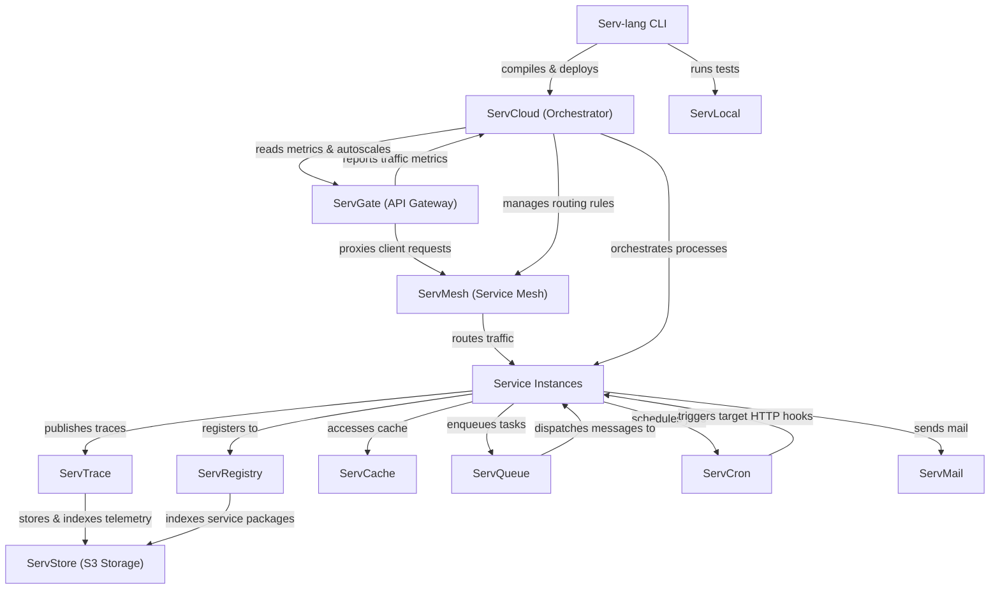

# Serv Unified Ecosystem Roadmap & Architect Analysis

> Single source of truth for the **Serv** ecosystem: Serv-lang, ServGate, ServStore, ServQueue, ServConsole, ServCache, ServMesh, ServCron, ServCloud, ServTrace, ServTunnel, ServAuth, ServPool, ServMail, ServFlow, and the Servverse vision.  

> Last updated: July 9, 2026

---

## Ecosystem Completion Status

All items in Phases 1 through 14 have been fully implemented, verified, and pushed.

- For completed details of Phases 1 to 5: Refer to the git history and repository CHANGELOG.

- For completed details of Phases 6 to 10: See [UNIFIED_ROADMAP_COMPLETED_6_10.md](file:///c:/Mine/try/serv/servverse-repo/UNIFIED_ROADMAP_COMPLETED_6_10.md).

- For completed details of Phases 11 to 15: See [UNIFIED_ROADMAP_COMPLETED_11_15.md](file:///c:/Mine/try/serv/servverse-repo/UNIFIED_ROADMAP_COMPLETED_11_15.md).

- For completed details of Phase 16-19: See [UNIFIED_ROADMAP_COMPLETED_16_20.md](file:///c:/Mine/try/serv/servverse-repo/UNIFIED_ROADMAP_COMPLETED_16_20.md).

- For completed details of Phase 31-35: See [UNIFIED_ROADMAP_COMPLETED_31_35.md](UNIFIED_ROADMAP_COMPLETED_31_35.md).

- For completed details of Phase 36-38: See [UNIFIED_ROADMAP_COMPLETED_36_40.md](UNIFIED_ROADMAP_COMPLETED_36_40.md).

- For completed details of Phase 71-75: See [UNIFIED_ROADMAP_COMPLETED_71_75.md](UNIFIED_ROADMAP_COMPLETED_71_75.md).

- For completed details of Phase 76-80: See [UNIFIED_ROADMAP_COMPLETED_76_80.md](UNIFIED_ROADMAP_COMPLETED_76_80.md).

### Completion Tracker

| Initiative Area | Total Items | Completed | Pending | Progress | Status Bar |

|-----------------|-------------|-----------|---------|----------|------------|

| **Phase 9: Scale & Enterprise Hardening** | 13 | 13 | 0 | **100%** | ████████████████████ |

| **Phase 10: Productization & Cloud PaaS** | 32 | 32 | 0 | **100%** | ████████████████████ |

| **Phase 11: Unified Dashboard & Console** | 33 | 33 | 0 | **100%** | ████████████████████ |

| **Phase 12: Dual-Licensing & EE Split** | 19 | 19 | 0 | **100%** | ████████████████████ |

| **Phase 13: Language & Runtime Evolution**| 18 | 18 | 0 | **100%** | ████████████████████ |

| **Phase 14: AI-Native Ecosystem** | 28 | 28 | 0 | **100%** | ████████████████████ |

| **Phase 16: Operational Hardening & Production Readiness** | 18 | 18 | 0 | **100%** | ████████████████████ |

| **Phase 17: Zero-Trust Clustering & Edge Serverless** | 8 | 8 | 0 | **100%** | ████████████████████ |

| **Phase 18: OSS-to-EE Boundary Alignment & Refactoring** | 6 | 6 | 0 | **100%** | ████████████████████ |

| **Phase 19: Component Maturity Alignment** | 7 | 7 | 0 | **100%** | ████████████████████ |

| **Phase 20: OSS-to-EE Refactoring & Enterprise Migrations** | 6 | 6 | 0 | **100%** | ████████████████████ |

| **Phase 21: Enterprise Ecosystem Scale & Next-Gen** | 6 | 6 | 0 | **100%** | ████████████████████ |

| **Phase 22: Quality, Credibility & Code Health** | 20 | 20 | 0 | **100%** | ████████████████████ |

| **Phase 23: Developer Adoption & Growth** | 14 | 11 | 3 | **79%** | ███████████████░░░░ |

| **Phase 24: Standalone Component Independence** | 20 | 16 | 4 | **80%** | ████████████████░░░░ |

| **Phase 25: Component Depth & Production Hardening** | 60 | 60 | 0 | **100%** | ████████████████████ |

| **Phase 26: Competitive Differentiation** | 107 | 107 | 0 | **100%** | ████████████████████ |

| **Phase 27: v1.0 Release Readiness** | 14 | 13 | 1 | **93%** | ██████████████████░░ |

| **Phase 28: Distribution & Installer Packaging** | 11 | 11 | 0 | **100%** |

| **Phase 29: LSP IntelliSense & Developer Tooling** | 16 | 16 | 0 | **100%** |

| **Phase 30: ServLock & ServSecret Hardening** | 10 | 10 | 0 | **100%** | ████████████████████ |

| **Phase 31: ServLock & ServSecret Ecosystem Integration** | 5 | 5 | 0 | **100%** | ████████████████████ |

| **Phase 32: ServLock & ServSecret Standalone & Hardening** | 8 | 8 | 0 | **100%** | ████████████████████ |

| **Phase 33: ServLock & ServSecret Advanced Capabilities** | 10 | 10 | 0 | **100%** | ████████████████████ |

| **Phase 34: ServLock & ServSecret Enterprise & UI** | 6 | 6 | 0 | **100%** | ████████████████████ |

| **Phase 35: Serv-lang Language Ergonomics** | 40 | 40 | 0 | **100%** | ████████████████████ |
| **Phase 39: ServQueue Embedded & OPFS Browser Queue** | 6 | 6 | 0 | **100%** | ████████████████████ |
| **Phase 40: ServQueue Browser WASM Hardening & Multi-Tab Resilience** | 6 | 6 | 0 | **100%** | ████████████████████ |
| **Phase 41: ServQueue Next-Gen Enterprise Stream Engine** | 8 | 8 | 0 | **100%** | ████████████████████ |
| **Phase 42: ServQueue Beyond-Enterprise Security & Sovereign Stream Engine** | 8 | 8 | 0 | **100%** | ████████████████████ |
| **Phase 43: ServQueue Standalone Distribution, Dual-CLI & ServConsole Suite** | 8 | 8 | 0 | **100%** | ████████████████████ |
| **Phase 44: ServQueue Cloud-Native Ecosystem & Enterprise Operations** | 8 | 8 | 0 | **100%** | ████████████████████ |
| **Phase 45: ServQueue Enterprise Commercial Feature Modularization & Build-Tag Gating** | 8 | 8 | 0 | **100%** | ████████████████████ |
| **Phase 46: ServGateway Standalone Distribution & Edge AI Processing** | 8 | 8 | 0 | **100%** | ████████████████████ |
| **Phase 47: ServGateway Sovereign Security, eBPF & Enterprise Ops** | 5 | 5 | 0 | **100%** | ████████████████████ |
| **Phase 74: Developer Adoption & High-Impact Differentiators** | 17 | 17 | 0 | **100%** | ████████████████████ |
| **Phase 75: Production Hardening & Scale Bottleneck Fixes** | 12 | 12 | 0 | **100%** | ████████████████████ |
| **Phase 76: Serv-lang Compiler & Developer Experience Hardening** | 10 | 10 | 0 | **100%** | ████████████████████ |
| **Phase 51: ServStore Instant Copy-on-Write (CoW) Bucket Branching** | 5 | 5 | 0 | **100%** | ████████████████████ |
| **Phase 52: ServStore Browser WebTorrent P2P Asset Seeding & OPFS Sharing** | 5 | 5 | 0 | **100%** | ████████████████████ |
| **Phase 53: ServStore S3 Select Engine, Multi-Cloud Tiering & Interactive Console UI** | 5 | 5 | 0 | **100%** | ████████████████████ |
| **Phase 54: ServStore Enterprise Multi-Cloud Lifecycle & Sovereign Archiving** | 5 | 5 | 0 | **100%** | ████████████████████ |
| **Phase 55: ServGateway WASM Plugin Hot-Reload Registry, GraphQL Federation & WAF** | 5 | 5 | 0 | **100%** | ████████████████████ |
| **Phase 56: ServGateway Enterprise WAF, Remote WASM Sync & OAuth2 Engine** | 5 | 5 | 0 | **100%** | ████████████████████ |

| **Phase 57: ServAuth — Session Management, Passkeys & Adaptive MFA** | 6 | 6 | 0 | **100%** | ████████████████████ |
| **Phase 58: ServCache — Distributed Cluster Mode, Bloom Filters & Tiered TTL** | 6 | 6 | 0 | **100%** | ████████████████████ |
| **Phase 59: ServCron — DAG Job Chaining, Retry Policies & Cron-as-Code** | 6 | 6 | 0 | **100%** | ████████████████████ |
| **Phase 60: ServFlow — Visual Workflow Designer, WASM Step Functions & Human Tasks** | 6 | 5 | 1 | **83%** | ████████████████░░░░ |
| **Phase 61: ServMesh — WireGuard Overlay, mTLS Identity & Adaptive Load Balancing** | 6 | 0 | 6 | **0%** | ░░░░░░░░░░░░░░░░░░░░ |
| **Phase 62: ServCloud — Blue/Green Deploys, Preview URLs & Container Isolation** | 6 | 0 | 6 | **0%** | ░░░░░░░░░░░░░░░░░░░░ |
| **Phase 63: ServTrace — eBPF Continuous Profiling, Flamegraphs & SLO Burn Alerts** | 6 | 0 | 6 | **0%** | ░░░░░░░░░░░░░░░░░░░░ |
| **Phase 64: ServMail — DMARC Enforcement, Inbound Webhooks & Email Template DSL** | 6 | 0 | 6 | **0%** | ░░░░░░░░░░░░░░░░░░░░ |
| **Phase 65: ServPool — Adaptive Scaling, Read-Replica Routing & Connection Health** | 6 | 2 | 4 | **33%** | ███████░░░░░░░░░░░░░ |
| **Phase 66: ServTunnel — WebSocket Multiplexing, Replay Inspector & Auth Gating** | 6 | 0 | 6 | **0%** | ░░░░░░░░░░░░░░░░░░░░ |
| **Phase 67: Serv-lang — Rust & Python Code-Gen Targets & WASM Browser Playground** | 6 | 0 | 6 | **0%** | ░░░░░░░░░░░░░░░░░░░░ |
| **Phase 68: ServGateway — Native MCP Tool Registry & AI Agent Routing** | 6 | 6 | 0 | **100%** | ████████████████████ |
| **Phase 69: ServStore — Native HNSW Vector Index & Semantic Object Search** | 6 | 6 | 0 | **100%** | ████████████████████ |
| **Phase 70: ServConsole — eBPF Flamegraph Profiler, Chaos Engine & Unified AI Assistant** | 6 | 0 | 6 | **0%** | ░░░░░░░░░░░░░░░░░░░░ |
| **Phase 71: ServQueue — Schema Registry, Dead Letter Replay UI & Consumer Group Dashboard** | 6 | 2 | 4 | **33%** | ███████░░░░░░░░░░░░░ |
| **Phase 72: Unified Platform — Single-Binary `servd`, WireGuard Mesh & Chaos Injection Engine** | 6 | 6 | 0 | **100%** | ████████████████████ |
| **Phase 73: VS Code Extension — Modern Ecosystem Alignment** | 7 | 7 | 0 | **100%** | ████████████████████ |
| **Phase 77: End-to-End Integration Testing & Conformance Suites** | 6 | 0 | 6 | **0%** | ░░░░░░░░░░░░░░░░░░░░ |
| **Phase 78: Third-Party Ecosystem Integrations & Connectors** | 6 | 0 | 6 | **0%** | ░░░░░░░░░░░░░░░░░░░░ |
| **Phase 79: Developer Experience Polish & Onboarding Automation** | 6 | 0 | 6 | **0%** | ░░░░░░░░░░░░░░░░░░░░ |
| **Phase 80: Go-to-Market Readiness & Community Foundation** | 6 | 0 | 6 | **0%** | ░░░░░░░░░░░░░░░░░░░░ |

| **TOTAL ECOSYSTEM WORK** | **719** | **693** | **26** | **96%** | ███████████████████░ |

---

## Phase 15: Component Backlog & Future Enhancements (Completed)

All backlog and component enhancement items for Phase 15 have been fully completed, verified, and pushed.

- For completed details of Phase 15: See [UNIFIED_ROADMAP_COMPLETED_11_15.md](file:///c:/Mine/try/serv/servverse-repo/UNIFIED_ROADMAP_COMPLETED_11_15.md).

---

## Appendix A: Cross-Service Runtime Dependency Diagram

---

## Appendix B: Component Maturity Matrix

> Updated July 14, 2026 � based on actual code metrics (test counts, pkg structure, standalone flags, EE gating, main.go line counts).

| Component | Tests | Code Structure | Security | Observability | Standalone | EE Gated | Overall |

|-----------|-------|----------------|----------|---------------|-----------|----------|---------|

| **Serv-lang** | ?? 112 funcs | ?? compiler/, runtime/, lsp/, stdlib/ | ?? Null safety, type checking | ?? OTel codegen | ? N/A | ? N/A | **Production** |

| **ServStore** | ?? 93 funcs | ?? cmd/ + 11 packages | ?? SigV4 + TLS + OIDC + LDAP | ?? OTel + slog | ?? A+ Zero-config | ? Federation + cold tier | **Production** |

| **ServGate** | ?? 50 funcs | ?? 3 packages (proxy, wasm, otel) | ?? JWT + mTLS + ACME + policy | ?? OTel + access logs | ?? A- config.json | ? AI cache + LLM routing | **Production** |

| **ServConsole** | ?? 56 funcs | ?? 12 packages | ?? OIDC + RBAC + JWT | ?? OTel | ? Aggregator | ? SLO, cost, runbooks, exec | **Production** |

| **ServCache** | ?? 46 funcs | ?? 3 packages | ?? Token auth | ?? OTel | ?? A Standalone flag | ? Namespace isolation | **Production** |

| **ServFlow** | ?? 43 funcs | ?? 3 packages (engine, handlers, storage) | ?? JWT | ?? OTel | ?? A Standalone flag | ? Saga hooks | **Production** |

| **ServPool** | ?? 40 funcs | ?? 4 packages | ?? JWT | ?? OTel | ?? B+ docs only | ? N/A | **Production** |

| **ServMesh** | ?? 37 funcs | ?? 7 packages | ?? mTLS + JWT + auto-rotate | ?? OTel | ?? B+ needs services | ? N/A | **Production** |

| **ServTunnel** | ?? 37 funcs | ?? 6 packages | ?? TLS + token + rate limit | ?? OTel | ?? A- generic tunnel | ? Federation | **Production** |

| **ServQueue** | ?? 36 funcs | ?? 5 packages | ?? TLS + STOMP auth | ?? OTel + spans | ?? A Zero-config | ? Federation + semantic route | **Production** |

| **ServMail** | ?? 34 funcs | ?? 5 packages | ?? JWT | ?? OTel | ?? A Standalone flag | ? N/A | **Production** |

| **ServDocs** | ?? 34 funcs | ?? 3 packages (generator, openapi, parser) | ? N/A | ? N/A | ?? B+ .srv-specific | ? N/A | **Stable** |

| **ServCloud** | ?? 31 funcs | ?? 3 packages | ?? JWT | ?? OTel | ?? B Serv-specific | ? Autoscale | **Stable** |

| **ServShared** | ?? 30 funcs | ?? 4 packages (datafabric, middleware, outbox, policy) | ?? JWT + mTLS + tenant | ?? OTel init | ? Library | ? Tenant isolation | **Production** |

| **ServTrace** | ?? 17 funcs | ?? 2 packages | ?? Basic auth | ?? Self-traces | ?? A- OTLP collector | ? Cold tier, NL, anomaly | **Stable** |

| **ServAuth** | ?? 16 funcs | ?? 6 packages | ?? bcrypt + AES + MFA + OIDC | ?? OTel | ?? B No standalone flag | ? Stuffing detection | **Stable** |

| **ServCron** | ?? 13 funcs | ?? 3 packages | ?? JWT + Redis lease | ?? OTel | ?? A Standalone flag | ? N/A | **Stable** |

| **ServRegistry** | ?? 12 funcs | ?? 4 packages (registry, resolution, signing, web) | ?? JWT + crypto signing | ?? OTel | ?? B+ Standalone flag | ? N/A | **Stable** |

| **ServLock** | ?? 2 funcs | ?? 2 packages (handlers, storage) | ?? JWT | ?? Basic | ?? B+ Embedded | ? N/A | **Beta** |
| **ServSecret** | ?? 2 funcs | ?? 2 packages (handlers, storage) | ?? AES-GCM + JWT | ?? Basic | ?? B+ Standalone | ? N/A | **Beta** |

### Summary

| Rating | Count | Components |

|--------|-------|-----------|

| **Production** | 13 | Serv-lang, ServStore, ServGate, ServConsole, ServCache, ServFlow, ServPool, ServMesh, ServTunnel, ServQueue, ServMail, ServShared |

| **Stable** | 6 | ServDocs, ServCloud, ServTrace, ServAuth, ServCron, ServRegistry |

| **Beta** | 2 | ServLock, ServSecret |

**Legend:** ?? Strong | ?? Adequate | ?? Needs work | ? Not applicable | ? EE features gated

---

## Phase 16: Operational Hardening & Production Readiness (Completed)

All backlog tasks for Phase 16 have been fully completed, verified, and archived.

- For completed details of Phase 16: See [UNIFIED_ROADMAP_COMPLETED_16_20.md](file:///c:/Mine/try/serv/servverse-repo/UNIFIED_ROADMAP_COMPLETED_16_20.md).

---

## Phase 17: Zero-Trust Clustering & Edge Serverless Evolution (Completed)

All backlog tasks for Phase 17 have been fully completed, verified, and archived.

- For completed details of Phase 17: See [UNIFIED_ROADMAP_COMPLETED_16_20.md](file:///c:/Mine/try/serv/servverse-repo/UNIFIED_ROADMAP_COMPLETED_16_20.md).

---

## Phase 18: OSS-to-EE Boundary Alignment & Refactoring (Completed)

All backlog tasks for Phase 18 have been fully completed, verified, and archived.

- For completed details of Phase 18: See [UNIFIED_ROADMAP_COMPLETED_16_20.md](file:///c:/Mine/try/serv/servverse-repo/UNIFIED_ROADMAP_COMPLETED_16_20.md).

---

## Phase 19: Component Maturity Alignment (Completed)

All backlog tasks for Phase 19 have been fully completed, verified, and archived.

- For completed details of Phase 19: See [UNIFIED_ROADMAP_COMPLETED_16_20.md](file:///c:/Mine/try/serv/servverse-repo/UNIFIED_ROADMAP_COMPLETED_16_20.md).

---

## Phase 20: OSS-to-EE Refactoring & Enterprise Migrations (Completed)

All backlog tasks for Phase 20 have been fully completed, verified, and archived.

- For completed details of Phase 20: See [UNIFIED_ROADMAP_COMPLETED_16_20.md](file:///c:/Mine/try/serv/servverse-repo/UNIFIED_ROADMAP_COMPLETED_16_20.md).

## Phase 21: Enterprise Ecosystem Scale & Next-Gen Capabilities (Completed)

All backlog tasks for Phase 21 have been fully completed, verified, and archived.

- For completed details of Phase 21: See [UNIFIED_ROADMAP_COMPLETED_21_25.md](file:///c:/Mine/try/serv/servverse-repo/UNIFIED_ROADMAP_COMPLETED_21_25.md).

## Phase 22: Quality, Credibility & Code Health (Completed)

All backlog tasks for Phase 22 have been fully completed, verified, and archived.

- For completed details of Phase 22: See [UNIFIED_ROADMAP_COMPLETED_21_25.md](file:///c:/Mine/try/serv/servverse-repo/UNIFIED_ROADMAP_COMPLETED_21_25.md).

## Phase 23: Developer Adoption & Growth (Pending)

> **Context:** The platform is feature-complete but has zero external users. This phase focuses on removing friction, building community, and proving production-readiness.

- For completed details of Phase 23: See [UNIFIED_ROADMAP_COMPLETED_21_25.md](file:///F:/Don/servverse/servverse/UNIFIED_ROADMAP_COMPLETED_21_25.md).

### Pending / Deferred Items

| # | Item | Component | Description | Status |
|---|------|-----------|-------------|--------|
| AG.4 | **10-minute demo video** | servverse-repo | Screen recording: install → write service → deploy → observe in console. Hosted on YouTube + embedded in GitHub Pages | [Deferred] |
| AG.5 | **Discord/community server** | - | Developer community for questions, showcases, and contributors | [Deferred] |
| AG.12 | **Customer pilot program** | - | Find 2-3 teams to run in staging. Gather real feedback on DX, performance, gaps | [Deferred] |

## Phase 24: Standalone Component Independence (Completed)

All backlog tasks for Phase 24 have been fully completed, verified, and archived.

- For completed details of Phase 24: See [UNIFIED_ROADMAP_COMPLETED_21_25.md](file:///c:/Mine/try/serv/servverse-repo/UNIFIED_ROADMAP_COMPLETED_21_25.md).

---

## Phase 24.1: Standalone Hardening to A+ (Completed)

All backlog tasks for Phase 24.1 have been fully completed, verified, and archived.
- For completed details of Phase 24.1: See [UNIFIED_ROADMAP_COMPLETED_21_25.md](file:///F:/Don/servverse/servverse/UNIFIED_ROADMAP_COMPLETED_21_25.md).

---

## Phase 25: Component Depth & Production Hardening (Completed)

All backlog tasks for Phase 25 (D.1 - D.60) have been fully completed, verified, and archived.

- For completed details of Phase 25: See [UNIFIED_ROADMAP_COMPLETED_21_25.md](file:///c:/Mine/try/serv/servverse-repo/UNIFIED_ROADMAP_COMPLETED_21_25.md).

---

## Phase 26: Competitive Differentiation (Completed)

All backlog tasks for Phase 26 have been fully completed, verified, and archived.
- For completed details of Phase 26: See [UNIFIED_ROADMAP_COMPLETED_26_30.md](file:///F:/Don/servverse/servverse/UNIFIED_ROADMAP_COMPLETED_26_30.md).

## Phase 27: v1.0 Release Readiness (Pending)

> **Goal:** Close the consistency gaps identified in the API maturity audit. These are mechanical fixes (not design changes) required to confidently tag v1.0.0.

- For completed details of Phase 27: See [UNIFIED_ROADMAP_COMPLETED_26_30.md](file:///F:/Don/servverse/servverse/UNIFIED_ROADMAP_COMPLETED_26_30.md).

### Pending / Deferred Items

| # | Item | Description | Status |
|---|------|-------------|--------|
| V1.9 | **API freeze period** | 4 weeks with zero breaking changes after all V1.1-V1.6 are done. Monitor for issues | [Deferred] |

## Phase 28: Distribution & Installer Packaging (Completed)

All backlog tasks for Phase 28 have been fully completed, verified, and archived.

- For completed details of Phase 28: See [UNIFIED_ROADMAP_COMPLETED_26_30.md](file:///F:/Don/servverse/servverse/UNIFIED_ROADMAP_COMPLETED_26_30.md).

## Phase 29: LSP IntelliSense & Developer Tooling (Completed)

All backlog tasks for Phase 29 have been fully completed, verified, and archived.

- For completed details of Phase 29: See [UNIFIED_ROADMAP_COMPLETED_26_30.md](file:///F:/Don/servverse/servverse/UNIFIED_ROADMAP_COMPLETED_26_30.md).

## Phase 30: ServLock & ServSecret Hardening (Completed)

All backlog tasks for Phase 30 have been fully completed, verified, and archived.

- For completed details of Phase 30: See [UNIFIED_ROADMAP_COMPLETED_26_30.md](file:///F:/Don/servverse/servverse/UNIFIED_ROADMAP_COMPLETED_26_30.md).

## Phase 31: ServLock & ServSecret Ecosystem Integration (Completed)

All backlog tasks for Phase 31 have been fully completed, verified, and archived.

- For completed details of Phase 31: See [UNIFIED_ROADMAP_COMPLETED_31_35.md](file:///F:/Don/servverse/servverse/UNIFIED_ROADMAP_COMPLETED_31_35.md).

## Phase 32: ServLock & ServSecret Standalone & Hardening (Completed)

All backlog tasks for Phase 32 have been fully completed, verified, and archived.

- For completed details of Phase 32: See [UNIFIED_ROADMAP_COMPLETED_31_35.md](file:///F:/Don/servverse/servverse/UNIFIED_ROADMAP_COMPLETED_31_35.md).

## Phase 33: ServLock & ServSecret Advanced Capabilities (Completed)

All backlog tasks for Phase 33 have been fully completed, verified, and archived.

- For completed details of Phase 33: See [UNIFIED_ROADMAP_COMPLETED_31_35.md](file:///F:/Don/servverse/servverse/UNIFIED_ROADMAP_COMPLETED_31_35.md).

## Phase 34: ServLock & ServSecret Enterprise & UI (Completed)

All backlog tasks for Phase 34 have been fully completed, verified, and archived.

- For completed details of Phase 31-35: See [UNIFIED_ROADMAP_COMPLETED_31_35.md](UNIFIED_ROADMAP_COMPLETED_31_35.md).

- For completed details of Phase 36-38: See [UNIFIED_ROADMAP_COMPLETED_36_40.md](UNIFIED_ROADMAP_COMPLETED_36_40.md).

---

## Phase 36: Component Maturity & Ecosystem Security (Completed)

All backlog tasks for Phase 36 have been fully completed, verified, and archived.
- For completed details of Phase 36: See [UNIFIED_ROADMAP_COMPLETED_36_40.md](UNIFIED_ROADMAP_COMPLETED_36_40.md).

## Phase 37: Serv-lang Niche Positioning & DX Evolution (Completed)

All backlog tasks for Phase 37 have been fully completed, verified, and archived.
- For completed details of Phase 37: See [UNIFIED_ROADMAP_COMPLETED_36_40.md](UNIFIED_ROADMAP_COMPLETED_36_40.md).

## Phase 38: WASM Plugin Ecosystem & Community Repository (Completed)

All backlog tasks for Phase 38 have been fully completed, verified, and archived.
- For completed details of Phase 38: See [UNIFIED_ROADMAP_COMPLETED_36_40.md](UNIFIED_ROADMAP_COMPLETED_36_40.md).

---

## Phase 39: ServQueue Embedded & OPFS Browser Event Streaming (Completed)

All backlog tasks for Phase 39 have been fully completed, verified, and archived.
- For completed details of Phase 39: See [UNIFIED_ROADMAP_COMPLETED_36_40.md](UNIFIED_ROADMAP_COMPLETED_36_40.md).

---

## Phase 40: ServQueue Browser WASM Hardening & Multi-Tab Resilience (Completed)

All backlog tasks for Phase 40 have been fully completed, verified, and archived.
- For completed details of Phase 40: See [UNIFIED_ROADMAP_COMPLETED_36_40.md](UNIFIED_ROADMAP_COMPLETED_36_40.md).

---

## Phase 41: ServQueue Next-Gen Enterprise Stream Engine (Completed)

All backlog tasks for Phase 41 have been fully completed, verified, and archived.
- For completed details of Phase 41: See [UNIFIED_ROADMAP_COMPLETED_41_45.md](UNIFIED_ROADMAP_COMPLETED_41_45.md).

---

## Phase 42: ServQueue Beyond-Enterprise Security & Sovereign Stream Engine (Completed)

All backlog tasks for Phase 42 have been fully completed, verified, and archived.
- For completed details of Phase 42: See [UNIFIED_ROADMAP_COMPLETED_41_45.md](UNIFIED_ROADMAP_COMPLETED_41_45.md).

---

## Phase 43: ServQueue Standalone Distribution, Dual-CLI & ServConsole Suite (Completed)

All backlog tasks for Phase 43 have been fully completed, verified, and archived.
- For completed details of Phase 43: See [UNIFIED_ROADMAP_COMPLETED_41_45.md](UNIFIED_ROADMAP_COMPLETED_41_45.md).

---

## Phase 44: ServQueue Cloud-Native Ecosystem & Enterprise Operations (Completed)

All backlog tasks for Phase 44 have been fully completed, verified, and archived.
- For completed details of Phase 44: See [UNIFIED_ROADMAP_COMPLETED_41_45.md](UNIFIED_ROADMAP_COMPLETED_41_45.md).

---

---

## Phase 57: (Completed)

All backlog tasks for Phase 57 have been fully completed, verified, and archived.
- For completed details of Phase 57: See [UNIFIED_ROADMAP_COMPLETED_56_60.md](UNIFIED_ROADMAP_COMPLETED_56_60.md).

---
## Phase 58: (Completed)

All backlog tasks for Phase 58 have been fully completed, verified, and archived.
- For completed details of Phase 58: See [UNIFIED_ROADMAP_COMPLETED_56_60.md](UNIFIED_ROADMAP_COMPLETED_56_60.md).

---
## Phase 60: (Completed)

All backlog tasks for Phase 60 have been fully completed, verified, and archived.
- For completed details of Phase 60: See [UNIFIED_ROADMAP_COMPLETED_56_60.md](UNIFIED_ROADMAP_COMPLETED_56_60.md).

---
## Phase 61: (Completed)

All backlog tasks for Phase 61 have been fully completed, verified, and archived.
- For completed details of Phase 61: See [UNIFIED_ROADMAP_COMPLETED_61_65.md](UNIFIED_ROADMAP_COMPLETED_61_65.md).

---
## Phase 62: (Completed)

All backlog tasks for Phase 62 have been fully completed, verified, and archived.
- For completed details of Phase 62: See [UNIFIED_ROADMAP_COMPLETED_61_65.md](UNIFIED_ROADMAP_COMPLETED_61_65.md).

---
## Phase 63: (Completed)

All backlog tasks for Phase 63 have been fully completed, verified, and archived.
- For completed details of Phase 63: See [UNIFIED_ROADMAP_COMPLETED_61_65.md](UNIFIED_ROADMAP_COMPLETED_61_65.md).

---
## Phase 66: (Completed)

All backlog tasks for Phase 66 have been fully completed, verified, and archived.
- For completed details of Phase 66: See [UNIFIED_ROADMAP_COMPLETED_66_70.md](UNIFIED_ROADMAP_COMPLETED_66_70.md).

---
## Phase 68: (Completed)

All backlog tasks for Phase 68 have been fully completed, verified, and archived.
- For completed details of Phase 68: See [UNIFIED_ROADMAP_COMPLETED_66_70.md](UNIFIED_ROADMAP_COMPLETED_66_70.md).

---
## Phase 70: (Completed)

All backlog tasks for Phase 70 have been fully completed, verified, and archived.
- For completed details of Phase 70: See [UNIFIED_ROADMAP_COMPLETED_66_70.md](UNIFIED_ROADMAP_COMPLETED_66_70.md).

---
## Phase 72: (Completed)

All backlog tasks for Phase 72 have been fully completed, verified, and archived.
- For completed details of Phase 72: See [UNIFIED_ROADMAP_COMPLETED_71_75.md](UNIFIED_ROADMAP_COMPLETED_71_75.md).

---
## Phase 73: (Completed)

All backlog tasks for Phase 73 have been fully completed, verified, and archived.
- For completed details of Phase 73: See [UNIFIED_ROADMAP_COMPLETED_71_75.md](UNIFIED_ROADMAP_COMPLETED_71_75.md).

---
## Phase 74: (Completed)

All backlog tasks for Phase 74 have been fully completed, verified, and archived.
- For completed details of Phase 74: See [UNIFIED_ROADMAP_COMPLETED_71_75.md](UNIFIED_ROADMAP_COMPLETED_71_75.md).

---
## Phase 75: (Completed)

All backlog tasks for Phase 75 have been fully completed, verified, and archived.
- For completed details of Phase 75: See [UNIFIED_ROADMAP_COMPLETED_71_75.md](UNIFIED_ROADMAP_COMPLETED_71_75.md).

---
## Phase 76: (Completed)

All backlog tasks for Phase 76 have been fully completed, verified, and archived.
- For completed details of Phase 76: See [UNIFIED_ROADMAP_COMPLETED_76_80.md](UNIFIED_ROADMAP_COMPLETED_76_80.md).

---

## Phase 77: End-to-End Integration Testing & Conformance Suites (Planned)

> **Goal**: Prove the system works as advertised with automated conformance tests that run in CI and produce publishable badges.

| # | Item | Component | Description | Status | Tier |
|---|------|-----------|-------------|--------|:---:|
| IT.1 | **S3 Conformance Test Suite (Mint-compatible)** | ServStore | Run the open-source Mint S3 conformance suite against ServStore. Publish pass rate as CI badge. Target: 90%+ pass rate. | [ ] | OSS |
| IT.2 | **Cross-Component Integration Test Harness** | servverse-repo | Automated test that starts all 15 services via `servverse up`, runs a full user journey (deploy `.srv` app → hit API → see trace → check queue → verify cache), assert all pass. Run in CI on every push. | [ ] | OSS |
| IT.3 | **STOMP/Kafka/MQTT Protocol Conformance Tests** | ServQueue | Run standard protocol test suites: Apache ActiveMQ STOMP tests, Kafka protocol decoder tests, Eclipse Paho MQTT test suite. Publish conformance percentages. | [ ] | OSS |
| IT.4 | **Load Test Baseline with Published Results** | ServStore, ServGate, ServQueue | Run `servstore bench`, `servgate` performance tests, `servqueue benchmark` in CI. Publish baseline numbers in README badges. Detect regressions automatically. | [ ] | OSS |
| IT.5 | **Upgrade Path Smoke Test (v0.x → v1.0 data migration)** | All | Automated test: create data with current version, upgrade binary to next version, verify data still accessible. Catches breaking changes in storage format. | [ ] | OSS |
| IT.6 | **Chaos Engineering Regression Suite** | ServConsole, ServMesh | Inject network partitions, kill random services, verify the system recovers within SLA. Run weekly in CI. Publish mean-time-to-recovery. | [ ] | OSS |

---

## Phase 78: Third-Party Ecosystem Integrations & Connectors (Planned)

> **Goal**: Make Servverse work with existing tools, not just instead of them. Reduce switching cost.

| # | Item | Component | Description | Status | Tier |
|---|------|-----------|-------------|--------|:---:|
| EC.1 | **Terraform Provider for Servverse** | servverse-repo | `terraform-provider-servverse` enabling declarative management of buckets, topics, routes, cron jobs, and workflow definitions. Publish on Terraform Registry. | [ ] | OSS |
| EC.2 | **Prometheus Remote Write Receiver in ServTrace** | ServTrace | Accept Prometheus `remote_write` protocol — lets existing Prometheus scrapers forward metrics to ServTrace without changing their config. | [ ] | OSS |
| EC.3 | **Grafana Data Source Plugin** | ServTrace, ServQueue | Grafana plugin that queries ServTrace spans and ServQueue metrics natively. Users keep Grafana as their dashboard but backed by Servverse telemetry. | [ ] | OSS |
| EC.4 | **GitHub Actions for Serv Deployments** | servverse-repo | `servverse/deploy-action@v1` — CI action that builds a `.srv` app, pushes to ServRegistry, and triggers blue/green deploy on ServCloud. Publish on GitHub Marketplace. | [ ] | OSS |
| EC.5 | **OpenTelemetry Collector Exporter** | ServTrace | Implement an OTel Collector exporter so teams using the standard OTel Collector can route traces/metrics to ServTrace without code changes. | [ ] | OSS |
| EC.6 | **VS Code Dev Container + Codespaces Template** | servverse-repo | One-click GitHub Codespaces template: opens with Servverse pre-installed, sample app deployed, ServConsole accessible in forwarded port. Zero-install evaluation. | [ ] | OSS |

---

## Phase 79: Developer Experience Polish & Onboarding Automation (Planned)

> **Goal**: Make the first 5 minutes frictionless for someone who's never seen Servverse.

| # | Item | Component | Description | Status | Tier |
|---|------|-----------|-------------|--------|:---:|
| DX.1 | **Interactive CLI Wizard (`servverse quickstart`)** | servverse-repo | Guided setup: asks what you need (API + DB? Queue? Auth?), generates minimal config, starts only required services. Like `npm init` for infrastructure. | [ ] | OSS |
| DX.2 | **serv playground hosted at `playground.servverse.dev`** | Serv-lang | Zero-install browser IDE showing: editor (left), generated Go (center), running output (right). Pre-loaded with 5 example templates. Share button generates URL. | [ ] | OSS |
| DX.3 | **Unified Error Code Registry with Fix Suggestions** | All | Every error across all services gets a unique code (SRV-E001 through SRV-E999). CLI shows Error `SRV-E042`: see `https://docs.servverse.dev/errors/SRV-E042` with fix steps. | [ ] | OSS |
| DX.4 | **`servverse doctor` Health Diagnostic** | servverse-repo | Single command that checks: Go version, port availability, disk space, Docker running, all binaries present, config valid. Outputs pass/fail with fix suggestions. | [ ] | OSS |
| DX.5 | **Auto-Generated CLI Reference Docs from Source** | All | `go generate` step that produces markdown CLI reference from flag definitions. Published at `docs.servverse.dev/cli`. Always current. | [ ] | OSS |
| DX.6 | **`serv create my-api --template rest+auth+queue`** | Serv-lang | Scaffold generator: creates a project with sensible defaults for common patterns (REST API, background worker, webhook processor, full-stack). Like `rails new`. | [ ] | OSS |

---

## Phase 80: Go-to-Market Readiness & Community Foundation (Planned)

> **Goal**: Everything a potential adopter needs to evaluate, trust, and adopt Servverse.

| # | Item | Component | Description | Status | Tier |
|---|------|-----------|-------------|--------|:---:|
| GTM.1 | **10-Minute Demo Video (YouTube + GitHub Pages embed)** | servverse-repo | Screen recording: install (scoop/brew) → `serv create task-api` → add route → `servverse up` → hit API → see trace in console → deploy to ServCloud. Professional narration. | [ ] | — |
| GTM.2 | **Comparison Landing Pages** | servverse-repo | "ServStore vs MinIO", "ServGate vs Kong", "ServQueue vs RabbitMQ" — honest feature matrices showing where Servverse wins (simplicity, unified) and loses (raw throughput, community size). | [ ] | — |
| GTM.3 | **Public Roadmap Board (GitHub Projects or Linear)** | servverse-repo | Transparent roadmap where users can vote on features, see what's next, and understand release cadence. Builds trust. | [ ] | — |
| GTM.4 | **"Built with Servverse" Showcase Gallery** | servverse-repo | Page showing 3-5 real applications built on Servverse (even your own internal tools count). Each with architecture diagram, lines of code, and deployment stats. | [ ] | — |
| GTM.5 | **Discord Community Launch** | — | Create Discord with channels: `#general`, `#help`, `#showcase`, `#contributors`, `#releases`. Bot that posts new releases automatically. Pin the quickstart guide. | [ ] | — |
| GTM.6 | **Show HN + r/selfhosted + r/golang Launch Posts** | — | Craft a compelling "Show HN" title: *"Serv – A unified backend platform (API gateway + S3 store + message queue + auth + 10 more) in one Go binary."* Time for a weekday morning. | [ ] | — |

---
