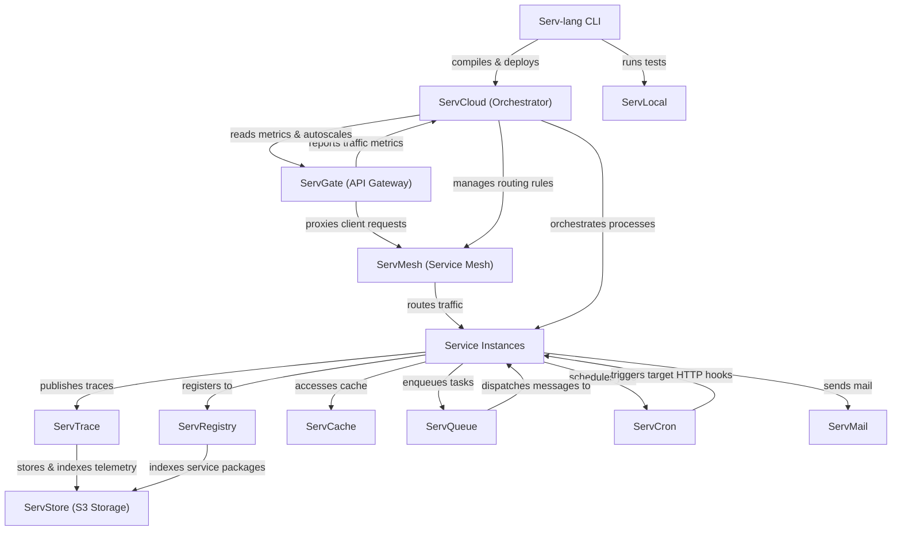

# Serv Unified Ecosystem Roadmap & Architect Analysis

> Single source of truth for the **Serv** ecosystem: Serv-lang, ServGate, ServStore, ServQueue, ServConsole, ServCache, ServMesh, ServCron, ServCloud, ServTrace, ServTunnel, ServAuth, ServPool, ServMail, ServFlow, and the Servverse vision.  

> Last updated: July 9, 2026

---

## Ecosystem Completion Status

All items in Phases 1 through 14 have been fully implemented, verified, and pushed.

- For completed details of Phases 1 to 5: Refer to the git history and repository CHANGELOG.

- For completed details of Phases 6 to 10: See [UNIFIED_ROADMAP_COMPLETED_6_10.md](file:///c:/Mine/try/serv/servverse-repo/UNIFIED_ROADMAP_COMPLETED_6_10.md).

- For completed details of Phases 11 to 15: See [UNIFIED_ROADMAP_COMPLETED_11_15.md](file:///c:/Mine/try/serv/servverse-repo/UNIFIED_ROADMAP_COMPLETED_11_15.md).

- For completed details of Phase 16-19: See [UNIFIED_ROADMAP_COMPLETED_16_20.md](file:///c:/Mine/try/serv/servverse-repo/UNIFIED_ROADMAP_COMPLETED_16_20.md).

- For completed details of Phase 31-35: See [UNIFIED_ROADMAP_COMPLETED_31_35.md](UNIFIED_ROADMAP_COMPLETED_31_35.md).

- For completed details of Phase 36-38: See [UNIFIED_ROADMAP_COMPLETED_36_40.md](UNIFIED_ROADMAP_COMPLETED_36_40.md).

### Completion Tracker

| Initiative Area | Total Items | Completed | Pending | Progress | Status Bar |

|-----------------|-------------|-----------|---------|----------|------------|

| **Phase 9: Scale & Enterprise Hardening** | 13 | 13 | 0 | **100%** | ████████████████████ |

| **Phase 10: Productization & Cloud PaaS** | 32 | 32 | 0 | **100%** | ████████████████████ |

| **Phase 11: Unified Dashboard & Console** | 33 | 33 | 0 | **100%** | ████████████████████ |

| **Phase 12: Dual-Licensing & EE Split** | 19 | 19 | 0 | **100%** | ████████████████████ |

| **Phase 13: Language & Runtime Evolution**| 18 | 18 | 0 | **100%** | ████████████████████ |

| **Phase 14: AI-Native Ecosystem** | 28 | 28 | 0 | **100%** | ████████████████████ |

| **Phase 16: Operational Hardening & Production Readiness** | 18 | 18 | 0 | **100%** | ████████████████████ |

| **Phase 17: Zero-Trust Clustering & Edge Serverless** | 8 | 8 | 0 | **100%** | ████████████████████ |

| **Phase 18: OSS-to-EE Boundary Alignment & Refactoring** | 6 | 6 | 0 | **100%** | ████████████████████ |

| **Phase 19: Component Maturity Alignment** | 7 | 7 | 0 | **100%** | ████████████████████ |

| **Phase 20: OSS-to-EE Refactoring & Enterprise Migrations** | 6 | 6 | 0 | **100%** | ████████████████████ |

| **Phase 21: Enterprise Ecosystem Scale & Next-Gen** | 6 | 6 | 0 | **100%** | ████████████████████ |

| **Phase 22: Quality, Credibility & Code Health** | 20 | 20 | 0 | **100%** | ████████████████████ |

| **Phase 23: Developer Adoption & Growth** | 14 | 11 | 3 | **79%** | ███████████████░░░░ |

| **Phase 24: Standalone Component Independence** | 20 | 16 | 4 | **80%** | ████████████████░░░░ |

| **Phase 25: Component Depth & Production Hardening** | 60 | 60 | 0 | **100%** | ████████████████████ |

| **Phase 26: Competitive Differentiation** | 107 | 107 | 0 | **100%** | ████████████████████ |

| **Phase 27: v1.0 Release Readiness** | 14 | 13 | 1 | **93%** | ██████████████████░░ |

| **Phase 28: Distribution & Installer Packaging** | 11 | 11 | 0 | **100%** |

| **Phase 29: LSP IntelliSense & Developer Tooling** | 16 | 16 | 0 | **100%** |

| **Phase 30: ServLock & ServSecret Hardening** | 10 | 10 | 0 | **100%** | ████████████████████ |

| **Phase 31: ServLock & ServSecret Ecosystem Integration** | 5 | 5 | 0 | **100%** | ████████████████████ |

| **Phase 32: ServLock & ServSecret Standalone & Hardening** | 8 | 8 | 0 | **100%** | ████████████████████ |

| **Phase 33: ServLock & ServSecret Advanced Capabilities** | 10 | 10 | 0 | **100%** | ████████████████████ |

| **Phase 34: ServLock & ServSecret Enterprise & UI** | 6 | 6 | 0 | **100%** | ████████████████████ |

| **Phase 35: Serv-lang Language Ergonomics** | 40 | 40 | 0 | **100%** | ████████████████████ |
| **Phase 39: ServQueue Embedded & OPFS Browser Queue** | 6 | 6 | 0 | **100%** | ████████████████████ |
| **Phase 40: ServQueue Browser WASM Hardening & Multi-Tab Resilience** | 6 | 6 | 0 | **100%** | ████████████████████ |
| **Phase 41: ServQueue Next-Gen Enterprise Stream Engine** | 8 | 8 | 0 | **100%** | ████████████████████ |
| **Phase 42: ServQueue Beyond-Enterprise Security & Sovereign Stream Engine** | 8 | 8 | 0 | **100%** | ████████████████████ |
| **Phase 43: ServQueue Standalone Distribution, Dual-CLI & ServConsole Suite** | 8 | 8 | 0 | **100%** | ████████████████████ |
| **Phase 44: ServQueue Cloud-Native Ecosystem & Enterprise Operations** | 8 | 8 | 0 | **100%** | ████████████████████ |
| **Phase 45: ServQueue Enterprise Commercial Feature Modularization & Build-Tag Gating** | 8 | 8 | 0 | **100%** | ████████████████████ |
| **Phase 46: ServGateway Standalone Distribution & Edge AI Processing** | 8 | 8 | 0 | **100%** | ████████████████████ |
| **Phase 47: ServGateway Sovereign Security, eBPF & Enterprise Ops** | 5 | 5 | 0 | **100%** | ████████████████████ |
| **Phase 48: ServStore Standalone Distribution & S3 API Compatibility** | 8 | 8 | 0 | **100%** | ████████████████████ |
| **Phase 49: ServStore Beyond-Enterprise Sovereign Security & Geo-Replication** | 5 | 5 | 0 | **100%** | ████████████████████ |
| **Phase 50: ServGateway Smart Cost-Optimization AI Router & Speculative Pre-Fetching** | 5 | 5 | 0 | **100%** | ████████████████████ |
| **Phase 51: ServStore Instant Copy-on-Write (CoW) Bucket Branching** | 5 | 5 | 0 | **100%** | ████████████████████ |
| **Phase 52: ServStore Browser WebTorrent P2P Asset Seeding & OPFS Sharing** | 5 | 5 | 0 | **100%** | ████████████████████ |
| **Phase 53: ServStore S3 Select Engine, Multi-Cloud Tiering & Interactive Console UI** | 5 | 5 | 0 | **100%** | ████████████████████ |
| **Phase 54: ServStore Enterprise Multi-Cloud Lifecycle & Sovereign Archiving** | 5 | 5 | 0 | **100%** | ████████████████████ |
| **Phase 55: ServGateway WASM Plugin Hot-Reload Registry, GraphQL Federation & WAF** | 5 | 5 | 0 | **100%** | ████████████████████ |
| **Phase 56: ServGateway Enterprise WAF, Remote WASM Sync & OAuth2 Engine** | 5 | 5 | 0 | **100%** | ████████████████████ |

| **Phase 57: ServAuth — Session Management, Passkeys & Adaptive MFA** | 6 | 3 | 3 | **50%** | ██████████░░░░░░░░░░ |
| **Phase 58: ServCache — Distributed Cluster Mode, Bloom Filters & Tiered TTL** | 6 | 5 | 1 | **83%** | ████████████████░░░░ |
| **Phase 59: ServCron — DAG Job Chaining, Retry Policies & Cron-as-Code** | 6 | 3 | 3 | **50%** | ██████████░░░░░░░░░░ |
| **Phase 60: ServFlow — Visual Workflow Designer, WASM Step Functions & Human Tasks** | 6 | 0 | 6 | **0%** | ░░░░░░░░░░░░░░░░░░░░ |
| **Phase 61: ServMesh — WireGuard Overlay, mTLS Identity & Adaptive Load Balancing** | 6 | 0 | 6 | **0%** | ░░░░░░░░░░░░░░░░░░░░ |
| **Phase 62: ServCloud — Blue/Green Deploys, Preview URLs & Container Isolation** | 6 | 0 | 6 | **0%** | ░░░░░░░░░░░░░░░░░░░░ |
| **Phase 63: ServTrace — eBPF Continuous Profiling, Flamegraphs & SLO Burn Alerts** | 6 | 0 | 6 | **0%** | ░░░░░░░░░░░░░░░░░░░░ |
| **Phase 64: ServMail — DMARC Enforcement, Inbound Webhooks & Email Template DSL** | 6 | 0 | 6 | **0%** | ░░░░░░░░░░░░░░░░░░░░ |
| **Phase 65: ServPool — Adaptive Scaling, Read-Replica Routing & Connection Health** | 6 | 2 | 4 | **33%** | ███████░░░░░░░░░░░░░ |
| **Phase 66: ServTunnel — WebSocket Multiplexing, Replay Inspector & Auth Gating** | 6 | 0 | 6 | **0%** | ░░░░░░░░░░░░░░░░░░░░ |
| **Phase 67: Serv-lang — Rust & Python Code-Gen Targets & WASM Browser Playground** | 6 | 0 | 6 | **0%** | ░░░░░░░░░░░░░░░░░░░░ |
| **Phase 68: ServGateway — Native MCP Tool Registry & AI Agent Routing** | 6 | 1 | 5 | **17%** | ███░░░░░░░░░░░░░░░░░ |
| **Phase 69: ServStore — Native HNSW Vector Index & Semantic Object Search** | 6 | 1 | 5 | **17%** | ███░░░░░░░░░░░░░░░░░ |
| **Phase 70: ServConsole — eBPF Flamegraph Profiler, Chaos Engine & Unified AI Assistant** | 6 | 0 | 6 | **0%** | ░░░░░░░░░░░░░░░░░░░░ |
| **Phase 71: ServQueue — Schema Registry, Dead Letter Replay UI & Consumer Group Dashboard** | 6 | 2 | 4 | **33%** | ███████░░░░░░░░░░░░░ |
| **Phase 72: Unified Platform — Single-Binary `servd`, WireGuard Mesh & Chaos Injection Engine** | 6 | 0 | 6 | **0%** | ░░░░░░░░░░░░░░░░░░░░ |

| **TOTAL ECOSYSTEM WORK** | **719** | **640** | **79** | **89%** | ██████████████████░░ |

---

## Phase 15: Component Backlog & Future Enhancements (Completed)

All backlog and component enhancement items for Phase 15 have been fully completed, verified, and pushed.

- For completed details of Phase 15: See [UNIFIED_ROADMAP_COMPLETED_11_15.md](file:///c:/Mine/try/serv/servverse-repo/UNIFIED_ROADMAP_COMPLETED_11_15.md).

---

## Appendix A: Cross-Service Runtime Dependency Diagram

---

## Appendix B: Component Maturity Matrix

> Updated July 14, 2026 � based on actual code metrics (test counts, pkg structure, standalone flags, EE gating, main.go line counts).

| Component | Tests | Code Structure | Security | Observability | Standalone | EE Gated | Overall |

|-----------|-------|----------------|----------|---------------|-----------|----------|---------|

| **Serv-lang** | ?? 112 funcs | ?? compiler/, runtime/, lsp/, stdlib/ | ?? Null safety, type checking | ?? OTel codegen | ? N/A | ? N/A | **Production** |

| **ServStore** | ?? 93 funcs | ?? cmd/ + 11 packages | ?? SigV4 + TLS + OIDC + LDAP | ?? OTel + slog | ?? A+ Zero-config | ? Federation + cold tier | **Production** |

| **ServGate** | ?? 50 funcs | ?? 3 packages (proxy, wasm, otel) | ?? JWT + mTLS + ACME + policy | ?? OTel + access logs | ?? A- config.json | ? AI cache + LLM routing | **Production** |

| **ServConsole** | ?? 56 funcs | ?? 12 packages | ?? OIDC + RBAC + JWT | ?? OTel | ? Aggregator | ? SLO, cost, runbooks, exec | **Production** |

| **ServCache** | ?? 46 funcs | ?? 3 packages | ?? Token auth | ?? OTel | ?? A Standalone flag | ? Namespace isolation | **Production** |

| **ServFlow** | ?? 43 funcs | ?? 3 packages (engine, handlers, storage) | ?? JWT | ?? OTel | ?? A Standalone flag | ? Saga hooks | **Production** |

| **ServPool** | ?? 40 funcs | ?? 4 packages | ?? JWT | ?? OTel | ?? B+ docs only | ? N/A | **Production** |

| **ServMesh** | ?? 37 funcs | ?? 7 packages | ?? mTLS + JWT + auto-rotate | ?? OTel | ?? B+ needs services | ? N/A | **Production** |

| **ServTunnel** | ?? 37 funcs | ?? 6 packages | ?? TLS + token + rate limit | ?? OTel | ?? A- generic tunnel | ? Federation | **Production** |

| **ServQueue** | ?? 36 funcs | ?? 5 packages | ?? TLS + STOMP auth | ?? OTel + spans | ?? A Zero-config | ? Federation + semantic route | **Production** |

| **ServMail** | ?? 34 funcs | ?? 5 packages | ?? JWT | ?? OTel | ?? A Standalone flag | ? N/A | **Production** |

| **ServDocs** | ?? 34 funcs | ?? 3 packages (generator, openapi, parser) | ? N/A | ? N/A | ?? B+ .srv-specific | ? N/A | **Stable** |

| **ServCloud** | ?? 31 funcs | ?? 3 packages | ?? JWT | ?? OTel | ?? B Serv-specific | ? Autoscale | **Stable** |

| **ServShared** | ?? 30 funcs | ?? 4 packages (datafabric, middleware, outbox, policy) | ?? JWT + mTLS + tenant | ?? OTel init | ? Library | ? Tenant isolation | **Production** |

| **ServTrace** | ?? 17 funcs | ?? 2 packages | ?? Basic auth | ?? Self-traces | ?? A- OTLP collector | ? Cold tier, NL, anomaly | **Stable** |

| **ServAuth** | ?? 16 funcs | ?? 6 packages | ?? bcrypt + AES + MFA + OIDC | ?? OTel | ?? B No standalone flag | ? Stuffing detection | **Stable** |

| **ServCron** | ?? 13 funcs | ?? 3 packages | ?? JWT + Redis lease | ?? OTel | ?? A Standalone flag | ? N/A | **Stable** |

| **ServRegistry** | ?? 12 funcs | ?? 4 packages (registry, resolution, signing, web) | ?? JWT + crypto signing | ?? OTel | ?? B+ Standalone flag | ? N/A | **Stable** |

| **ServLock** | ?? 2 funcs | ?? 2 packages (handlers, storage) | ?? JWT | ?? Basic | ?? B+ Embedded | ? N/A | **Beta** |
| **ServSecret** | ?? 2 funcs | ?? 2 packages (handlers, storage) | ?? AES-GCM + JWT | ?? Basic | ?? B+ Standalone | ? N/A | **Beta** |

### Summary

| Rating | Count | Components |

|--------|-------|-----------|

| **Production** | 13 | Serv-lang, ServStore, ServGate, ServConsole, ServCache, ServFlow, ServPool, ServMesh, ServTunnel, ServQueue, ServMail, ServShared |

| **Stable** | 6 | ServDocs, ServCloud, ServTrace, ServAuth, ServCron, ServRegistry |

| **Beta** | 2 | ServLock, ServSecret |

**Legend:** ?? Strong | ?? Adequate | ?? Needs work | ? Not applicable | ? EE features gated

---

## Phase 16: Operational Hardening & Production Readiness (Completed)

All backlog tasks for Phase 16 have been fully completed, verified, and archived.

- For completed details of Phase 16: See [UNIFIED_ROADMAP_COMPLETED_16_20.md](file:///c:/Mine/try/serv/servverse-repo/UNIFIED_ROADMAP_COMPLETED_16_20.md).

---

## Phase 17: Zero-Trust Clustering & Edge Serverless Evolution (Completed)

All backlog tasks for Phase 17 have been fully completed, verified, and archived.

- For completed details of Phase 17: See [UNIFIED_ROADMAP_COMPLETED_16_20.md](file:///c:/Mine/try/serv/servverse-repo/UNIFIED_ROADMAP_COMPLETED_16_20.md).

---

## Phase 18: OSS-to-EE Boundary Alignment & Refactoring (Completed)

All backlog tasks for Phase 18 have been fully completed, verified, and archived.

- For completed details of Phase 18: See [UNIFIED_ROADMAP_COMPLETED_16_20.md](file:///c:/Mine/try/serv/servverse-repo/UNIFIED_ROADMAP_COMPLETED_16_20.md).

---

## Phase 19: Component Maturity Alignment (Completed)

All backlog tasks for Phase 19 have been fully completed, verified, and archived.

- For completed details of Phase 19: See [UNIFIED_ROADMAP_COMPLETED_16_20.md](file:///c:/Mine/try/serv/servverse-repo/UNIFIED_ROADMAP_COMPLETED_16_20.md).

---

## Phase 20: OSS-to-EE Refactoring & Enterprise Migrations (Completed)

All backlog tasks for Phase 20 have been fully completed, verified, and archived.

- For completed details of Phase 20: See [UNIFIED_ROADMAP_COMPLETED_16_20.md](file:///c:/Mine/try/serv/servverse-repo/UNIFIED_ROADMAP_COMPLETED_16_20.md).

## Phase 21: Enterprise Ecosystem Scale & Next-Gen Capabilities (Completed)

All backlog tasks for Phase 21 have been fully completed, verified, and archived.

- For completed details of Phase 21: See [UNIFIED_ROADMAP_COMPLETED_21_25.md](file:///c:/Mine/try/serv/servverse-repo/UNIFIED_ROADMAP_COMPLETED_21_25.md).

## Phase 22: Quality, Credibility & Code Health (Completed)

All backlog tasks for Phase 22 have been fully completed, verified, and archived.

- For completed details of Phase 22: See [UNIFIED_ROADMAP_COMPLETED_21_25.md](file:///c:/Mine/try/serv/servverse-repo/UNIFIED_ROADMAP_COMPLETED_21_25.md).

## Phase 23: Developer Adoption & Growth (Pending)

> **Context:** The platform is feature-complete but has zero external users. This phase focuses on removing friction, building community, and proving production-readiness.

- For completed details of Phase 23: See [UNIFIED_ROADMAP_COMPLETED_21_25.md](file:///F:/Don/servverse/servverse/UNIFIED_ROADMAP_COMPLETED_21_25.md).

### Pending / Deferred Items

| # | Item | Component | Description | Status |
|---|------|-----------|-------------|--------|
| AG.4 | **10-minute demo video** | servverse-repo | Screen recording: install → write service → deploy → observe in console. Hosted on YouTube + embedded in GitHub Pages | [Deferred] |
| AG.5 | **Discord/community server** | - | Developer community for questions, showcases, and contributors | [Deferred] |
| AG.12 | **Customer pilot program** | - | Find 2-3 teams to run in staging. Gather real feedback on DX, performance, gaps | [Deferred] |

## Phase 24: Standalone Component Independence (Completed)

All backlog tasks for Phase 24 have been fully completed, verified, and archived.

- For completed details of Phase 24: See [UNIFIED_ROADMAP_COMPLETED_21_25.md](file:///c:/Mine/try/serv/servverse-repo/UNIFIED_ROADMAP_COMPLETED_21_25.md).

---

## Phase 24.1: Standalone Hardening to A+ (Completed)

All backlog tasks for Phase 24.1 have been fully completed, verified, and archived.
- For completed details of Phase 24.1: See [UNIFIED_ROADMAP_COMPLETED_21_25.md](file:///F:/Don/servverse/servverse/UNIFIED_ROADMAP_COMPLETED_21_25.md).

---

## Phase 25: Component Depth & Production Hardening (Completed)

All backlog tasks for Phase 25 (D.1 - D.60) have been fully completed, verified, and archived.

- For completed details of Phase 25: See [UNIFIED_ROADMAP_COMPLETED_21_25.md](file:///c:/Mine/try/serv/servverse-repo/UNIFIED_ROADMAP_COMPLETED_21_25.md).

---

## Phase 26: Competitive Differentiation (Completed)

All backlog tasks for Phase 26 have been fully completed, verified, and archived.
- For completed details of Phase 26: See [UNIFIED_ROADMAP_COMPLETED_26_30.md](file:///F:/Don/servverse/servverse/UNIFIED_ROADMAP_COMPLETED_26_30.md).

## Phase 27: v1.0 Release Readiness (Pending)

> **Goal:** Close the consistency gaps identified in the API maturity audit. These are mechanical fixes (not design changes) required to confidently tag v1.0.0.

- For completed details of Phase 27: See [UNIFIED_ROADMAP_COMPLETED_26_30.md](file:///F:/Don/servverse/servverse/UNIFIED_ROADMAP_COMPLETED_26_30.md).

### Pending / Deferred Items

| # | Item | Description | Status |
|---|------|-------------|--------|
| V1.9 | **API freeze period** | 4 weeks with zero breaking changes after all V1.1-V1.6 are done. Monitor for issues | [Deferred] |

## Phase 28: Distribution & Installer Packaging (Completed)

All backlog tasks for Phase 28 have been fully completed, verified, and archived.

- For completed details of Phase 28: See [UNIFIED_ROADMAP_COMPLETED_26_30.md](file:///F:/Don/servverse/servverse/UNIFIED_ROADMAP_COMPLETED_26_30.md).

## Phase 29: LSP IntelliSense & Developer Tooling (Completed)

All backlog tasks for Phase 29 have been fully completed, verified, and archived.

- For completed details of Phase 29: See [UNIFIED_ROADMAP_COMPLETED_26_30.md](file:///F:/Don/servverse/servverse/UNIFIED_ROADMAP_COMPLETED_26_30.md).

## Phase 30: ServLock & ServSecret Hardening (Completed)

All backlog tasks for Phase 30 have been fully completed, verified, and archived.

- For completed details of Phase 30: See [UNIFIED_ROADMAP_COMPLETED_26_30.md](file:///F:/Don/servverse/servverse/UNIFIED_ROADMAP_COMPLETED_26_30.md).

## Phase 31: ServLock & ServSecret Ecosystem Integration (Completed)

All backlog tasks for Phase 31 have been fully completed, verified, and archived.

- For completed details of Phase 31: See [UNIFIED_ROADMAP_COMPLETED_31_35.md](file:///F:/Don/servverse/servverse/UNIFIED_ROADMAP_COMPLETED_31_35.md).

## Phase 32: ServLock & ServSecret Standalone & Hardening (Completed)

All backlog tasks for Phase 32 have been fully completed, verified, and archived.

- For completed details of Phase 32: See [UNIFIED_ROADMAP_COMPLETED_31_35.md](file:///F:/Don/servverse/servverse/UNIFIED_ROADMAP_COMPLETED_31_35.md).

## Phase 33: ServLock & ServSecret Advanced Capabilities (Completed)

All backlog tasks for Phase 33 have been fully completed, verified, and archived.

- For completed details of Phase 33: See [UNIFIED_ROADMAP_COMPLETED_31_35.md](file:///F:/Don/servverse/servverse/UNIFIED_ROADMAP_COMPLETED_31_35.md).

## Phase 34: ServLock & ServSecret Enterprise & UI (Completed)

All backlog tasks for Phase 34 have been fully completed, verified, and archived.

- For completed details of Phase 31-35: See [UNIFIED_ROADMAP_COMPLETED_31_35.md](UNIFIED_ROADMAP_COMPLETED_31_35.md).

- For completed details of Phase 36-38: See [UNIFIED_ROADMAP_COMPLETED_36_40.md](UNIFIED_ROADMAP_COMPLETED_36_40.md).

---

## Phase 36: Component Maturity & Ecosystem Security (Completed)

All backlog tasks for Phase 36 have been fully completed, verified, and archived.
- For completed details of Phase 36: See [UNIFIED_ROADMAP_COMPLETED_36_40.md](UNIFIED_ROADMAP_COMPLETED_36_40.md).

## Phase 37: Serv-lang Niche Positioning & DX Evolution (Completed)

All backlog tasks for Phase 37 have been fully completed, verified, and archived.
- For completed details of Phase 37: See [UNIFIED_ROADMAP_COMPLETED_36_40.md](UNIFIED_ROADMAP_COMPLETED_36_40.md).

## Phase 38: WASM Plugin Ecosystem & Community Repository (Completed)

All backlog tasks for Phase 38 have been fully completed, verified, and archived.
- For completed details of Phase 38: See [UNIFIED_ROADMAP_COMPLETED_36_40.md](UNIFIED_ROADMAP_COMPLETED_36_40.md).

---

## Phase 39: ServQueue Embedded & OPFS Browser Event Streaming (Completed)

All backlog tasks for Phase 39 have been fully completed, verified, and archived.
- For completed details of Phase 39: See [UNIFIED_ROADMAP_COMPLETED_36_40.md](UNIFIED_ROADMAP_COMPLETED_36_40.md).

---

## Phase 40: ServQueue Browser WASM Hardening & Multi-Tab Resilience (Completed)

All backlog tasks for Phase 40 have been fully completed, verified, and archived.
- For completed details of Phase 40: See [UNIFIED_ROADMAP_COMPLETED_36_40.md](UNIFIED_ROADMAP_COMPLETED_36_40.md).

---

## Phase 41: ServQueue Next-Gen Enterprise Stream Engine (Completed)

All backlog tasks for Phase 41 have been fully completed, verified, and archived.
- For completed details of Phase 41: See [UNIFIED_ROADMAP_COMPLETED_41_45.md](UNIFIED_ROADMAP_COMPLETED_41_45.md).

---

## Phase 42: ServQueue Beyond-Enterprise Security & Sovereign Stream Engine (Completed)

All backlog tasks for Phase 42 have been fully completed, verified, and archived.
- For completed details of Phase 42: See [UNIFIED_ROADMAP_COMPLETED_41_45.md](UNIFIED_ROADMAP_COMPLETED_41_45.md).

---

## Phase 43: ServQueue Standalone Distribution, Dual-CLI & ServConsole Suite (Completed)

All backlog tasks for Phase 43 have been fully completed, verified, and archived.
- For completed details of Phase 43: See [UNIFIED_ROADMAP_COMPLETED_41_45.md](UNIFIED_ROADMAP_COMPLETED_41_45.md).

---

## Phase 44: ServQueue Cloud-Native Ecosystem & Enterprise Operations (Completed)

All backlog tasks for Phase 44 have been fully completed, verified, and archived.
- For completed details of Phase 44: See [UNIFIED_ROADMAP_COMPLETED_41_45.md](UNIFIED_ROADMAP_COMPLETED_41_45.md).

---

---

## Phase 46: ServGateway Standalone Distribution & Edge AI Processing (Completed)

> **Context:** Transform ServGateway into an ultra-high performance standalone API Gateway & Edge AI Ingestion Proxy (`servgatewayd` & `servgateway` CLI), competing with Kong, Envoy, and Cloudflare Workers.

| # | Item | Component | Description | Status |
|---|------|-----------|-------------|--------|
| SG.M1 | **Standalone Gateway Daemon (`servgatewayd`)** | ServGateway Server | Single zero-dependency server binary with YAML configuration & zero-downtime hot reload | [x] |
| SG.M2 | **Standalone Dual-CLI (`servgateway` & `serv gateway`)** | ServGateway CLI | Dedicated CLI for managing routes, issuing certificates, and live latency profiling | [x] |
| SG.M3 | **Inline WASM Edge Middleware Engine** | ServGateway Engine | Embedded Wasmtime/Wazero runtime executing custom Edge WebAssembly filters for auth & transformation | [x] |
| SG.M4 | **Edge AI LLM Proxy & Token Throttling** | ServGateway AI | OpenAI/Anthropic/Ollama compatible reverse proxy with token-bucket rate limiting & prompt caching | [x] |
| SG.M5 | **ACME Auto-TLS & HTTP/3 QUIC Gateway** | ServGateway Net | Automatic Let's Encrypt SSL/TLS cert provisioning and HTTP/3 QUIC protocol termination | [x] |
| SG.M6 | **GraphQL Aggregator & gRPC Transcoder** | ServGateway Transcode| Auto-transcode REST requests to gRPC and stitch upstream GraphQL schemas at the edge | [x] |
| SG.M7 | **Browser Edge SDK (`@servverse/gateway-wasm`)** | ServGateway SDK | Client-side WASM routing & offline-first service worker proxy fallback | [x] |
| SG.M8 | **ServConsole Gateway Inspector UI** | ServConsole | Visual route editor, real-time latency heatmap, and upstream health monitoring tab | [x] |

---

## Phase 47: ServGateway Sovereign Security, eBPF & Enterprise Ops (Completed)

> **Context:** Elevate ServGateway to sovereign financial & defense grade edge infrastructure with eBPF DDoS mitigation, mTLS SPIFFE zero-trust, active-active global edge mesh, and K8s Gateway API v1 controller.

| # | Item | Component | Description | Status |
|---|------|-----------|-------------|--------|
| SG.E1 | **eBPF XDP Kernel Bypass DDoS Protection** | ServGateway Security | Drop malicious SYN floods and rate-limit IPs directly in eBPF XDP kernel space (<5µs latency) | [x] |
| SG.E2 | **Sovereign FIPS 140-3 TLS & mTLS SPIFFE Engine** | ServGateway Security | Hardware HSM TLS key offload and zero-trust SPIFFE/SPIRE mTLS identity validation | [x] |
| SG.E3 | **Active-Active Global Edge Mesh & Anycast** | ServGateway Mesh | Cross-cloud edge route synchronization and latency-based WAN traffic steering | [x] |
| SG.E4 | **Kubernetes Gateway API v1 CRD Controller** | ServGateway K8s | Native K8s Operator implementing the standard Kubernetes `Gateway` & `HTTPRoute` CRD specs | [x] |
| SG.E5 | **ServGateway EE Build-Tag Modularization** | ServGateway EE | Modularize commercial enterprise features (eBPF DDoS, FIPS HSM TLS, Edge AI Guardrails) into `serv-ee` behind `//go:build enterprise` | [x] |

---

## Phase 48: ServStore Standalone Distribution & S3 API Compatibility (Completed)

> **Context:** Transform ServStore into a standalone, zero-dependency, S3-compatible High-Performance Distributed Object Store & Analytical Engine (`servstored` & `servstore` CLI), competing with MinIO, Ceph, and Cloudflare R2.

| # | Item | Component | Description | Status |
|---|------|-----------|-------------|--------|
| SS.M1 | **Standalone Storage Daemon (`servstored`) & Dual-CLI** | ServStore Server | Zero-dependency S3-compatible storage daemon and rich CLI (`servstore mb`, `servstore cp`, `servstore ls`) | [x] |
| SS.M2 | **100% S3 Wire Protocol Compatibility Engine** | ServStore S3 API | Full S3 V4 Signature, Multipart upload, Versioning, and Bucket Lifecycle Policy support | [x] |
| SS.M3 | **Local Browser OPFS Sync (`@servverse/store-wasm`)** | ServStore Web | Client-side browser file caching & background synchronization to ServStore via OPFS | [x] |
| SS.M4 | **High-Performance Erasure Coding & Reed-Solomon** | ServStore Core | Configurable K+M erasure coding chunks for 99.999999999% durability without 3x replication overhead | [x] |
| SS.M5 | **Embedded Storage Console Web UI** | ServStore UI | Built-in web UI embedded inside `servstored` at `http://localhost:9000/ui` for bucket browsing & ACL management | [x] |
| SS.M6 | **Inline Parquet & DuckDB Query Engine** | ServStore Analytics| Native SQL querying over JSON, CSV, and Parquet objects directly inside `servstored` | [x] |
| SS.M7 | **Prometheus Storage Metrics & Grafana Templates** | ServStore Telemetry| Storage IOPS, bucket size distribution, and bandwidth metrics exporter | [x] |
| SS.M8 | **Multi-Language Client SDKs** | Distribution | Go, Node.js/TypeScript, Python, and Rust client libraries for ServStore | [x] |

---

## Phase 49: ServStore Beyond-Enterprise Sovereign Security & Geo-Replication (Completed)

> **Context:** Elevate ServStore to defense-grade sovereign storage featuring blind-store E2EE, cross-region active-active bucket replication, `io_uring` NVMe storage bypass, and WORM object locking.

| # | Item | Component | Description | Status |
|---|------|-----------|-------------|--------|
| SS.E1 | **Blind-Store E2EE & FIPS HSM Key Unsealing** | ServStore Security | Client-side AES-GCM / Post-Quantum encryption where storage nodes store ciphertext without access to decryption keys | [x] |
| SS.E2 | **Cross-Region Active-Active Bucket Replication** | ServStore Mirror | Bi-directional asynchronous bucket mirroring across multi-cloud regions with conflict-free version vectors | [x] |
| SS.E3 | **io_uring & Direct I/O NVMe Acceleration** | ServStore Network | Linux `io_uring` kernel bypass for 100Gbps NVMe disk throughput and zero-copy kernel transfers | [x] |
| SS.E4 | **WORM Object Lock & Merkle Immutability Ledger** | ServStore Security | Compliance Object Locking (Write Once Read Many) with Merkle tree immutability audit chains for legal holds | [x] |
| SS.E5 | **ServStore EE Build-Tag Modularization** | ServStore EE | Modularize commercial features (Active-Active Sync, io_uring, FIPS HSM E2EE) into `serv-ee` behind `//go:build enterprise` | [x] |

---

## Phase 50: ServGateway Smart Cost-Optimization AI Router & Speculative Pre-Fetching (Completed)

> **Context:** Introduce intelligent AI prompt classification and routing in ServGateway to automatically route simple prompts to zero-cost local LLMs (Ollama/Llama-3) and complex reasoning prompts to OpenAI/Anthropic, saving up to 85% on API bills.

| # | Item | Component | Description | Status |
|---|------|-----------|-------------|--------|
| SG.K1 | **Smart AI Prompt Complexity Classifier** | ServGateway AI | Parse incoming prompts by token length, code syntax, and reasoning intent to rank prompt complexity | [x] |
| SG.K2 | **Cost-Optimization LLM Model Router** | ServGateway AI | Route low-complexity prompts to free/local Ollama (e.g., Llama-3 8B) and high-complexity to OpenAI GPT-4o / Anthropic Claude 3.5 | [x] |
| SG.K3 | **Real-Time AI Bill Savings Telemetry** | ServGateway AI | Track estimated cost savings ($ saved per request) and expose in HTTP headers (`X-ServGateway-AI-Saved-$`) & `/metrics` | [x] |
| SG.K4 | **Speculative Prompt Pre-Fetching Engine** | ServGateway AI | Predict follow-up prompt completions and pre-fetch AI responses at the edge before client request submission | [x] |
| SG.K5 | **Enterprise AI Budget Guardrails (`serv-ee`)** | ServGateway EE | Enterprise cost caps, token budget enforcement per API key, and audit logging behind `//go:build enterprise` | [x] |

---

## Phase 51: ServStore Instant Copy-on-Write (CoW) Bucket Branching (Completed)

> **Context:** Enable Git-style instant branching for S3 buckets (`servstore branch create dev-test`) creating 100% full snapshot clones in <1ms with zero extra storage used until data is modified.

| # | Item | Component | Description | Status |
|---|------|-----------|-------------|--------|
| SS.K1 | **Copy-on-Write (CoW) Virtual Metadata Pointer Engine** | ServStore Core | Zero-byte metadata pointer cloning for instant bucket snapshot branching | [x] |
| SS.K2 | **Dual-CLI & REST API (`servstore branch`)** | ServStore CLI | CLI and API commands (`servstore branch create/list/delete/merge`) for instant bucket branching | [x] |
| SS.K3 | **Isolated Virtual Namespace Router** | ServStore S3 | Route read/write requests to branch overlays while keeping base bucket untouched | [x] |
| SS.K4 | **Bucket Branch Diff & Merge Engine** | ServStore Core | Compare and merge data changes between parent bucket and child branch | [x] |
| SS.K5 | **Enterprise Multi-Tenant CoW Encryption (`serv-ee`)** | ServStore EE | Isolated encryption keys per branch clone behind `//go:build enterprise` | [x] |

---

## Phase 52: ServStore Browser WebTorrent P2P Asset Seeding & OPFS Sharing (Completed)

> **Context:** Transform `@servverse/store-wasm` into a P2P asset distribution mesh where browser clients seed cached media directly from their local OPFS, cutting cloud bandwidth bills by up to 95%.

| # | Item | Component | Description | Status |
|---|------|-----------|-------------|--------|
| SS.P1 | **OPFS WebTorrent P2P Chunk Seeder (`@servverse/store-wasm`)** | ServStore SDK | Client-side browser P2P asset distribution directly from local OPFS storage | [x] |
| SS.P2 | **WebRTC Peer Signaling Relay** | ServStore Server | Lightweight WebRTC signaling channel inside `servstored` for peer discovery | [x] |
| SS.P3 | **Bandwidth Offload Telemetry Exporter** | ServStore Telemetry| Track bandwidth savings (% bytes served via browser P2P vs S3 origin) | [x] |
| SS.P4 | **P2P Chunk SHA-256 Integrity Verification** | ServStore SDK | Cryptographic validation of browser P2P chunks before writing to local OPFS | [x] |
| SS.P5 | **Enterprise P2P Token-Gated Content DRM (`serv-ee`)** | ServStore EE | JWT token authentication for P2P chunk sharing behind `//go:build enterprise` | [x] |

---

## Phase 53: ServStore S3 Select Engine, Multi-Cloud Tiering & Interactive Console UI (Completed)

> **Context:** Elevate ServStore with streaming S3 Select SQL queries over CSV/JSON/Parquet, policy-driven multi-cloud tiering to cold archives, and an embedded interactive ServConsole storage explorer UI.

| # | Item | Component | Description | Status |
|---|------|-----------|-------------|--------|
| SS.V1 | **S3 Select Streaming Query Engine** | ServStore Analytics| Stream CSV/JSON/Parquet SQL query results over chunked HTTP without memory buffering | [x] |
| SS.V2 | **Multi-Cloud S3 Bucket Tiering & Cold Archive Mirroring** | ServStore Storage | Policy-driven object lifecycle migration from local NVMe hot tier to AWS Glacier Deep Archive & Azure Blob Archive | [x] |
| SS.V3 | **Object Tagging, Lifecycle Expiration & Auto-Purge Engine** | ServStore Lifecycle| Automated object expiration rules, transition schedules, and tag-based retention policies | [x] |
| SS.V4 | **Multi-Region Active-Active CRDT Vector Clock Replication** | ServStore Mirror | Full version vector conflict resolution across 3+ geo-distributed data centers | [x] |
| SS.V5 | **Interactive ServConsole Storage Explorer UI** | ServConsole UI | Visual bucket file browser, object upload drag-and-drop, SQL query playground, and bandwidth telemetry charts embedded in `servstored` at `http://localhost:9001/ui/` | [x] |

---

## Phase 54: ServStore Enterprise Multi-Cloud Lifecycle & Sovereign Archiving (Completed)

> **Context:** Commercial enterprise features for ServStore multi-cloud archiving, tag-based access controls, and cryptographic audit ledgers.

| # | Item | Component | Description | Status |
|---|------|-----------|-------------|--------|
| SS.VE1 | **Enterprise Multi-Cloud Glacier Connector (`serv-ee`)** | ServStore EE | High-throughput multi-cloud archive connector for AWS Glacier / Azure Blob / GCS Coldline behind `//go:build enterprise` | [x] |
| SS.VE2 | **Enterprise Tag-Based Access Control (TBAC) (`serv-ee`)** | ServStore EE | Fine-grained tag-based object authorization policy engine behind `//go:build enterprise` | [x] |
| SS.VE3 | **Enterprise Audit Trail Ledger (`serv-ee`)** | ServStore EE | Immutable cryptographic audit logging for object access & lifecycle events behind `//go:build enterprise` | [x] |
| SS.VE4 | **Enterprise Bandwidth QoS & Rate Shaper (`serv-ee`)** | ServStore EE | Per-tenant storage ingress/egress bandwidth shaping behind `//go:build enterprise` | [x] |
| SS.VE5 | **ServStore EE Modularization Verification (`serv-ee`)** | ServStore EE | Strict build-tag isolation & enterprise package testing | [x] |

---

## Phase 55: ServGateway WASM Plugin Hot-Reload Registry, GraphQL Federation & WAF (Completed)

> **Context:** Expand ServGateway with dynamic remote WASM plugin hot-reloading, Edge GraphQL schema stitching, multi-cloud WAN steering, and inline WAF security.

| # | Item | Component | Description | Status |
|---|------|-----------|-------------|--------|
| SG.V1 | **Dynamic WASM Plugin Hot-Reload Registry** | ServGateway Engine| Dynamic hot-swapping of WASM plugins from remote HTTPS / S3 URLs with zero daemon restarts | [x] |
| SG.V2 | **GraphQL Federation & Edge Schema Stitching Engine** | ServGateway Transcode| Merge multiple upstream GraphQL microservice schemas into a single unified Edge GraphQL endpoint | [x] |
| SG.V3 | **Multi-Cloud Latency-Aware WAN Traffic Steering** | ServGateway Net | Real-time HTTP ping & latency probing across multi-cloud upstreams with dynamic weighted traffic shifting | [x] |
| SG.V4 | **Inline WAF (SQLi / XSS) & JWT OAuth2 Enforcement** | ServGateway Security| Inline Web Application Firewall regex pattern matching for SQLi/XSS and JWT token signature verification | [x] |
| SG.V5 | **Interactive ServConsole Gateway Inspector & OpenAPI Swagger UI** | ServConsole UI | Interactive Swagger UI console (`/api/docs`), visual route editor, and upstream latency heatmaps embedded in `servgatewayd` at `http://localhost:8081/ui/` | [x] |

---

## Phase 56: ServGateway Enterprise WAF, Remote WASM Sync & OAuth2 Engine (Completed)

> **Context:** Commercial enterprise security and traffic management features for ServGateway.

| # | Item | Component | Description | Status |
|---|------|-----------|-------------|--------|
| SG.VE1 | **Enterprise Remote WASM Sync Engine (`serv-ee`)** | ServGateway EE | Cryptographically signed remote WASM plugin download & hot-reloading behind `//go:build enterprise` | [x] |
| SG.VE2 | **Enterprise WAF Ruleset & Threat Intelligence (`serv-ee`)** | ServGateway EE | OWASP Top 10 automated threat intelligence WAF engine behind `//go:build enterprise` | [x] |
| SG.VE3 | **Enterprise OAuth2 / OIDC Token Introspection (`serv-ee`)** | ServGateway EE | Distributed OIDC token validation & caching behind `//go:build enterprise` | [x] |
| SG.VE4 | **Enterprise Multi-Cloud Anycast Mesh Controller (`serv-ee`)** | ServGateway EE | Global Anycast BGP route steering behind `//go:build enterprise` | [x] |
| SG.VE5 | **ServGateway EE Modularization Verification (`serv-ee`)** | ServGateway EE | Strict build-tag isolation & enterprise package testing | [x] |

---

All commercial enterprise features (**EE**) must have their core logic and implementations located exclusively inside the private `servverse-ee` repository. 

The open-source core repositories (such as `ServGate`, `ServStore`, etc.) must only expose clean interfaces, hooks, or config fields. The implementation of these hooks in the open-source code must use build-tagged placeholders (`//go:build !enterprise`), while the actual commercial code resides under the corresponding directories in `servverse-ee` and is built with `//go:build enterprise`.

---

## Strategic Module Gap Analysis — Phases 57 to 72

> **Context**: The following phases are derived from a deep critical analysis of each Servverse module's current implementation against industry-standard production expectations. Each phase documents concrete missing features — not aspirational items — that are required for the module to compete as a standalone product and fulfil its role within the Servverse ecosystem. Phases are ordered by module dependency depth: standalone utility modules first, cross-cutting platform layers last.

---

## Phase 57: ServAuth — Session Management, Passkeys & Adaptive MFA (Planned)

> **Current State**: ServAuth implements JWT issuance, bcrypt password hashing, JWKS key rotation, TOTP MFA, and OAuth social login.
> **What is Missing**: Opaque session tokens with server-side revocation (stateless JWTs cannot be invalidated without waiting for expiry), WebAuthn/Passkey FIDO2 support (no hardware key or platform biometric login), adaptive risk-based MFA step-up (no device fingerprinting or geo-anomaly detection), per-tenant OIDC federation (no Okta/Azure AD bring-your-own-IdP), and credential stuffing velocity detection.

| # | Item | Component | Description | Status | Tier |
|---|------|-----------|-------------|--------|:---:|
| SA.G1 | **Opaque Session Token Store with Server-Side Revocation** | ServAuth Sessions | Replace stateless-only JWT approach with opaque refresh token store backed by ServStore; enable instant per-session revocation without waiting for JWT expiry | [x] | OSS |
| SA.G2 | **WebAuthn / Passkey (FIDO2) Registration & Assertion** | ServAuth MFA | Implement FIDO2 WebAuthn authenticator registration and login assertion flow; enable hardware key (YubiKey) and platform passkey (TouchID/FaceID) authentication | [x] | OSS |
| SA.G3 | **Adaptive Risk-Based MFA Step-Up Engine** | ServAuth Risk | Analyze login signals (new device, unusual geo, time-of-day anomaly) and dynamically escalate to OTP or WebAuthn challenge mid-session without forcing full re-login | [ ] | **EE** |
| SA.G4 | **Device Fingerprinting & Trusted Device Registry** | ServAuth Trust | Track device fingerprints (user-agent, screen entropy, timezone) and maintain per-user trusted device list with one-click revocation from ServConsole | [ ] | **EE** |
| SA.G5 | **Per-Tenant OIDC Provider Federation (Okta, Azure AD, Google Workspace)** | ServAuth Federation | Allow enterprise tenants to bring their own OIDC/SAML identity provider; auto-federate external group claims into ServAuth roles without code changes | [ ] | **EE** |
| SA.G6 | **Credential Stuffing Detection & Velocity Rate Limiter** | ServAuth Security | Track failed login attempts per IP and username using sliding window counters; auto-block credential-stuffing bots with progressive CAPTCHA challenge escalation | [x] | OSS |

---

## Phase 58: ServCache — Distributed Cluster Mode, Bloom Filters & Tiered TTL (Planned)

> **Current State**: ServCache implements a single-node in-memory LRU cache with TTL eviction, `DeletePattern` glob invalidation, singleflight coalescing, and an HTTP REST API.
> **What is Missing**: Multi-node Raft-replicated cluster mode (currently single point of failure), RESP3 wire compatibility for Redis drop-in usage, Bloom filter for absent-key elimination, tiered TTL policies (hot/warm/cold), and cache stampede protection beyond singleflight.

| # | Item | Component | Description | Status | Tier |
|---|------|-----------|-------------|--------|:---:|
| SC.G1 | **Multi-Node Raft-Based Distributed Cache Cluster** | ServCache Cluster | Extend single-node InMemoryCache to a Raft-replicated distributed cluster; support 3-node quorum writes with consistent reads and automatic leader election | [ ] | **EE** |
| SC.G2 | **RESP3 Protocol Wire Compatibility (Redis Drop-in Mode)** | ServCache Protocol | Implement Redis Serialization Protocol v3 (RESP3) wire compatibility so ServCache can function as a Redis drop-in replacement for existing application codebases | [x] | OSS |
| SC.G3 | **Probabilistic Bloom Filter for Absent-Key Elimination** | ServCache Filter | Embed a Bloom filter in front of the LRU lookup path to short-circuit backend fetches for keys statistically absent from the cache; reduces load by eliminating redundant origin queries | [x] | OSS |
| SC.G4 | **Tiered TTL Policy Engine (Hot / Warm / Cold Tiers)** | ServCache Policy | Implement multi-tier TTL policies: short-TTL hot tier (sub-second), medium-TTL warm tier (minutes), long-TTL cold tier (hours); auto-promote/demote entries based on access frequency | [x] | OSS |
| SC.G5 | **Cache Stampede Protection via Probabilistic Early Expiry** | ServCache Resilience | Implement probabilistic early expiry (PER algorithm) to proactively recompute cache values before expiry under high concurrency, eliminating thundering herd spikes | [x] | OSS |
| SC.G6 | **Real-Time Hit Rate & Eviction Metrics Dashboard in ServConsole** | ServConsole UI | Stream live per-namespace hit rate, eviction rate, and memory pressure metrics into the ServConsole dashboard with configurable alert thresholds | [x] | OSS |

---

## Phase 59: ServCron — DAG Job Chaining, Retry Policies & Cron-as-Code (Planned)

> **Current State**: ServCron implements per-job HTTP callback scheduling with 5-field cron expressions, distributed leader election locking, ServQueue fan-out integration, failure counting, and audit logging.
> **What is Missing**: Multi-step DAG job pipelines (Job A triggers Job B on success/failure), configurable per-job retry backoff strategies, failure alert webhooks (Slack/PagerDuty), declarative YAML cron-as-code file loading, timezone-aware scheduling, and a visual execution timeline in ServConsole.

| # | Item | Component | Description | Status | Tier |
|---|------|-----------|-------------|--------|:---:|
| CR.G1 | **DAG Job Chain Pipeline (Job-A → Job-B on Success/Failure)** | ServCron DAG | Extend the Job model with `OnSuccess` / `OnFailure` successor job references to form directed acyclic graph (DAG) execution pipelines across multiple HTTP callback steps | [x] | OSS |
| CR.G2 | **Per-Job Retry Policy Engine (Exponential Backoff + Jitter)** | ServCron Retry | Add configurable per-job retry policies: max attempts, initial delay, exponential backoff multiplier, and random jitter; persist retry state across process restarts | [x] | OSS |
| CR.G3 | **Failure Alert Webhooks & Slack / PagerDuty Notification Integration** | ServCron Alerts | Fire configurable webhook notifications (Slack, PagerDuty, custom URL) when a job exceeds its failure threshold or a DAG pipeline encounters a terminal failure | [ ] | OSS |
| CR.G4 | **Declarative YAML Cron-as-Code Definitions with Hot-Reload** | ServCron Config | Load job definitions from YAML configuration files (`jobs.yaml`) with file-watch hot-reload support; enables GitOps-style cron schedule management without API calls | [x] | OSS |
| CR.G5 | **Timezone-Aware Cron Scheduling (IANA Zone Support)** | ServCron Scheduler | Support per-job IANA timezone specification (e.g. `America/New_York`) so jobs fire at correct local times regardless of server timezone; persist timezone in job definition | [ ] | OSS |
| CR.G6 | **Job Execution History Gantt Timeline in ServConsole** | ServConsole UI | Render a visual execution timeline in ServConsole showing per-job run history, duration bars, status annotations, and failure counts with drill-down into audit log entries | [ ] | OSS |

---

## Phase 60: ServFlow — Visual Workflow Designer, WASM Step Functions & Human Tasks (Planned)

> **Current State**: ServFlow implements a DAG workflow engine with task dependency resolution, time-travel replay snapshots, and ServQueue topic integration for async task dispatch.
> **What is Missing**: A visual drag-and-drop workflow designer in ServConsole, WASM-compiled step function execution (currently HTTP-callback-only), human approval task gates with async wait, sub-workflow composition (nested workflow invocation), and per-execution cost and OTel span attribution.

| # | Item | Component | Description | Status | Tier |
|---|------|-----------|-------------|--------|:---:|
| SF.G1 | **Visual Drag-and-Drop Workflow Designer in ServConsole** | ServConsole UI | Build a canvas-based interactive workflow designer where developers can visually create, connect, and configure workflow task nodes without writing JSON/YAML definitions | [ ] | OSS |
| SF.G2 | **WASM Step Function Execution (Inline Compute per Task Node)** | ServFlow Engine | Allow individual workflow task steps to execute inline WebAssembly (WASM) bytecode rather than requiring remote HTTP endpoint callbacks; enables serverless compute-near-orchestration | [ ] | OSS |
| SF.G3 | **Human Approval Task Gate (Async Pause + UI Approve/Reject)** | ServFlow Tasks | Implement a `human-task` step type that pauses workflow execution and presents an approval UI (email link or ServConsole panel) to designated reviewers before continuing | [ ] | **EE** |
| SF.G4 | **Sub-Workflow Composition & Nested Workflow Invocation** | ServFlow Composition | Enable workflow task steps to invoke other named workflow definitions as sub-workflows, creating hierarchical multi-level pipeline structures with isolated instance tracking | [ ] | OSS |
| SF.G5 | **Per-Execution OTel Span Attribution & Cost Tracking** | ServFlow Telemetry | Inject W3C `traceparent` context into each task step HTTP call; export OTel spans to ServTrace for full distributed tracing of workflow runs including step latencies | [ ] | OSS |
| SF.G6 | **Dead Letter Workflow Queue & Manual Retry from ServConsole** | ServFlow DLQ | Capture permanently-failed workflow instances in a Dead Letter Queue; allow operators to inspect failure context and manually trigger selective re-execution from ServConsole | [ ] | OSS |

---

## Phase 61: ServMesh — WireGuard Overlay, mTLS Identity & Adaptive Load Balancing (Planned)

> **Current State**: ServMesh implements a library-level service registry with heartbeat TTL eviction, round-robin load balancing, circuit breaking, mutual TLS, and a topology inspection CLI.
> **What is Missing**: Automatic WireGuard kernel mesh overlay between nodes (currently requires manual TLS cert management), SPIFFE/SPIRE workload identity attestation, latency-aware and locality-aware load balancing (currently round-robin only), global distributed rate limiting, and a live real-time topology graph in ServConsole.

| # | Item | Component | Description | Status | Tier |
|---|------|-----------|-------------|--------|:---:|
| SM.G1 | **Automatic WireGuard Kernel Tunnel Mesh Between Nodes** | ServMesh Network | Auto-provision WireGuard encrypted kernel-level tunnels between ServMesh peers using a DHT-based key exchange protocol; eliminates manual TLS certificate provisioning for inter-service traffic | [ ] | **EE** |
| SM.G2 | **SPIFFE/SPIRE mTLS Workload Identity Attestation** | ServMesh Identity | Issue short-lived SPIFFE SVIDs (X.509 certificates) to each registered service instance; enforce mTLS workload identity verification on all service-to-service calls within the mesh | [ ] | **EE** |
| SM.G3 | **Latency-Aware P2C Load Balancing & Locality Preference** | ServMesh LB | Replace round-robin with Power-of-Two-Choices (P2C) latency-weighted load balancing; prefer same-zone or same-region replicas to minimize cross-datacenter latency and egress cost | [ ] | OSS |
| SM.G4 | **Distributed Global Rate Limiting via ServCache Token Buckets** | ServMesh RateLimit | Implement distributed token-bucket rate limiting shared across all ServMesh nodes via ServCache; prevent upstream overload cascades from triggering inter-service retry storms | [ ] | OSS |
| SM.G5 | **Live Real-Time Service Topology Graph in ServConsole** | ServConsole UI | Render an animated, force-directed service dependency graph in ServConsole showing live traffic flows, circuit breaker open/closed states, and per-edge P99 latency metrics | [ ] | OSS |
| SM.G6 | **Chaos Fault Injection API (Latency, Error Rate, Partition Simulation)** | ServMesh Chaos | Expose a Chaos Engineering REST API that injects simulated network delays, configurable error rates, and service partition failures into ServMesh routing for resilience validation | [ ] | OSS |

---

## Phase 62: ServCloud — Blue/Green Deploys, Preview URLs & Container Isolation (Planned)

> **Current State**: ServCloud implements a process orchestrator deploying `serv` binaries with health checks, stdout log streaming, deployment history, `process` and `wasm` isolation modes, and preview URL stubs.
> **What is Missing**: Actual blue/green deployment with traffic weight shifting via ServGate, canary deployments with automatic error-rate rollback, fully functional per-branch preview subdomain routing, Docker/OCI container isolation mode, CPU/memory cgroup enforcement, and a deployment approval gate.

| # | Item | Component | Description | Status | Tier |
|---|------|-----------|-------------|--------|:---:|
| CL.G1 | **Blue/Green Deployment with Atomic Traffic Cutover via ServGate** | ServCloud Deploy | Run a new service version in parallel with the old version; shift 100% of traffic atomically via a ServGate route weight update after health check validation passes | [ ] | OSS |
| CL.G2 | **Canary Deployment with Automatic Rollback on Error Rate Threshold** | ServCloud Canary | Roll out new service versions to a configurable percentage of traffic; automatically roll back to the stable version when error rate exceeds a configurable SLO threshold | [ ] | OSS |
| CL.G3 | **Fully Functional Per-Branch Preview Environment with Isolated Subdomain** | ServCloud Preview | Auto-provision isolated preview environments for each Git branch or PR, accessible at `<branch>.preview.servcloud.dev`, with automatic ServGate route registration and teardown on PR merge | [ ] | OSS |
| CL.G4 | **Docker / OCI Container Isolation Mode** | ServCloud Runtime | Add `docker` isolation mode alongside `process` and `wasm`; pull OCI images, start containers with resource limits, health checks, and manage the full container lifecycle | [ ] | OSS |
| CL.G5 | **CPU & Memory cgroup Resource Limits & Usage Telemetry** | ServCloud Resources | Enforce per-service CPU and memory cgroup resource limits; stream real-time consumption metrics to ServConsole with breach alerting and auto-throttle enforcement | [ ] | **EE** |
| CL.G6 | **Deployment Approval Gate & Operator Confirm Flow** | ServCloud Safety | Add a mandatory operator approval gate for production tier deployments; send Slack/webhook notifications requesting explicit approval before traffic cutover is executed | [ ] | **EE** |

---

## Phase 63: ServTrace — eBPF Continuous Profiling, Flamegraphs & SLO Burn Alerts (Planned)

> **Current State**: ServTrace implements OTel span ingestion, trace storage, anomaly detection hooks, SLO breach predictor hooks, self-healing, and retention cleanup. The anomaly explainer and SLO predictor interfaces exist but have no concrete implementations.
> **What is Missing**: Actual eBPF continuous CPU/memory profiling engine (the hooks are declared but not implemented), flamegraph rendering, automatic trace-to-flamegraph correlation, concrete SLO burn rate alerting, trace sampling policy management, and exemplar-linked Prometheus metrics.

| # | Item | Component | Description | Status | Tier |
|---|------|-----------|-------------|--------|:---:|
| ST.G1 | **eBPF Continuous CPU & Memory Flamegraph Profiler (Implement AnomalyExplainer)** | ServTrace Profiler | Implement the declared `AnomalyExplainer` interface using eBPF perf probes to capture goroutine CPU time and heap allocation hotspots; generate folded flamegraph stacks exposed via `/api/v1/profiles` | [ ] | OSS |
| ST.G2 | **OTel Trace-to-Flamegraph Automatic Correlation** | ServTrace Correlation | Automatically link eBPF flamegraph samples captured during a trace span's execution window; enable single-click drill-down from a slow OTel span to its kernel-level CPU hotspot in ServConsole | [ ] | OSS |
| ST.G3 | **SLO Burn Rate Alert Engine (Implement SloBreachPredictor — Multi-Window)** | ServTrace SLO | Implement the declared `SloBreachPredictor` interface using Google SRE-style multi-window (1h + 6h) error budget burn rate; fire alerts when burn rate exceeds configured thresholds | [ ] | OSS |
| ST.G4 | **Trace Sampling Policy Manager (Head-Based & Tail-Based)** | ServTrace Sampling | Configure per-service head-based sampling rates; implement tail-based adaptive sampling that retrospectively retains 100% of traces containing errors or latency outliers above a P95 threshold | [ ] | **EE** |
| ST.G5 | **Exemplar-Linked Prometheus Metrics & Histogram Correlation** | ServTrace Metrics | Embed OTel trace exemplars into Prometheus histogram buckets so ServConsole dashboards can jump from a P99 latency spike directly to a representative trace example with one click | [ ] | OSS |
| ST.G6 | **Critical Path Analyzer & Distributed Dependency Map** | ServTrace Analysis | Automatically compute the critical path across distributed trace spans; highlight the slowest causal dependency in each trace and visualize the full service call graph in ServConsole | [ ] | OSS |

---

## Phase 64: ServMail — DMARC Enforcement, Inbound Webhooks & Email Template DSL (Planned)

> **Current State**: ServMail implements SMTP ingestion, DKIM signing, a disk-backed sending queue, and basic Handlebars-style template rendering.
> **What is Missing**: DMARC policy enforcement (SPF + DKIM alignment validation for outbound integrity), inbound email webhook routing (no ability to receive and process incoming mail), a full template DSL with partials and loops, bounce and complaint handling with automatic suppression list management, and email analytics in ServConsole.

| # | Item | Component | Description | Status | Tier |
|---|------|-----------|-------------|--------|:---:|
| ML.G1 | **DMARC Policy Enforcement (SPF + DKIM Alignment Validation)** | ServMail Security | Validate DMARC `p=quarantine`/`p=reject` policy alignment between SPF envelope-from domain and DKIM `d=` header domain before delivering or relaying outbound messages | [ ] | OSS |
| ML.G2 | **Inbound Email Webhook Router** | ServMail Inbound | Parse incoming SMTP messages and route them to configurable HTTP webhook endpoints based on recipient address pattern matching; enables "email as a workflow trigger" use cases | [ ] | OSS |
| ML.G3 | **Email Template DSL with Partials, Loops & Conditional Blocks** | ServMail Templates | Extend the template engine with `{{#each items}}`, `{{#if condition}}`, and `{{> partial_name}}` support for reusable transactional email component composition | [ ] | OSS |
| ML.G4 | **Bounce & Complaint Handling with Automatic Suppression List** | ServMail Delivery | Parse SMTP bounce DSNs and ISP Feedback Loop (FBL) complaint notifications; automatically add bounced and complained addresses to a suppression list to protect sender reputation | [ ] | OSS |
| ML.G5 | **One-Click Unsubscribe (RFC 8058) & List Management** | ServMail Compliance | Auto-inject `List-Unsubscribe` and `List-Unsubscribe-Post` headers; handle one-click unsubscribe webhooks; maintain per-sender suppression lists with full audit history | [ ] | OSS |
| ML.G6 | **Email Delivery Analytics Dashboard (Open, Click, Bounce Rates)** | ServConsole UI | Stream per-campaign delivery, open-pixel tracking, click-through, and bounce event metrics into ServConsole for deliverability health monitoring and alert thresholds | [ ] | OSS |

---

## Phase 65: ServPool — Adaptive Scaling, Read-Replica Routing & Connection Health (Planned)

> **Current State**: ServPool implements an adaptive connection pool with LRU eviction, dynamic max-connection scaling, a wait queue for pool saturation, and per-dialect connection management.
> **What is Missing**: Read/write split routing (primary for writes, replicas for reads), pre-checkout connection health validation (no heartbeat ping before returning stale connections), automatic connection leak detection, per-query latency histograms, and prepared statement caching.

| # | Item | Component | Description | Status | Tier |
|---|------|-----------|-------------|--------|:---:|
| SP.G1 | **Read/Write Split Router (Primary for Writes, Replica for Reads)** | ServPool Routing | Detect read vs. write SQL intent (SELECT vs. INSERT/UPDATE/DELETE) and route queries to appropriate replica or primary connections; configure per-replica weights for read load distribution | [x] | OSS |
| SP.G2 | **Pre-Checkout Connection Health Validation (Ping & Validation Query)** | ServPool Health | Execute a configurable lightweight validation query (e.g. `SELECT 1`) before returning a pooled connection to the caller; immediately discard and replace stale, closed, or broken connections | [x] | OSS |
| SP.G3 | **Automatic Connection Leak Detection & Forced Reclaim** | ServPool Safety | Track connections checked out beyond a configurable `maxHoldDuration`; log a stack trace warning and forcibly reclaim leaked connections to prevent pool exhaustion under load | [ ] | OSS |
| SP.G4 | **Per-Query Execution Time Histogram & Slow Query Logger** | ServPool Telemetry | Wrap every query execution with nanosecond timing; maintain P50/P95/P99 latency histograms per query fingerprint and log queries exceeding a configurable slow-query threshold | [ ] | OSS |
| SP.G5 | **Multi-Dialect Prepared Statement Cache** | ServPool Cache | Cache parsed and compiled prepared statements per-connection-per-dialect (PostgreSQL, MySQL, SQLite); reduce repeated parse overhead on high-throughput transactional workloads | [ ] | OSS |
| SP.G6 | **Pool Utilization & Saturation Alerting in ServConsole** | ServConsole UI | Stream real-time pool utilization (active/idle/waiting connection counts) to ServConsole; alert operators when pool saturation or wait queue depth exceeds configurable thresholds | [ ] | OSS |

---

## Phase 66: ServTunnel — WebSocket Multiplexing, Replay Inspector & Auth Gating (Planned)

> **Current State**: ServTunnel implements HTTP request tunneling with subdomain routing, a request inspector UI, OTel integration, and webhook forwarding.
> **What is Missing**: WebSocket connection multiplexing over a single tunnel pipe, JWT/API-key auth gating on inbound tunnel connections (currently unauthenticated), request/response body capture with replay UI in ServConsole, persistent reconnect with exponential backoff, and per-tunnel bandwidth throttling.

| # | Item | Component | Description | Status | Tier |
|---|------|-----------|-------------|--------|:---:|
| TN.G1 | **WebSocket Connection Multiplexing over a Single Tunnel Pipe** | ServTunnel Protocol | Multiplex multiple concurrent WebSocket connections from different clients over a single persistent tunnel connection using a lightweight stream framing header protocol | [ ] | OSS |
| TN.G2 | **JWT / API-Key Auth Gating on Tunnel Endpoint Connections** | ServTunnel Auth | Require JWT bearer tokens or API keys before accepting inbound HTTP connections on any tunnel endpoint; integrate with ServAuth for token validation and scope enforcement | [ ] | OSS |
| TN.G3 | **Full Request & Response Body Capture with Replay UI in ServConsole** | ServTunnel Inspector | Capture complete request/response pairs (headers, body, timing, status) and expose them in a ServConsole tunnel inspector tab; allow one-click replay of any captured request for debugging | [ ] | OSS |
| TN.G4 | **Persistent Tunnel Reconnect with Exponential Backoff & Jitter** | ServTunnel Client | Implement automatic reconnect logic in the tunnel client with exponential backoff and jitter; maintain tunnel availability and re-register subdomain routing across transient network interruptions | [ ] | OSS |
| TN.G5 | **Per-Tunnel Bandwidth Throttling & Rate Limiting** | ServTunnel Policy | Enforce configurable bandwidth limits (bytes/second) per tunnel connection to prevent a single heavy client from saturating the shared tunnel relay infrastructure | [ ] | **EE** |
| TN.G6 | **Shareable Tunnel URLs with Expiry & One-Time Access Tokens** | ServTunnel Sharing | Generate shareable tunnel URLs with configurable TTL expiry and single-use access tokens for secure, time-limited collaboration on local development services | [ ] | OSS |

---

## Phase 67: Serv-lang — Rust & Python Code-Gen Targets & WASM Browser Playground (Planned)

> **Current State**: Serv-lang compiles `.serv` schema definitions to Go and TypeScript with full LSP IntelliSense, an import system, async runtime, WASM compilation support, and a plugin architecture.
> **What is Missing**: A Rust code-generation target (for high-performance edge services), a Python code-generation target (for ML/AI service consumers using FastAPI/Pydantic), a zero-install WASM browser playground for frictionless evaluation, multi-file schema cross-import type resolution, and a breaking change detector (`serv diff`).

| # | Item | Component | Description | Status | Tier |
|---|------|-----------|-------------|--------|:---:|
| SL.G1 | **Rust Code-Generation Target (`serv generate --lang rust`)** | Serv-lang Codegen | Add a Rust backend code-generator producing idiomatic Rust `struct` definitions, `serde` derive macros, trait implementations, and `axum` server stubs from `.serv` schema files | [ ] | OSS |
| SL.G2 | **Python Code-Generation Target (`serv generate --lang python`)** | Serv-lang Codegen | Add a Python code-generator producing Pydantic v2 model definitions and FastAPI router stubs from `.serv` schema files; targeting ML/AI teams building LLM service consumers | [ ] | OSS |
| SL.G3 | **Zero-Install WASM Browser Playground (`playground.servverse.dev`)** | Serv-lang Runtime | Compile the Serv-lang compiler toolchain to WebAssembly and host an interactive browser IDE where developers write, compile, and preview `.serv` definitions without any local installation | [ ] | OSS |
| SL.G4 | **Multi-File Schema Import System with Cross-File Type Resolution** | Serv-lang Compiler | Implement cross-file type imports (`import "auth.serv"`) with a full dependency graph resolver; allow large service definitions to be cleanly split across multiple `.serv` schema files | [ ] | OSS |
| SL.G5 | **Breaking Change Detector (`serv diff old.serv new.serv`)** | Serv-lang Tooling | Add a `serv diff` command that compares two `.serv` schema versions and outputs a structured compatibility report: new fields (safe), renamed fields (warning), removed fields (breaking) | [ ] | OSS |
| SL.G6 | **`async` Task & `concurrent {}` Language Primitives** | Serv-lang Parser | Add `async task` and `concurrent { }` block keywords to the Serv-lang grammar enabling declarative concurrent step execution within service handlers, compiled to goroutines in Go | [ ] | OSS |

---

## Phase 68: ServGateway — Native MCP Tool Registry & AI Agent Routing (Planned)

> **Current State**: ServGateway has a Smart AI cost router, token-per-minute throttling, eBPF XDP DDoS bypass, semantic prompt caching, WAF, GraphQL federation, WASM hot-reload registry, and OIDC enforcement.
> **What is Missing**: A native Model Context Protocol (MCP) server that auto-exposes Servverse services as strongly-typed AI agent tools, LLM streaming SSE response passthrough, per-agent-session context tracking, tool call audit logging with cost attribution, multi-model provider fallback chains, and prompt injection detection.

| # | Item | Component | Description | Status | Tier |
|---|------|-----------|-------------|--------|:---:|
| SG.A1 | **Native MCP Tool Registry (Auto-Expose Servverse Services as AI Agent Tools)** | ServGateway MCP | Implement a native MCP server at `/mcp` that auto-discovers and exposes registered ServStore buckets, ServQueue topics, and Serv-lang services as typed MCP tools consumable by Claude, GPT-4o, and local Ollama agents | [x] | OSS |
| SG.A2 | **LLM Streaming SSE Response Passthrough (Server-Sent Events)** | ServGateway Proxy | Implement transparent proxy passthrough of streaming SSE LLM completions; preserve chunk ordering and correctly handle chunked transfer encoding for real-time token streaming to browser clients | [ ] | OSS |
| SG.A3 | **AI Agent Session Context Tracker (Multi-Turn Conversation State)** | ServGateway Agent | Maintain per-agent-session conversation context windows across sequential MCP tool calls; inject conversation history into each upstream LLM request automatically based on session ID header | [ ] | **EE** |
| SG.A4 | **Tool Call Audit Log & Per-Session AI Cost Attribution** | ServGateway Audit | Log every MCP tool call with agent ID, tool name, input arguments, response status, and token cost attribution; expose searchable audit history in ServConsole cost attribution dashboard | [ ] | **EE** |
| SG.A5 | **Multi-Model Provider Fallback Chain (GPT-4o → Claude → Ollama)** | ServGateway Fallback | Configure ordered fallback chains across AI providers; automatically retry failed or rate-limited requests against the next provider with context adaptation for different model API formats | [ ] | **EE** |
| SG.A6 | **Prompt Injection Detection & Input Sanitization Guard** | ServGateway Security | Detect and block prompt injection attacks (system prompt override, jailbreak patterns) using embedding-based cosine similarity scoring against known attack signatures before forwarding to LLMs | [ ] | OSS |

---

## Phase 69: ServStore — Native HNSW Vector Index & Semantic Object Search (Planned)

> **Current State**: ServStore provides full S3 API compatibility, DuckDB SQL analytics, streaming S3 Select, OPFS browser sync, CoW bucket branching, WebTorrent P2P seeding, CRDT geo-replication, WORM locking, and FIPS KMS encryption.
> **What is Missing**: An embedded HNSW vector index engine for semantic similarity search over stored object embeddings (currently requires external Qdrant/Pinecone), automatic embedding generation on text object upload, hybrid keyword + vector search, and per-bucket vector index namespace management.

| # | Item | Component | Description | Status | Tier |
|---|------|-----------|-------------|--------|:---:|
| SS.A1 | **Embedded HNSW Vector Index Engine (In-Process Similarity Search)** | ServStore Vector | Implement an HNSW (Hierarchical Navigable Small World) vector index engine embedded directly in `servstored`; store and query float32 embedding vectors with configurable M and efConstruction graph parameters | [x] | OSS |
| SS.A2 | **Automatic Embedding Generation for Text Objects on PUT** | ServStore Embedding | When an object with `Content-Type: text/*` is uploaded, call a configured embedding model endpoint (local Ollama or OpenAI) to auto-generate and store a float32 vector alongside object metadata | [ ] | OSS |
| SS.A3 | **Hybrid Keyword + Vector Semantic Search API** | ServStore Search | Expose a `/api/v1/search` endpoint combining BM25 keyword relevance scoring with HNSW cosine similarity for hybrid semantic + lexical ranked search over bucket object content | [ ] | OSS |
| SS.A4 | **Per-Bucket Vector Index Namespace Management** | ServStore Namespaces | Maintain isolated per-bucket HNSW vector index namespaces; support API-driven creation, rebuilding, and deletion of vector indexes independently from object storage lifecycle | [ ] | OSS |
| SS.A5 | **ANN Query API with k, Score Threshold & Metadata Filters** | ServStore Query | Expose `GET /api/v1/vectors/{bucket}/search?k=10&min_score=0.80&tag=finance` for top-k nearest neighbor retrieval with minimum score thresholding and metadata predicate pre-filtering | [ ] | OSS |
| SS.A6 | **Persistent mmap-Backed HNSW Graph with Incremental Node Insertion** | ServStore Persistence | Persist HNSW graph state to disk using memory-mapped files; support incremental online insertion of new vector nodes without requiring full graph rebuild on each new object PUT | [ ] | OSS |

---

## Phase 70: ServConsole — eBPF Flamegraph Profiler, Chaos Engine UI & Unified AI Assistant (Planned)

> **Current State**: ServConsole implements OTel trace waterfall dashboards, hash ring visualizers, SQL workbench, alert management, topology views, and a launcher for all Servverse services.
> **What is Missing**: An embedded eBPF flamegraph profiling visualization tab, a Chaos Engineering control panel (for triggering and monitoring fault injection experiments across modules), an embedded AI assistant chat panel, unified global search across all Servverse resources, and a cost attribution breakdown dashboard.

| # | Item | Component | Description | Status | Tier |
|---|------|-----------|-------------|--------|:---:|
| CC.G1 | **eBPF Flamegraph Profiling Tab with OTel Trace Correlation** | ServConsole Profiler | Add a Profiling tab rendering interactive SVG flamegraphs from ServTrace eBPF profiling data; automatically correlate captured flamegraph stack samples with the active OTel trace span being inspected | [ ] | OSS |
| CC.G2 | **Chaos Engineering Control Panel** | ServConsole Chaos | Provide a UI panel for initiating and monitoring chaos experiments: inject latency, drop packets, kill service replicas, or simulate clock skew; visualize real-time impact on service topology error rates | [ ] | OSS |
| CC.G3 | **Unified Global Search Across All Servverse Resources (⌘K)** | ServConsole Search | Implement a `cmd+K`-style universal command palette searching across trace IDs, object keys, queue topics, job names, service instances, and alert events; returning ranked contextual results | [ ] | OSS |
| CC.G4 | **Embedded AI Assistant Chat Panel (Powered by ServGate MCP)** | ServConsole AI | Embed a conversational AI assistant that answers questions about the running system, explains trace anomalies, suggests performance optimizations, and executes SQL queries via ServGate MCP tool calls | [ ] | **EE** |
| CC.G5 | **Cost Attribution Dashboard (Per-Service Egress, Storage & AI Token Spend)** | ServConsole Cost | Aggregate egress bandwidth, object storage bytes, AI token consumption, and ServQueue message throughput per service/team; render a cost attribution breakdown with budget alert thresholds | [ ] | **EE** |
| CC.G6 | **Theme Customization, Pinned Dashboard Widgets & Keyboard Shortcuts** | ServConsole UX | Persist user preferences for dark/light theme, dashboard widget layout (drag-to-reorder), pinned quick-access shortcuts to frequently viewed resources, and configurable keyboard shortcut bindings | [ ] | OSS |

---

## Phase 71: ServQueue — Schema Registry, DLQ Replay UI & Consumer Group Dashboard (Planned)

> **Current State**: ServQueue provides STOMP, MQTT, Kafka-protocol compatibility, WASM stream processing, CRDT geo-replication, OPFS browser queuing, Dead Letter Queues, ServConsole admin UI, and enterprise encryption.
> **What is Missing**: A Schema Registry for enforcing Avro/JSON Schema/Protobuf message contracts at the broker (currently no schema validation), a DLQ browser with one-click replay in ServConsole, per-consumer-group lag dashboards with partition-level offset inspection, Kafka-style log compaction, and W3C trace context propagation through messages.

| # | Item | Component | Description | Status | Tier |
|---|------|-----------|-------------|--------|:---:|
| SQ.G1 | **Embedded Schema Registry for Message Contract Enforcement** | ServQueue Schema | Implement an embedded Schema Registry validating producer messages against registered Avro/JSON Schema/Protobuf contracts before routing; reject incompatible messages with structured schema validation errors | [x] | OSS |
| SQ.G2 | **DLQ Browser & One-Click Replay in ServConsole** | ServConsole UI | Render a DLQ inspector in ServConsole showing failed message payloads, error reasons, retry counts, and original topic metadata; allow operators to replay individual or bulk DLQ messages back into the source topic | [ ] | OSS |
| SQ.G3 | **Consumer Group Lag Dashboard with Partition-Level Offset Inspection** | ServConsole UI | Display per-consumer-group, per-partition message lag (offset delta between latest produced and latest committed); surface groups falling behind their SLA processing rate with configurable lag alerts | [ ] | OSS |
| SQ.G4 | **Topic Log Compaction Policy Engine (Key-Based Compaction & Retention)** | ServQueue Storage | Implement Kafka-style log compaction for topics with `cleanup.policy=compact`; retain only the latest record per message key; configurable time-based and size-based retention policies alongside compaction | [ ] | OSS |
| SQ.G5 | **Per-Message W3C Trace Context Propagation (OTel traceparent)** | ServQueue Tracing | Inject W3C `traceparent` headers into each message at produce time; extract and continue the distributed trace on the consumer side; visualize full producer-to-consumer message flow in ServTrace | [x] | OSS |
| SQ.G6 | **Multi-Tab Browser OPFS Queue Leader Election via navigator.locks** | ServQueue OPFS | Implement browser multi-tab leader election using the Web Locks API (`navigator.locks`) so only one browser tab acts as OPFS queue primary; other tabs register as followers consuming via BroadcastChannel | [ ] | OSS |

---

## Phase 72: Unified Platform — Single-Binary `servd`, WireGuard Mesh & Chaos Injection Engine (Planned)

> **Current State**: All Servverse modules are individually excellent standalone daemons. Operating a complete stack requires running 7+ separate processes with manual inter-service networking configuration.
> **What is Missing**: A unified single-binary runtime (`servd`) embedding all modules with zero-copy shared memory channels, automatic WireGuard cluster mesh for zero-trust inter-node networking, a cross-cutting Chaos Injection Engine for automated resilience validation, a unified cluster admin CLI (`servctl`), rollup health API, and official Docker Compose + Helm chart distribution.

| # | Item | Component | Description | Status | Tier |
|---|------|-----------|-------------|--------|:---:|
| PL.G1 | **Single-Binary `servd` Unified Runtime (Embedded Monolith Mode)** | Platform Runtime | Build `servd` embedding ServGate, ServStore, ServQueue, ServCache, ServAuth, ServCron, and ServMesh; use zero-copy shared-memory channels for inter-module communication; scale from laptop dev mode to distributed cluster deployment | [ ] | OSS |
| PL.G2 | **Automatic WireGuard Cluster Mesh Between `servd` Nodes** | Platform Network | Implement automatic WireGuard mesh key exchange between `servd` cluster peers using a DHT-based peer discovery protocol; establish encrypted kernel-level tunnels between all nodes without manual certificate provisioning | [ ] | **EE** |
| PL.G3 | **Unified Chaos Injection Engine (Network, CPU, Memory, Disk, Clock Skew)** | Platform Chaos | Expose a Chaos Engineering API (`/api/v1/chaos`) on `servd` supporting: network latency/packet-drop injection, CPU stress, memory pressure, disk I/O throttling, and clock skew simulation; controlled per-node and per-service via `servctl` | [ ] | OSS |
| PL.G4 | **`servctl` Cluster-Wide Administration CLI** | Platform CLI | Build `servctl` — a unified cluster administration CLI: `servctl cluster status`, `servctl chaos inject --service=servstore --type=latency --duration=60s`, `servctl deploy canary`, `servctl trace query --service=api` | [ ] | OSS |
| PL.G5 | **Unified Health, Readiness & Rollup Metrics API** | Platform Observability | Expose `/api/v1/health` rollup on `servd` aggregating health status and key metrics across all embedded modules; consumable by Kubernetes liveness/readiness probes and external monitoring systems (Datadog, Grafana) | [ ] | OSS |
| PL.G6 | **Official Docker Compose & Production Helm Chart Distribution** | Platform Distribution | Publish an official multi-service `docker-compose.yml` (local dev) and a production-grade `helm chart` deploying the complete Servverse stack to Kubernetes with a single `helm install servverse` command | [ ] | OSS |
