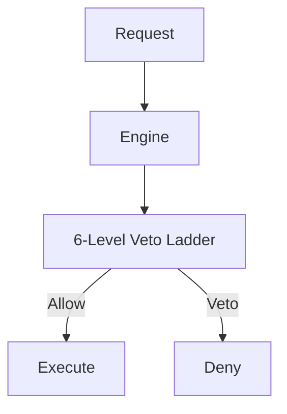

# Pranor Decision — Governed AI Execution

> **Status:** v2.0-dev — Beta. Merges to main after v1.0.0 tag. | **Version:** 2.0.0-dev | **Module Path:** `github.com/vyuvaraj/pranor/decision` | **Default Port:** N/A (library) | **License:** AGPL-3.0 (OSS) / EE

## Overview

Pranor Decision is the governed AI agent decision layer for the AI Execution Fabric. It enforces deterministic and auditable policies over agentic actions.

## 6-Level Priority Veto Ladder

| Level | Name | Hard/Soft | Effect |
|-------|------|-----------|--------|
| 1 | System Hard | Hard | Absolute block |
| 2 | Model Guard | Hard | Guardrail block |
| 3 | Operator | Hard | Operator override |
| 4 | Semantic | Soft | Warn/Escalate |
| 5 | Cost Budget | Soft | Budget warn |
| 6 | Baseline | Soft | Default pass |

## SIMULATION Mode

The Decision Engine supports a `SIMULATION` mode, allowing policies and vetoes to be evaluated in a dry-run context without enforcing the actual blocks. Useful for validating new governance rules.

## Fault Contract

- **DENY** on graph unavailability.
- **Learn skip** on timeout.

## API Reference

```go
type DecisionRequest struct {
    AgentID string
    Action  string
    Context map[string]interface{}
}

type DecisionResult struct {
    Allowed  bool
    VetoLevel int
    Reason   string
}
```

## Architecture



## OSS vs EE

| Feature | OSS | Enterprise |
|---------|-----|------------|
| Veto Ladder | Basic rules | Advanced semantic/cost rules |
| Simulation | Local | Distributed |
