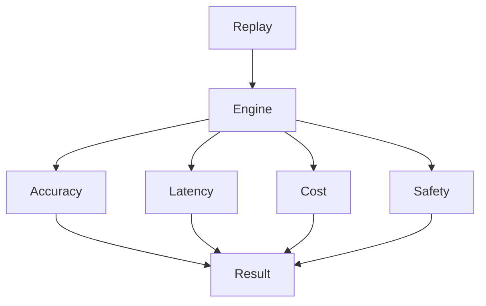

# Pranor Eval — Trajectory Quality Scoring

> **Status:** v2.0-dev — Beta. Merges to main after v1.0.0 tag. | **Version:** 2.0.0-dev | **Module Path:** `github.com/vyuvaraj/pranor/eval` | **Default Port:** N/A (library) | **License:** AGPL-3.0 (OSS) / EE

## Overview

Pranor Eval provides trajectory replay and quality scoring for the AI Execution Fabric, evaluating agentic workflows using multiple evaluators.

## 4 Evaluators

| Evaluator | Description |
|-----------|-------------|
| AccuracyEvaluator | Measures correctness of outputs |
| LatencyEvaluator | Measures response times |
| CostEvaluator | Measures token/execution cost |
| SafetyEvaluator | Measures alignment and policy adherence |

## EvalEngine API

```go
type EvalEngine interface {
    Register(evaluator Evaluator)
    Run(trajectory Trajectory) (EvalResult, error)
    Replay(trajectoryID string) (EvalResult, error)
}
```

## Fault Contract

- Soft-fail per-evaluator guarantee (one failing evaluator does not fail the entire evaluation run).

## Trajectory Types

```go
type TrajectorySpan struct { /* ... */ }
type Trajectory struct { /* ... */ }
type EvalScore struct { /* ... */ }
type EvalResult struct { /* ... */ }
```

## Architecture



## OSS vs EE

| Feature | OSS | Enterprise |
|---------|-----|------------|
| Replay | Local replay | CI quality gate + archive |
