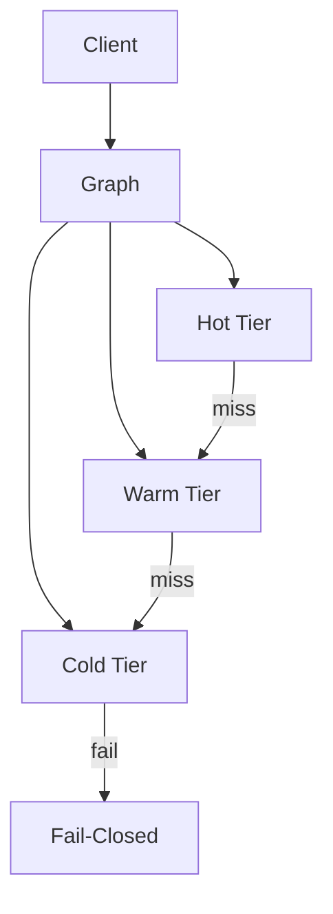

# Pranor Graph — Virtual Entity Context Assembly

> **Status:** v2.0-dev — Beta. Merges to main after v1.0.0 tag. | **Version:** 2.0.0-dev | **Module Path:** `github.com/vyuvaraj/pranor/graph` | **Default Port:** N/A (library) | **License:** AGPL-3.0 (OSS) / EE

## Overview

Pranor Graph provides the virtual entity context layer for the AI Execution Fabric. It enables deterministic, auditable context assembly using a Hot/Warm/Cold 3-tier model that fails closed to guarantee safety.

## Key Features

| Feature | Description |
|---------|-------------|
| Hot Tier | In-memory synchronous access for immediate context |
| Warm Tier | Nearline cache (e.g., Redis) for fast retrieval |
| Cold Tier | Persistent storage (e.g., DB) for full context |

## Architecture



## GraphProvider Interface

```go
type GraphProvider interface {
    GetContext(ctx context.Context, entityID string) (ContextData, error)
    // ...
}
```

## OSS vs EE

| Feature | OSS | Enterprise |
|---------|-----|------------|
| Context Assembly | Basic in-memory | Distributed Hot/Warm/Cold |
| Fail-closed logic | Basic | Advanced policies |

## Configuration

- `ContextTier`: Specifies the tier (Hot/Warm/Cold).
- `MaxAgeSecs`: Maximum age of context data in seconds.

> **Note:** Zero-CGO Constraint — This module is compiled with `CGO_ENABLED=0`. No cgo dependencies are permitted in the pranor OSS repo.
