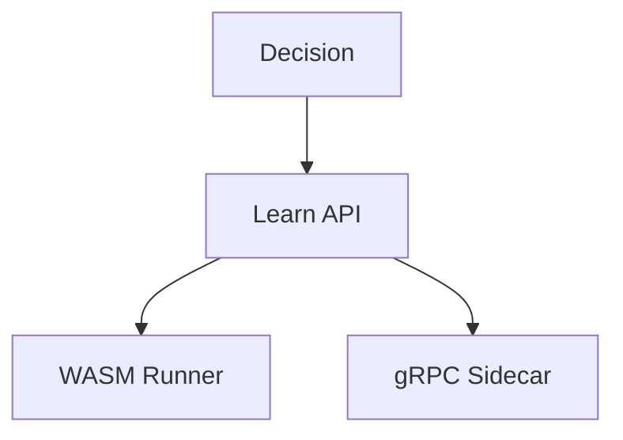

# Pranor Learn — Pluggable ML Inference

> **Status:** v2.0-dev — Beta. Merges to main after v1.0.0 tag. | **Version:** 2.0.0-dev | **Module Path:** `github.com/vyuvaraj/pranor/learn` | **Default Port:** N/A (library/sidecar) | **License:** AGPL-3.0 (OSS) / EE

## Overview

Pranor Learn provides a pluggable ML provider architecture for the AI Execution Fabric. It is structured into three sub-modules: `learn/api`, `learn/wasm`, and `learn/sidecar`.

## Architecture



## Predictor Interface

```go
type Predictor interface {
    Predict(ctx context.Context, input PredictInput) (PredictOutput, error)
}
```

## API Reference

```go
type PredictInput struct {
    Features []float64
    BudgetMs int
}

type PredictOutput struct {
    Prediction []float64
    LatencyMs  int
}
```

### Errors

- `ErrSidecarTimeout`
- `ErrModelBudgetExceeded`

## OSS vs EE

| Feature | OSS | Enterprise |
|---------|-----|------------|
| Implementation | returns `ErrEERequired` | GPU PyTorch / TabPFN pool |

> **Note:** Zero-CGO Constraint — This module is compiled with `CGO_ENABLED=0`. No cgo dependencies are permitted in the pranor OSS repo. All heavy ML dependencies run via Pure-Go WASM or gRPC sidecar binaries.
