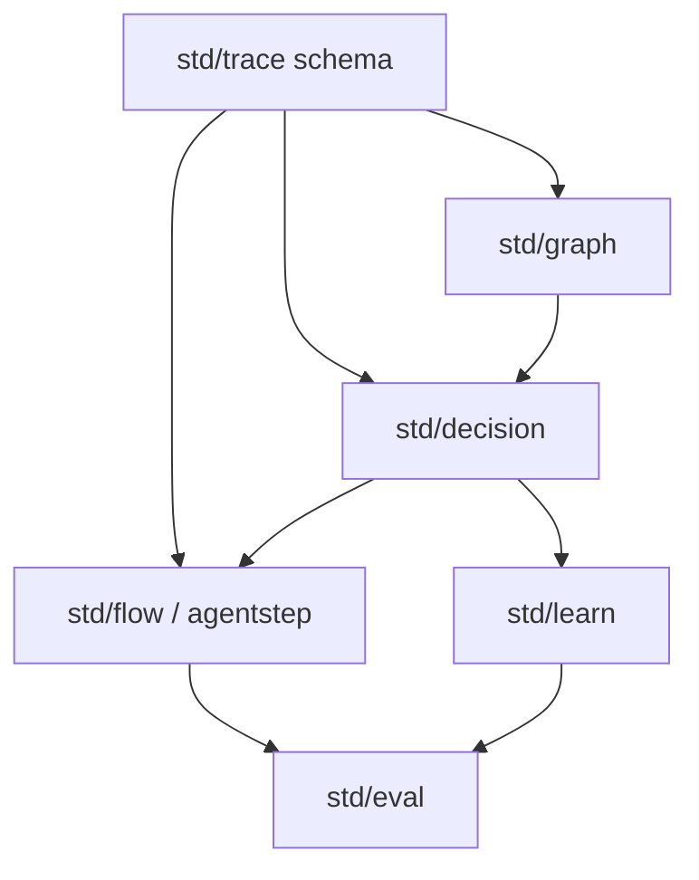

# Pranor v2.0 — AI Execution Fabric Architecture

> **Release Status:** `v2.0.0` GA — Officially merged to `main` and tagged `v2.0.0`.

## Overview

Pranor v2.0 introduces a governed AI agent execution layer on top of the v1.x infrastructure. It enables deterministic, auditable, and policy-governed agentic workflows with full observability.

The six new modules form the **AI Execution Fabric**:

| Module | Role | Sprint |
|--------|------|--------|
| `std/trace` (schema) | Canonical OTLP span hierarchy + attribute contract | Sprint 2 |
| `std/graph` | Virtual entity context assembly (3-tier) | Sprint 3 |
| `std/flow` (agentstep) | AgentStep interface, Saga runner, HITL queue | Sprints 4 + 10 |
| `std/decision` | 6-level governed execution veto ladder | Sprints 5, 6, 9 |
| `std/learn` | Pluggable ML inference provider | Sprint 8 |
| `std/eval` | Trajectory replay and quality scoring | Sprint 11 |

## Module Dependency Graph

## Zero-CGO Constraint

All v2.0 core modules are compiled with `CGO_ENABLED=0`. No cgo dependencies are permitted in the `pranor` OSS repo. All heavy ML dependencies (PyTorch, TabPFN) run via:
- **Pure-Go WASM** using `wazero` (no system calls required)
- **gRPC sidecar binaries** over Unix domain sockets or TCP IPC

## OSS / EE Build-Tag Convention

| Tag | File suffix | Behavior |
|-----|------------|----------|
| `//go:build !enterprise` | `_oss.go` | OSS implementation (stubs, in-memory) |
| `//go:build enterprise` | `_ee.go` | Enterprise implementation |
| *(no tag)* | shared | Interfaces and types used by both |

EE source lives in the `pranor-ee` repository under `src/Pranor<Module>/`.

## v2.0-dev Branch Strategy

- All v2.0 features are developed on the `v2.0-dev` branch of `pranor`
- v1.0 development is frozen on `main`
- `v2.0-dev` merges into `main` only after v1.0.0 is officially tagged
- EE stubs in `pranor-ee` also track `v2.0-dev`

## Sprint Completion Status

| Sprint | ID | Feature | Status |
|--------|----|---------|--------|
| 1 | V2.89.0 | CI/CD Build Invariants | ✅ Complete |
| 2 | V2.89.4 | Trace OTLP Span Schema | ✅ Complete |
| 3 | V2.89.1 | Pranor Graph Module | ✅ Complete |
| 4 | V2.89.3 | Flow AgentStep & Saga | ✅ Complete |
| 5 | V2.89.2 | Graph Fault Tolerance | ✅ Complete |
| 6 | V2.89.5 | Decision Engine (6-level) | ✅ Complete |
| 7 | V2.89.6 | Decision Fault Tolerance | ✅ Complete |
| 8 | V2.90.1 | Learn Provider Architecture | ✅ Complete |
| 9 | V2.90.3 | Decision Simulation Engine | ✅ Complete |
| 10 | V2.90.4 | HITL Approval Queue | ✅ Complete |
| 11 | V2.90.2 | Pranor Eval Framework | ✅ Complete |
