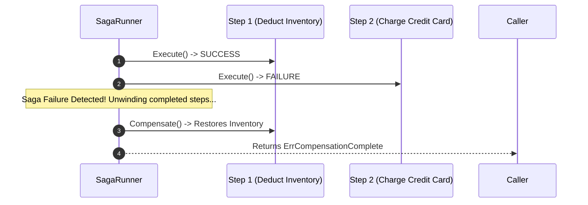

# Pranor v2.0 — Official LinkedIn & Medium Article Series

This document contains publication-ready articles for launching **Pranor v2.0 AI Execution Fabric** on **LinkedIn Pulse** and **Medium.com**.

---

## 📌 Article 1: LinkedIn Article (Thought Leadership & Executive Summary)

### **Title**: *Why AI Agents Need an Infrastructure Layer, Not Another Framework*
### **Subtitle**: *Introducing Pranor v2.0: A Zero-CGO, Governed Execution Fabric for Deterministic AI Workflows in Go.*

**Author**: Vyuvaraj  
**Target Audience**: CTOs, Engineering VPs, Principal Architects, AI Infrastructure Leads  
**Estimated Read Time**: 4 minutes  

---

### **The AI Agent Chaos Problem**

In 2024, building an AI agent was as simple as wrapping an LLM API in a python script with a system prompt and a few function calls.

By 2026, those prototype scripts have hit the production wall:
- ❌ **Unpredictable Costs**: An unconstrained agent loops 40 times on a tool error, burning $180 in API tokens in under two minutes.
- ❌ **Security Leaks**: Prompt injections trick agents into dumping raw database connections or exfiltrating user PII.
- ❌ **Cascading Failures**: A failed sub-agent call crashes the entire workflow with no state recovery or compensation.
- ❌ **Zero Auditability**: Debugging why an agent made a bad financial or legal decision requires wading through unformatted JSON logs.

Building reliable AI agents isn't an AI model problem anymore — **it's an infrastructure governance problem.**

---

### **Enter Pranor v2.0: The AI Execution Fabric**

Today, we are launching **Pranor v2.0** — an open-source, high-performance microservices runtime and governed AI execution fabric built natively in pure Go (`CGO_ENABLED=0`).

Rather than treating AI as an external API call, Pranor v2.0 elevates AI agents into **first-class governed primitives** with strict risk budgets, identity context, memory isolation, and deterministic 6-level veto ladders.

```
                  ┌─────────────────────────────────────┐
                  │      ExecutionContext (Context)     │
                  └──────────────────┬──────────────────┘
                                     │
                  ┌──────────────────▼──────────────────┐
                  │    Pranor Graph (Context Assembly)  │
                  └──────────────────┬──────────────────┘
                                     │
  ┌──────────────────────────────────▼──────────────────────────────────┐
  │                   Pranor Decision Veto Ladder                       │
  │  Level 1: Auth ──> Level 2: Budget ──> Level 3: Risk ──> Level 4...   │
  └──────────────────────────────────┬──────────────────────────────────┘
                                     │
                  ┌──────────────────▼──────────────────┐
                  │    AgentStep Saga Engine (Flow)     │
                  └─────────────────────────────────────┘
```

---

### **Key Highlights of Pranor v2.0**

1. 🛡️ **6-Level Priority Veto Ladder (`std/decision`)**  
   Every agent action must pass an immutable 6-stage policy gate: `Auth > Budget > Risk > Rules > Learn > Default`. If an agent attempts an unauthorized action or exceeds its token/USD budget, it is hard-denied before the tool executes.

2. 🧠 **Virtual Entity Context Assembly (`std/graph`)**  
   3-tier context assembly (Hot in-memory, Warm SQL join, Cold S3) with dynamic token budget node pruning. Context assembly is fail-closed — no degraded or partial data ever reaches an LLM.

3. 🔀 **AgentStep & Saga Compensation (`std/flow`)**  
   Long-running multi-agent workflows execute as transactional Sagas. If a step times out or fails, Pranor unwinds completed steps in reverse order or safely pauses for Human-In-The-Loop (HITL) approval via REST/Slack webhooks.

4. 🧪 **"What-If" Counterfactual Simulation Engine**  
   Test new policies and agent prompts in `SIMULATION` mode. Evaluate full veto ladder execution traces against historical production traffic without committing a single side-effect.

5. ⚡ **Zero-CGO Pure Go Guarantee**  
   All 31 Pranor modules compile into a single static, CGO-free binary for Linux, macOS, and Windows. Heavy ML inference runtimes execute via pure-Go WASM (`wazero`) or gRPC sidecar pools.

---

### **Getting Started with Pranor v2.0**

Pranor v2.0 is 100% open source under AGPL-3.0 and available now:

```bash
# Install via Homebrew
brew install vyuvaraj/pranor/pranor

# View the v2.0 Documentation
open https://vyuvaraj.github.io/pranor/v2.0/
```

Whether you're building financial workflows, autonomous customer support agents, or multi-agent orchestration systems, Pranor v2.0 gives you the infrastructure guarantees to ship AI to production with total confidence.

👉 Read the full technical architecture: [https://vyuvaraj.github.io/pranor/v2.0/](https://vyuvaraj.github.io/pranor/v2.0/)  
⭐ Star on GitHub: [github.com/vyuvaraj/pranor](https://github.com/vyuvaraj/pranor)

---

## 📌 Article 2: Medium.com Article (In-Depth Technical Architecture)

### **Title**: *Building a Zero-CGO Governed AI Execution Fabric in Pure Go*
### **Subtitle**: *Inside Pranor v2.0: 6-Level Priority Veto Ladders, 3-Tier Context Graphs, Vector Memory, and Agent Sagas.*

**Author**: Vyuvaraj  
**Publication**: Software Architecture / Go Engineering / AI Engineering  
**Tags**: `Go`, `Microservices`, `AI Agents`, `Software Architecture`, `System Design`  
**Estimated Read Time**: 9 minutes  

---

### **Introduction**

When designing microservice architectures in Go, developers demand high performance, deterministic behavior, zero runtime dependencies, and straightforward CGO-free compilation (`CGO_ENABLED=0`).

However, as organizations attempt to integrate autonomous LLM agents into their backend systems, they encounter a fundamental mismatch:
- Go backend services are **deterministic, strongly typed, and latency-sensitive**.
- LLM outputs are **probabilistic, unstructured, and unbounded in cost/latency**.

**Pranor v2.0** bridges this gap by introducing a governed **AI Execution Fabric** natively inside the Pranor Go ecosystem. In this article, we'll walk through the architectural blueprints, code patterns, and fault-tolerance contracts powering Pranor v2.0.

---

### **1. Immutable Execution Context Propagation (`std/execctx`)**

Every agent invocation in Pranor begins with `execctx.ExecutionContext`. Unlike standard `context.Context`, `ExecutionContext` carries immutable governance metadata across goroutine boundaries, RPC calls, and HTTP headers:

```go
package main

import (
	"context"
	"fmt"

	"github.com/vyuvaraj/pranor/core/pkg/execctx"
)

func main() {
	ctx := context.Background()
	
	// Create an immutable ExecutionContext with strict risk & token budgets
	ec := execctx.New(ctx, "tenant-prod-42", "agent-refund-bot", "user-8819").
		WithCapabilities("capability.vault.read", "capability.refund.execute").
		WithTokenBudget(5000).
		WithCostBudgetUSD(0.50)

	fmt.Printf("Tenant: %s | Agent: %s | Max Tokens: %d\n", 
		ec.TenantID, ec.AgentID, ec.TokenBudget)
}
```

#### **HTTP Header Carrier Binding**
When `ExecutionContext` traverses HTTP microservice boundaries, Pranor automatically serializes metadata into standardized non-spoofable headers:
- `X-Pranor-Tenant-ID`
- `X-Pranor-Agent-ID`
- `X-Pranor-Trace-ID`
- `X-Pranor-Capabilities`

---

### **2. The 6-Level Priority Veto Ladder (`std/decision`)**

Before any agent tool or capability is invoked, it must pass the **Priority Veto Ladder**. Evaluation halts immediately at the first hard `DENY`:

```
   Level 1: Auth (Hard DENY)    ──> Checks tenant RBAC & capability permissions
   Level 2: Budget (Hard DENY)  ──> Enforces daily token & USD cost limits
   Level 3: Risk (Soft/Hard)    ──> Evaluates blast radius & security risk score
   Level 4: Rules (Transform)   ──> Evaluates custom business policy rules
   Level 5: Learn (Advisory)    ──> Queries ML predictor sidecar (skipped on timeout)
   Level 6: Default (Fallback)  ──> Default ALLOW policy
```

#### **Go Implementation Pattern**

```go
package main

import (
	"context"
	"fmt"

	"github.com/vyuvaraj/pranor/core/pkg/execctx"
	"github.com/vyuvaraj/pranor/decision"
	"github.com/vyuvaraj/pranor/decision/api"
)

func EvaluateAction(ctx context.Context, ec *execctx.ExecutionContext) {
	req := api.DecisionRequest{
		AgentID:    ec.AgentID,
		TenantID:   ec.TenantID,
		Capability: "capability.refund.execute",
		Parameters: map[string]any{"amount": 450.00},
	}

	result, err := decision.Evaluate(ctx, req)
	if err != nil {
		fmt.Printf("Decision Denied: %v\n", err)
		return
	}

	if result.Action == api.ActionApprove {
		fmt.Println("Action Approved! Executing refund...")
	}
}
```

---

### **3. Virtual Entity Context & Budget Pruning (`std/graph`)**

Prompting LLMs with excessive context causes degraded reasoning quality and exponential latency growth. Pranor Graph (`std/graph`) solves this via a 3-tier entity context pipeline:

1. **Hot Tier (<2ms)**: Volatile in-memory cache for current active session state.
2. **Warm Tier (<15ms)**: Virtual SQL join across database connection pools (`pranor/pool`).
3. **Cold Tier (<100ms)**: S3 object storage fallback (`pranor/vault`).

#### **Semantic & FIFO Node Pruning**
When assembling graph context, `ThreeTierAssembler` enforces `MaxTokenBudget`. If the retrieved context tree exceeds the budget, Pranor dynamically prunes lower-relevance graph nodes while guaranteeing a **fail-closed contract** — if all tiers are exhausted, `ErrGraphContextUnavailable` is returned rather than sending corrupted data to an LLM.

---

### **4. Transactional AgentStep & Saga Compensation (`std/flow`)**

AI workflows that interact with real-world databases and APIs require rollback capabilities. `std/flow` provides the `AgentStep` interface and a bounded Saga engine:

```go
type AgentStep interface {
	Execute(ctx context.Context, input StepInput) (StepOutput, error)
	Compensate(ctx context.Context, input StepInput) error
	Name() string
}
```



If a step exceeds `StepTimeout` (e.g., 30 seconds) or max steps (25 steps), the Saga Engine executes `Compensate()` in reverse order for all completed steps. If an unrecoverable policy boundary is reached, the engine enqueues an `ApprovalRequest` to the **HITL (Human-In-The-Loop) Approval Queue**.

---

### **5. Vector Memory & Cosine Similarity (`std/memory`)**

`std/memory` provides working memory (volatile KV scratchpad) and episodic memory with Cosine Similarity vector recall:

```go
package main

import (
	"context"
	"fmt"

	"github.com/vyuvaraj/pranor/core/pkg/execctx"
	"github.com/vyuvaraj/pranor/memory"
)

func RecallRelevantHistory(ctx context.Context, ec *execctx.ExecutionContext) {
	em := memory.Episodic()

	// Perform Cosine Similarity vector search across episodic memory
	queryVector := []float32{0.82, 0.14, 0.05}
	results, err := em.RecallSemantic(ctx, ec, queryVector, 3)
	if err != nil {
		return
	}

	for i, entry := range results {
		fmt.Printf("#%d: %s (Cosine Score: %.4f)\n", i+1, entry.Content, entry.Score)
	}
}
```

---

### **6. Zero-CGO & Clean OSS/EE Build Tag Architecture**

To maintain ultra-fast compilation and static zero-dependency deployment, Pranor v2.0 enforces `CGO_ENABLED=0` across all 31 modules. Enterprise Edition extensions (such as GPU-accelerated PyTorch sidecars or Raft saga replication) are isolated in the `pranor-ee` repository behind `//go:build enterprise` build tags.

```
OSS (pranor repo)                     Enterprise (pranor-ee repo)
├── guardrails.go (interface)         ├── src/PranorGate/
├── guardrails_oss.go                 │   └── gpu_promptguard_ee.go (//go:build enterprise)
└── shadow_oss.go                     └── src/PranorFlow/
                                          └── saga_ee.go (//go:build enterprise)
```

---

### **Conclusion**

By combining structured execution contexts, 6-level veto ladders, 3-tier entity context graphs, and transactional Sagas, **Pranor v2.0** turns chaotic LLM interactions into enterprise-grade, deterministic microservice workflows.

#### **Explore Pranor v2.0**
- 📖 **v1.0 Docs**: [https://vyuvaraj.github.io/pranor/v1.0/](https://vyuvaraj.github.io/pranor/v1.0/)
- 🚀 **v2.0 AI Execution Fabric Docs**: [https://vyuvaraj.github.io/pranor/v2.0/](https://vyuvaraj.github.io/pranor/v2.0/)
- ⭐ **GitHub Repository**: [github.com/vyuvaraj/pranor](https://github.com/vyuvaraj/pranor)
